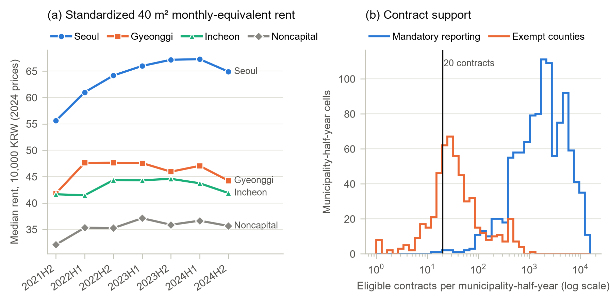
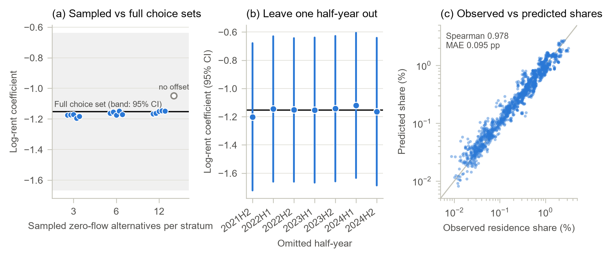
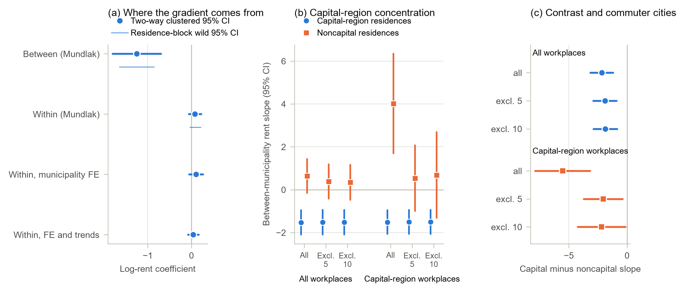
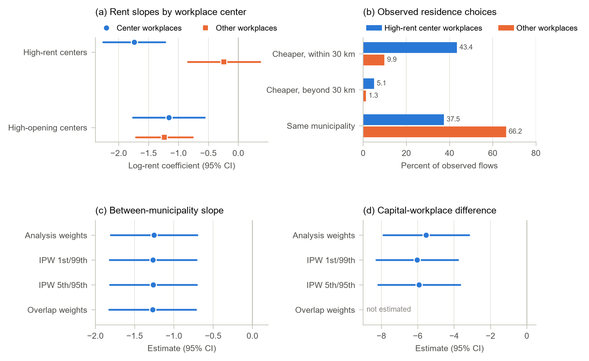

::: {.callout-note appearance="simple"}
**English version** — [Cheaper but Farther](../2026-09-cheaper-but-farther-en/)

본고는 통계청 지역별고용조사 마이크로데이터(2021년 하반기~2024년 하반기, 7개 반기, 마이크로데이터 통합서비스 이용)와 국토교통부 부동산거래관리시스템(RTMS)에 신고된 월세 계약 5,159,595건(2017년 상반기~2024년 하반기)을 이용하였다. 근로자의 거주지와 근무지는 시군구 단위로 파악된다.
:::

## 요약

임대료가 높은 지역일수록 청년층의 거주지로 선택될 가능성이 낮다는 관계는 직관적으로 예상되는 것이나, 그 크기와 발생 원천, 지역별 차이는 실증적으로 확인될 필요가 있다. 본고는 지역별고용조사의 19~34세 임금근로자 224,862명을 대상으로 근무지 시군구를 고정한 상태에서 거주지 시군구 선택을 조건부 로짓모형으로 추정하고, 부동산거래관리시스템의 임대차 계약자료로 구축한 시군구별 표준화 임대료 지수와 결합하여 분석하였다.

분석 결과, 표준화 임대료가 10% 높은 시군구가 거주지로 선택될 상대 승산은 약 10% 낮은 것으로 추정되었으며(로그 임대료 계수 −1.153), 이 결과는 선택집합, 조사 회차 및 추론 방법에 관계없이 안정적이었다. 동 계수는 개별 시군구 임대료의 시간적 변동(시군구 내 계수 0.080)이 아니라 시군구 간 임대료 수준의 지속적 격차(시군구 간 계수 −1.254)에서 비롯되며, 수도권 거주지에 국한되어 나타났다(수도권 − 비수도권 시군구 간 계수 차이 −2.166). 아울러 임대료가 높은 근무지 중심지에 근무하는 근로자는 임대료 계수가 더 크고, 근무지보다 임대료가 낮은 원거리 시군구에 거주하는 경향이 뚜렷하였다. 이들 추정치는 인과효과가 아닌 조건부 연관관계로서, 수도권 일자리에 종사하는 청년층의 거주지 선택이 지속적인 임대료 격차에 따라 배열되고 있음을 시사한다.

### 주요 분석 결과

| 구분 | 내용 |
|:--|--:|
| 분석 표본 | 19~34세 임금근로자 224,862명, 7개 반기 |
| 선택집합 내 거주지 대안 | 시군구 207~212개 |
| 임대료 지수 구축에 사용된 임대차 계약 | 5,159,595건 |
| 로그 임대료 계수(전체 선택집합) | −1.153 (0.263) |
| 임대료 10% 상승 시 거주지 선택 상대 승산 변화 | −10.4% |
| 시군구 내 계수 / 시군구 간 계수 | 0.080 / −1.254 |
| 시군구 간 계수, 수도권 − 비수도권 거주지 | −2.166 (통근도시 5개 제외 시 −1.903) |
| 임대료 계수, 고임대료 근무지 중심지 / 여타 근무지 | −1.739 / −0.238 |
| 근무지보다 임대료가 낮은 시군구 거주 비중, 고임대료 중심지 / 여타 근무지 | 48.5% / 11.2% |

## Ⅰ. 검토 배경

청년층의 거주지는 주거비, 일자리 접근성, 생활편의시설, 주택공급 등이 복합적으로 작용한 결과이며, 거주지 선택모형의 임대료 계수 하나로 이들 요인을 분리하기는 어렵다. 임대료는 접근성과 생활편의를 자본화한 균형가격이므로(Roback, 1982; Glaeser and Gottlieb, 2009) 거주지 임대료 계수가 음(−)이라 하더라도 이것이 비용 회피, 관측되지 않은 주거 질에 따른 정렬, 일자리 입지 중 어느 것을 반영하는지는 구분되지 않는다. 아울러 고임대료 노동시장의 주거비는 해당 지역에서의 취업 자체를 제약할 수 있다(Hsieh and Moretti, 2019; Ganong and Shoag, 2017).

우리나라의 경우 서울·인천·경기 수도권이 분석 표본 청년층 임금근로자 근무지의 57.8%를 차지하고, 임대료 수준도 여타 지역을 안정적인 순서로 상회하고 있어 이러한 문제가 특히 두드러진다. 2024년 가격 기준 40㎡ 표준주택의 시군구-반기 표준화 임대료 중위값은 서울 63.8만원, 경기 45.9만원, 인천 42.4만원인 데 비해 비수도권은 35.5만원이다. 일자리와 고임대료가 한 권역에 동시에 집중되어 있으므로, 수도권 일자리에 종사하는 청년층은 임대료 격차가 크고 지속적인 시군구들 가운데서 거주지를 선택하게 된다. 임대료 계수가 전국적 규칙성인지 수도권 특유의 현상인지는 청년 주거비 문제가 전국적 과제인지 대도시권 과제인지를 가르는 문제이기도 하다.

국내 선행연구는 주로 권역 간 이동이나 대학-직장 간 이동을 분석 대상으로 삼아 왔다. Shim and Kim (2012)은 대졸자의 수도권-비수도권 간 취업 이동을 임금 및 고용 안정성과 관련지어 분석하였고, Han and Yoon (2021)은 대학과 직장의 권역 선택을 순차적 선택으로 모형화하였으며, Choi (2022)와 Choi and Lee (2017)는 지역의 사회문화적 여건과 임금 격차가 대졸자의 지역 이탈에 미치는 영향을 검토하였다. 본고는 선택의 대상과 조건 설정에서 이들과 구별된다. 분석 대상은 근무지가 관측된 취업 임금근로자의 거주지 시군구이며, 대안은 전국의 임대료 측정 가능 시군구 전체이고, 관심 변수는 권역 평균이 아닌 행정 임대차 계약자료로 구축한 시군구별 표준화 임대료 지수이다.

본고의 분석 문제는 다음 세 가지이다. 첫째, 근무지를 고정한 조건부 임대료 계수가 음(−)인지, 그리고 선택집합·조사 회차·추론 방법을 바꾸어도 유지되는지 여부이다. 둘째, 동 계수가 시군구 간 임대료 수준의 지속적 격차에서 비롯되는지, 아니면 개별 시군구 임대료의 시간적 변동에서 비롯되는지 여부이다. 셋째, 동 계수가 전국적 규칙성인지 수도권에 국한된 현상인지, 그리고 고임대료 근무지 중심지에 근무하는 근로자의 통근 행태와 어떤 관계를 갖는지이다. 연령·성별·학력별 차이는 사전에 부호를 특정하지 않은 보조 검정으로 설정하였다.

## Ⅱ. 분석 자료 및 방법

### 1. 근무지를 고정한 거주지 선택모형

분석 단위는 근무지 시군구가 관측된 임금근로자가 선택한 거주지 시군구이다. 각 근로자의 대안은 해당 반기에 임대차 기록으로 임대료를 측정할 수 있는 전국의 모든 시군구(207~212개)이며, 이들 간의 선택을 조건부 로짓모형으로 추정하였다(McFadden, 1974). 반기 $t$에 시군구 $j$에 근무하는 유형 $g$(성별·학력·연령대)의 근로자가 거주지 $r$에서 얻는 체계적 효용은 다음과 같다.

$$V_{grjt}=\lambda_{gtj}+\beta_H h_{rt}+\beta_D\log(1+d_{rj})+\beta_S\mathbf{1}\{r=j\}+\beta_P\mathbf{1}\{p(r)=p(j)\}+\boldsymbol{\gamma}'\mathbf{A}_{rt}+\rho_{p(r)}$$

여기서 $h_{rt}$는 로그 표준화 임대료, $d_{rj}$는 근무지까지의 중심점 거리, $\mathbf{A}_{rt}$는 의료·문화·교육·교통의 네 가지 생활편의 지수, $\rho_{p(r)}$은 거주지 시도 효과이다. 선택집단 효과 $\lambda_{gtj}$는 해당 근로자가 선택 가능한 거주지 전체에 공통으로 작용하는 요인을 흡수한다.

근무지를 조건으로 두는 것이 임대료 계수를 거주지 간 비교로 만드는 핵심 장치이다. 근무지의 기대임금, 구인 규모, 산업 구성은 모든 대안에 공통이므로 우도에서 소거되며, 남는 것은 고정된 근무지에 대한 임대료·생활편의·통근거리에 따른 거주지 간 비교이다. 다만 동 모형은 취업과 근무지 선택의 결합모형이 아니며 근무지를 외생변수로 취급하지도 않는다. 근로자가 직장과 주거를 동시에 결정할 가능성은 배제되지 않는다. 또한 조사가 반복 횡단면이므로 개인의 이주가 아니라 각 반기에 취업 청년층이 어디에 거주하는지가 분석 대상이 된다. 임대료 계수 $\beta_H$는 수요 탄력성이 아닌 조건부 연관관계로 해석되어야 하는데, 임대료가 관측되지 않은 주거 질, 생산성, 주택공급을 함께 반영하는 균형가격이기 때문이다.

모형의 두 가지 특징은 이후 분석에서 중요한 의미를 갖는다. 첫째, 전체 선택집합을 사용하므로 대안 표본추출이 불필요하며, McFadden (1978)의 보정을 적용한 표본추출 선택집합은 점검 목적으로만 사용하였다. 둘째, 모든 선택집단이 임대료 측정 가능 거주지 전체를 대안으로 가지므로 근로자 224,862명으로부터 21,379개 선택집단, 4,498,851개 선택집합 행이 생성되며, 거주지 속성이 근로자 유형에 따라 달라지지 않는 모형에서는 우도의 변화 없이 1,596개 반기×근무지 집단의 335,839개 행으로 정확히 축약된다. 추론은 거주지 지리와 근무지 지리에 대해 이원 군집화한 표준오차를 사용하였으며(Cameron, Gelbach and Miller, 2011), 지리적 군집 수가 제한적인 점을 감안하여 주요 추정량에는 거주지 블록과 근무지 블록별로 999회 Rademacher 추출에 기초한 와일드 스코어 신뢰구간을 함께 제시하였다(Kline and Santos, 2012).

분석 대상의 공간 구조는 상당히 조밀하다. 분석 표본에서 근로자의 51.8%가 거주지와 근무지가 동일한 시군구이고 85.2%는 동일한 시도이며, 거주지-근무지 간 중심점 거리는 평균 8.6km, 90분위 24.5km이다. 수도권 경계를 넘는 통근은 양방향 모두 드물어, 비수도권에 근무하는 수도권 거주자는 조사 가중치의 0.44%, 수도권에 근무하는 비수도권 거주자는 0.35%에 불과하다. 이 사실은 Ⅲ장 4절의 분석에서 결정적으로 작용한다.

### 2. 표준화 임대료 지수

신고 임대료의 단순 중위값은 지역 간 가격 수준 차이에 면적, 주택유형, 건물연령, 층, 계약 시점의 차이가 혼재되어 있다. 이에 따라 임대료 지수는 2017년 상반기~2024년 하반기에 체결된 60㎡ 이하 월세 계약 5,159,595건 전체를 대상으로 한 계약 단위 헤도닉 회귀로 구축하였다. 각 계약의 월세환산액은 보증금을 국고채(3년) 수익률로 환산하여

$$MEC_{hm}=R_{hm}+\frac{i_m}{12}\,D_{hm}$$

와 같이 정의하고 2024년 가격으로 표시하였다. 로그 월세환산액을 면적·건물연령·층의 2차 함수, 주택유형 및 계약월 더미, 지리 단위×반기 고정효과에 회귀한 후, 적합값을 40㎡, 건물연령 10년, 3층에서 평가하고 주택유형은 고정된 전국 계약 비중으로 가중하여 표준화 임대료를 산출하였다. 표준주택을 고정함으로써 신고 계약의 구성 변화가 지수에 영향을 미치지 않도록 하였다. 월세가 없는 순수 전세 계약은 기준 지수에서 제외하였으며, 전세를 동일한 환산율로 포함한 보증금 포함 지수는 민감도 분석에 사용하였다.

시군구는 해당 반기에 적격 계약이 20건 이상인 경우에만 선택집합에 포함하였고, 계약이 희소한 셀에 대해 별도의 대체값은 부여하지 않았다. 이 기준은 주로 농촌 지역의 군을 제외하는 효과를 갖는데, 2021년 6월 시행된 임대차 신고 의무가 도 지역의 군에는 적용되지 않기 때문이다. 기준 미달인 시군구-반기 셀 130개 가운데 128개가 신고 의무 지역 밖의 군에 해당한다. 임대료 측정 가능 셀에 포함된 계약은 3,102,349건이다. 비교 가능한 셀에서 표준화 지수와 단순 중위값 간의 상관계수는 0.849로, 지수가 지역 임대료 수준의 순위를 적절히 반영하고 있음을 보여 준다. 다만 이는 균형 임대료를 외생 가격으로 전환하는 것은 아니다.

| 거주지 권역 | 시군구-반기 셀 수 | 5분위 | 중위 | 95분위 |
|:--|--:|--:|--:|--:|
| 서울 | 175 | 50.2 | 63.8 | 87.2 |
| 경기 | 217 | 32.8 | 45.9 | 64.3 |
| 인천 | 70 | 34.0 | 42.4 | 56.9 |
| 비수도권 | 1,011 | 23.0 | 35.5 | 44.6 |

: 〈표 1〉 권역별 표준화 임대료 분포(2021년 하반기~2024년 하반기). 주: 40㎡ 표준주택 기준, 2024년 가격 월 만원. 임대료 측정 가능 시군구-반기 셀을 동일 가중. 수도권 세 권역은 비수도권을 상회할 뿐 아니라 분포 범위가 거의 겹치지 않으며, 이는 Ⅲ장 2절의 시군구 간 분해가 유의한 결과를 얻는 배경이 된다.

## Ⅲ. 분석 결과

### 1. 기준 추정 결과: 임대료 계수 −1.15

| | (1) 통합 | (2) 수도권 상호작용 |
|:--|--:|--:|
| 로그 임대료 | −1.153 (0.263) | 0.534 (0.329) |
| 로그 임대료 × 수도권 거주지 | | −1.979 (0.428) |
| 로그(1 + 거리) | −1.919 (0.057) | −1.926 (0.057) |
| 동일 시군구 | −2.431 (0.190) | −2.445 (0.190) |
| 동일 시도 | 0.642 (0.087) | 0.633 (0.087) |
| 함의된 계수, 수도권 거주지 | | −1.446 (0.275) |
| 함의된 계수, 비수도권 거주지 | | 0.534 (0.329), p = 0.105 |

: 〈표 2〉 전체 선택집합 기준 추정 결과. 주: 임대료 측정 가능 거주지 시군구 전체를 대안으로 한 근무지 조건부 로짓모형. 네 가지 생활편의 지수와 거주지 시도 고정효과 포함. 괄호 안은 거주지·근무지 지리로 이원 군집화한 표준오차. 224,862명, 21,379개 선택집단, 4,498,851개 선택집합 행.

설명변수가 로그 임대료이므로 계수 −1.153은 근무지와 여타 관측 속성을 고정한 상태에서 표준화 임대료가 10% 높은 거주지의 선택 상대 승산이 10.4% 낮음을 의미한다. 통근 관련 항들은 근무지가 정해진 근로자의 거주지 선택에서 공간적 마찰이 크게 작용함을 확인해 주며, 이는 근무지 조건부 설계가 전제하는 바와 부합한다. 다만 동일 시군구 더미가 중심점 거리 0과 함께 정의되므로 이들 항과 생활편의 지수는 통제변수로만 취급하고 개별적으로 해석하지 않았다.

기준 추정치는 선택집합의 구성이나 특정 조사 회차에 의존하지 않는 것으로 나타났다. 층별로 유량이 0인 대안 12개를 표본추출하고 McFadden 오프셋을 적용한 선택집합은 다섯 개 난수 시드에 걸쳐 평균 −1.155의 계수를 주었으며, 이는 전체 선택집합 추정치와 0.17% 차이에 불과하다. 오프셋을 제외할 경우 추정치가 −1.049로 이동하므로, 전체 선택집합 사용으로 보정이 불필요해지더라도 보정 자체의 중요성은 확인된다. 한 반기씩 제외하고 전체 선택집합 모형을 재추정한 계수는 −1.201~−1.120의 범위에 있다. 모형이 예측한 시군구별 거주 비중과 실제 비중 간의 Spearman 상관계수는 표본 내 0.978, 제외 반기에서 0.975~0.979이다.

추론 방법에 따른 차이도 크지 않다. 통합 계수의 이원 군집 95% 신뢰구간은 [−1.668, −0.638]이며, 거주지 블록과 근무지 블록의 와일드 스코어 신뢰구간은 각각 [−1.513, −0.756], [−1.569, −0.729]이다. 〈표 2〉 (2)열의 수도권 − 비수도권 계수 차이(−1.979)에 대한 신뢰구간도 각각 [−2.819, −1.140], [−2.654, −1.293], [−2.703, −1.187]로 모두 0을 포함하지 않는다. 이 차이는 Ⅲ장 3절에서 지속적 임대료 수준을 기준으로 다시 검토한다.

### 2. 지역 내·지역 간 분해

통합 임대료 계수에는 개별 시군구 임대료의 시간적 변동과 시군구 간 임대료 수준의 지속적 격차라는 두 가지 변동이 혼재되어 있다. 장기적인 수준 격차는 생활편의와 접근성의 내구적 구조를 반영하는 반면, 반기별 편차에는 지역 충격과 신고 계약의 구성 변화가 함께 작용하므로 양자가 동일한 정보를 담고 있다고 보기는 어렵다. Mundlak 분해는 $\beta_H h_{rt}$를

$$\beta_W\,(h_{rt}-\bar h_r)+\beta_B\,\bar h_r$$

로 대체하여 두 변동을 분리한다. 여기서 $\bar h_r$은 7개 반기에 걸친 시군구 평균 로그 임대료이며, 생활편의 지수에도 동일한 분해를 적용하고 선택집단 효과 대신 반기×근무지 효과를 사용하였다.

| | 추정치 (표준오차) | p값 | 거주지 블록 와일드 95% | 근무지 블록 와일드 95% |
|:--|--:|--:|--:|--:|
| 시군구 내 임대료 | 0.080 (0.073) | 0.273 | [−0.037, 0.212] | [−0.067, 0.226] |
| 시군구 간 임대료 | −1.254 (0.281) | < 0.001 | [−1.646, −0.855] | [−1.690, −0.813] |
| 시군구 내 − 시군구 간 | 1.334 (0.295) | < 0.001 | [0.901, 1.757] | [0.868, 1.794] |
| 시군구 내 임대료, 시군구 고정효과 | 0.103 (0.081) | 0.203 | n.a. | n.a. |
| 시군구 내 임대료, 시군구 고정효과 및 추세 | 0.041 (0.062) | 0.508 | n.a. | n.a. |

: 〈표 3〉 지역 내·지역 간 분해 및 시군구 고정효과 모형. 주: 상단 3행은 통합 Mundlak 모형. 하단 2행은 시도 효과와 시군구 간 성분을 거주지 시군구 고정효과로 대체한 모형과 여기에 시군구별 선형 추세를 추가한 모형이며, 희소 고정효과 모형에는 와일드 스코어 신뢰구간을 산출할 수 없음.

7개 반기 평균 임대료가 10% 높은 시군구는 거주지로 선택될 상대 승산이 11.3% 낮은 반면, 개별 시군구의 임대료가 자체 평균에서 10% 이탈하는 것은 이에 비견할 만한 변화와 연관되지 않았다. 시군구 간 계수의 신뢰구간은 모두 0을 제외하고 시군구 내 계수의 신뢰구간은 모두 0을 포함하며, 양자의 차이에 대한 두 신뢰구간 역시 0을 제외한다. 시군구 고정효과를 사용한 두 가지 엄격한 설정에서도 동일한 결론이 도출되었다.

따라서 Ⅲ장 1절의 통합 임대료 계수는 단기 임대료 변동에 대한 반응이 아니라 시군구 간 공간적 정렬을 반영하는 것으로 판단된다. 다만 시군구 내 계수가 0과 구별되지 않는다는 결과가 시군구 내 임대료 변동이 거주지 선택과 무관함을 의미하는 것은 아니다. 7개 반기의 자료로는 시군구 내 변동이 충분히 확보되지 않고, 시간에 따라 변하는 지역 충격이 임대료와 거주지 선택을 동시에 움직일 수 있으므로, 시군구 내 계수는 본 분석 설계에서 정보력이 부족한 것으로 해석하는 것이 타당하다.

임대료 측정 시점을 달리한 검토도 같은 방향을 가리킨다. Ⅲ장 4절의 수도권 근무지 계수 차이는 권역×반기 효과를 추가할 경우 −5.512, 표본을 2022년 상반기부터 사용할 경우 −5.469, 임대료에 한 반기 시차를 둘 경우 −4.576으로 유지되었으나, 현재 임대료를 전년동기 대비 변화로 대체할 경우에는 0.344(p = 0.642)에 그쳤다. 시차 및 차분 임대료는 도구변수가 아니며, 이 결과는 해당 관계가 최근의 임대료 변동이 아닌 지속적 임대료 수준에 기초하고 있음을 보여 주는 것이다.

### 3. 수도권 집중

시군구 간 임대료 계수가 어느 지역에서 발생하는지를 확인하기 위해 전체 근로자를 대상으로 시군구 간 계수가 수도권 거주지와 비수도권 거주지 간에 다르도록 허용하였다. 그 결과 수도권 거주지의 계수는 −1.527, 비수도권 거주지는 0.639(p = 0.112)로 그 차이는 −2.166(p < 0.001)이었다. 비수도권 거주지 간에는 지속적 임대료 격차와 거주지 선택 사이에 유의한 관계가 검출되지 않았다. 즉 시군구 간 임대료 계수는 수도권에 국한된 현상이다.

| 시군구 간 계수 | 전체 거주지 | 통근도시 5개 제외 | 10개 제외 |
|:--|--:|--:|--:|
| 수도권 거주지 | −1.527 (0.289) | −1.520 (0.294) | −1.518 (0.296) |
| 비수도권 거주지 | 0.639 (0.402) | 0.384 (0.408) | 0.349 (0.417) |
| 수도권 − 비수도권 | −2.166 (0.496) | −1.903 (0.507) | −1.867 (0.519) |

: 〈표 4〉 수도권 및 비수도권 거주지의 시군구 간 임대료 계수(전체 근무지). 주: Mundlak 모형의 시군구 간 계수. 제외 도시는 수도권에 근무하는 비수도권 거주자 가운데 조사 가중치 비중이 가장 큰 비수도권 거주지로, 천안·아산·원주·청주·춘천(5개) 및 세종·대전 서구·대전 유성구·음성·진천(10개)이며 모든 선택집합에서 제외하였음.

이 차이는 수도권 경계를 넘는 통근의 대부분을 차지하는 소수의 비수도권 도시에 의존하지 않는다. 비중이 가장 큰 5개 도시를 제외하더라도 수도권 계수는 −1.520, 계수 차이는 −1.903으로 유지되며, 10개 도시를 제외할 경우에도 −1.867이다. Ⅲ장 1절의 통합 상호작용 모형에서도 5개 도시 제외 시 −1.760, 10개 도시 제외 시 −1.736으로 유사한 결과가 나타났다.

동 계수가 서울에만 기인하는 것도 아니다. 통합 계수가 시도별로 다르도록 허용하면 서울 거주지 −1.977, 경기 −1.240, 인천 −0.626(p = 0.259)이며 비수도권 거주지는 0.486(p = 0.147)이다. 각 시도를 차례로 모든 선택집합에서 제외할 경우 수도권 − 비수도권 계수 차이는 서울 제외 시 −1.539, 인천 제외 시 −2.098, 경기 제외 시 −2.210으로 나타났다.

보다 근본적인 제약은 공통 지지(common support) 문제이다. 수도권 시군구가 임대료 분포의 상위 구간을 차지하기 때문이다. 각 반기에서 두 집단이 공유하는 5~95분위 범위 내의 대안만 남길 경우 계수 차이는 −2.564(p = 0.027), 구성 계수는 −1.972(p = 0.069)와 0.593(p = 0.329)으로 나타났으나, 이 표본은 반기당 수도권 거주지 셀의 19.7~24.2%만을 유지한다. 공통 지지 범위에서도 계수 차이의 부호는 유지되지만, 수도권 셀의 5분의 1에 기초한 결과로 임대료 분포 전 구간에서의 성립 여부를 판단하기에는 한계가 있다.

### 4. 수도권 인접 비수도권 도시와 경계 효과

분석 대상을 수도권 근무자로 한정하면 훨씬 큰 계수 차이가 나타나며, 본고의 진단 가운데 가장 유의할 부분이 여기에 있다. 거주지×근무지 시장모형에서 수도권 근무자의 시군구 간 계수는 수도권 거주지 −1.515, 비수도권 거주지 4.016으로 계수 차이는 −5.531(1.206; p < 0.001), 거주지 블록 와일드 스코어 신뢰구간은 [−8.054, −3.073]이다. 비수도권 근무자 대비 이중차분은 −4.564이다. 이 수치만 보면 수도권 근무자의 거주지 선택이 Ⅲ장 3절의 전체 근로자 결과보다 임대료에 훨씬 민감하게 배열되는 것으로 해석될 수 있다.

그러나 이 계수 차이를 만들어내는 셀의 구성을 살펴보면 그러한 해석은 유지되기 어렵다. 수도권에 근무하는 비수도권 거주자는 조사 가중치의 0.35%에 불과하며, 그 가운데 71.3%를 천안(33.4%), 아산(18.5%), 원주(9.2%), 청주(5.2%), 춘천(5.0%)의 5개 시군구가 차지한다. 상위 10개 시군구의 비중은 85.3%이다.

| 수도권 근무지 | 전체 거주지 | 5개 제외 | 10개 제외 |
|:--|--:|--:|--:|
| 수도권 거주지 | −1.515 (0.282) | −1.505 (0.286) | −1.504 (0.289) |
| 비수도권 거주지 | 4.016 (1.187) | 0.537 (0.782) | 0.684 (1.024) |
| 수도권 − 비수도권 | −5.531 (1.206) | −2.042 (0.850) | −2.188 (1.045) |
| 비수도권 근무지 대비 이중차분 | −4.564 (1.234) | −1.264 (0.953) | −1.445 (1.147) |

: 〈표 5〉 수도권 근무자의 시군구 간 임대료 계수와 통근도시 제외 효과. 주: 거주지×근무지 시장모형의 시군구 간 계수. 통근도시를 모든 선택집합에서 제외하였음. 천안만 제외하더라도 계수 차이는 −3.605로 축소됨.

5개 도시를 모든 선택집합에서 제외하면 수도권 거주지 계수는 −1.505로 유지되는 반면 비수도권 거주지 계수는 0.537(p = 0.492)로 축소되고 그 와일드 스코어 신뢰구간은 0을 포함하게 된다. 계수 차이는 −2.042(p = 0.016)로 감소하여 여전히 0과 구별되지만, 이중차분은 −1.264(p = 0.185)로 더 이상 0과 구별되지 않는다.

이들 5개 시군구는 서울 지향적 통근도시가 아니라 수도권 경계에 인접한 규모가 큰 비수도권 노동시장이다. 임대료 측정 가능 비수도권 시군구 가운데 청년 일자리 스톡 분위는 85~100분위에 해당하고, 거주 임금근로자의 73~92%가 자체 도시 내에 근무하며 수도권 통근 비중은 0.9~8.0%에 그친다. 가장 가까운 수도권 시군구까지의 거리는 23~50km이고, 표준화 임대료는 비수도권 시군구 가운데 59~87분위로 비교적 높은 수준이다. 이들 도시의 수도권 통근자가 주로 향하는 근무지는 경계 바로 너머 경기 외곽 시군구로, 천안·아산에서는 평택·안성·화성, 원주에서는 여주·이천, 청주에서는 이천, 춘천에서는 가평이며, 그 다음이 서울 강남구와 송파구이다. 이들 통근자의 40%는 통근거리가 40km 이하인 반면, 수도권에 근무하는 여타 비수도권 거주자 중 동 비중은 12%에 불과하고 평균 통근거리는 121km에 달한다.

따라서 수도권 근무지 시장에서 나타난 비수도권 거주지의 양(+)의 계수는 수도권 통근자가 수도권 내 고임대료 지역을 회피한다는 증거가 아니다. 이는 인접한 노동시장 간에 행정적 수도권 경계를 넘어 이루어지는 통근을 반영하는 것으로, 이 경우 더 가깝고 임대료가 낮은 대안 대신 규모가 크고 임대료가 상대적으로 높은 비수도권 도시가 거주지로 선택된다. 이를 해당 통근자가 고임대료 주거를 선호한다는 의미로 해석해서는 안 되며, 5개 도시를 합한 조사 표본이 427명에 불과하여 집계 수준 이상의 서술은 어렵다.

이상의 결과에서 Ⅲ장 3절과 4절은 서로 다른 두 가지를 말하고 있으며 본고는 양자를 구분하여 제시한다. 시군구 간 임대료 계수는 수도권 거주지에 국한되어 있고 이러한 집중은 통근도시를 제외하더라도 유지된다. 반면 수도권 근무자에서 추가로 나타나는 큰 계수 차이는 인접한 소수 도시에 의존하는 경계 효과로서, 제외 결과와 함께 제시할 때에만 의미를 갖는다. 같은 비중으로 보고하되 결론의 근거로 삼지 않은 결과가 두 가지 더 있다. 비수도권 근무자의 수도권 − 비수도권 계수 차이는 −0.968(p = 0.107)로 근무지 블록 추론에서는 유의하나 거주지 블록 추론에서는 유의하지 않으며, 수도권 근무지의 시군구 내 계수 차이는 부정확하고 제외 도시 구성에 따라 불안정하다.

### 5. 고임대료 근무지 중심지와 통근

시군구 간 임대료 계수가 고임대료 근무지 주변의 거주지 정렬을 반영한다면, 임대료가 가장 높은 근무지에 종사하는 근로자에서 이러한 관계가 가장 뚜렷하게 나타나고 그에 수반되는 통근 행태도 함께 관찰되어야 한다. 근무지 시군구가 해당 반기에 표준화 임대료 기준 근무지 상위 4분위에 속하는 경우를 고임대료 중심지로 정의하였다. 중심지-반기 셀 401개 중 83.0%가 수도권 시군구이며, 고임대료 중심지 근무자의 56.3%는 서울에 근무한다.

| | 고임대료 중심지 | 고구인 중심지 |
|:--|--:|--:|
| 임대료 계수, 중심지 근무지 | −1.739 (0.265) | −1.161 (0.306) |
| 임대료 계수, 여타 근무지 | −0.238 (0.309) | −1.236 (0.242) |
| 임대료 계수 차이 | −1.501 (0.357) | 0.075 (0.279) |
| 거리 계수 차이 | −0.047 (0.055) | 0.132 (0.043) |

: 〈표 6〉 근무지 중심지 여부에 따른 임대료 및 거리 계수. 주: 각 반기에서 표준화 임대료 또는 청년 구인 건수가 상위 4분위인 근무지에 대해 임대료 및 거리 계수가 다르도록 허용한 결과.

고임대료 중심지 근무자의 임대료 계수는 −1.739로 여타 근무지 근무자의 −0.238(p = 0.441)과 −1.501의 차이를 보인 반면, 거리 계수의 차이는 −0.047(p = 0.395)에 그쳤다. 이러한 차이의 배경이 되는 실제 통근 행태는 다음과 같다.

| 관측된 통근 행태 | 중심지 근무지 | 여타 근무지 |
|:--|--:|--:|
| 평균 통근거리(km) | 10.09 | 7.07 |
| 근무지보다 임대료가 낮은 시군구 거주(%) | 48.5 | 11.2 |
| 임대료가 낮고 30km 이내(%) | 43.4 | 9.9 |
| 임대료가 낮고 30km 초과(%) | 5.12 | 1.32 |
| 근무지 시군구 내 거주(%) | 37.5 | 66.2 |

: 〈표 7〉 고임대료 중심지 근무자와 여타 근무자의 통근 행태. 주: 분석 표본의 조사 가중 유량. 거주지의 표준화 로그 임대료가 근무지보다 낮은 경우를 임대료가 낮은 거주지로 정의.

청년 구인 건수 상위 4분위로 정의한 고구인 중심지에서는 상이한 결과가 나타났다. 임대료 계수 차이는 0.075(p = 0.788)로 두 계수가 모두 음(−)이고 크기도 유사하며, 거리 계수는 여타 근무지보다 0.132(p = 0.002)만큼 절대값이 작다. 구인 밀도 자체가 이러한 행태를 만드는 것이 아니라 근무지의 높은 임대료 수준이 만드는 것으로 판단된다.

요컨대 고임대료 근무지 중심지에 종사하는 근로자는 더 싸지만 더 먼 곳에 거주한다. 이들은 임대료 계수가 더 크고, 근무지보다 임대료가 낮은 시군구에 거주하는 비중이 높으며, 여타 근무자보다 통근거리가 길다. 고임대료 중심지가 대부분 수도권에 위치하므로 이는 Ⅲ장 3절의 수도권 집중을 근로자 수준에서 확인하는 결과이다. 다만 중심지 여부, 거주지 임대료, 통근거리는 대도시권 구조에 의해 동시에 결정되므로 이 결과는 서술적 패턴이며 인과적 매개관계로 제시하는 것은 아니다.

### 6. 대안적 설명 및 강건성 검토

세 가지 대안적 설명을 검정하였으나 지지되지 않았다. 첫째, 고임대료 시군구가 더 많은 일자리에 대한 접근성 때문에 선택된다는 설명이다. 거리 감쇠 일자리 접근성 지수를 시군구 내·시군구 간 항으로 Mundlak 모형에 추가하더라도 시군구 간 임대료 계수는 −1.240~−1.251 범위에 머물렀고, 접근성의 시군구 간 성분은 30km 이내 청년 구인 −0.011(p = 0.947), 60km 이내 −0.029(p = 0.873), 30km 이내 취업 청년 스톡 −0.035(p = 0.851)로 유의하지 않았다. 접근성을 통제한 수도권 근무자 계수 차이는 −5.625였다. 둘째, 소득 능력이 낮은 근로자일수록 임대료에 민감하다는 설명이다. 민서(Mincer)형 임금함수로 예측한 기대임금 4분위별 계수는 −1.071~−1.304이며 최하위 분위와 최상위 분위의 차이는 −0.190(p = 0.435)에 불과하였다. 셋째, 소형주택 공급의 정태적 제약이 계수를 결정한다는 설명이다. 시군구 간 계수는 공급 제약이 낮은 지역에서 −1.183, 높은 지역에서 −1.260으로 차이는 −0.077(p = 0.829)이었다. 다만 시군구 집계 자료와 2024년 단일 시점의 공급 자료로는 이들 메커니즘의 보다 미세한 형태에 대한 검정력이 제한적이다.

연령·성별·학력별 차이는 사전에 부호를 특정하지 않은 보조 검정으로 설정하고 유의성과 관계없이 보고하였다. 상호작용을 하나씩 추가할 경우 통합 계수는 모든 집단에서 음(−)이고 −1.069~−1.291 범위에서 정밀하게 추정되었다. 집단 간 차이는 30~34세 대비 19~29세 −0.107(p = 0.226), 남성 대비 여성 −0.168(p = 0.086), 4년제 대졸자 0.197(p = 0.201)이며, 세 상호작용의 결합 Wald 통계량은 자유도 3에서 3.192(p = 0.363)로 유의하지 않았다.

임대료 측정 방식도 결과를 좌우하지 않았다. 보증금 포함 지수의 기초 계약 중 40.0%를 차지하고 로그 임대료가 기준 지수와 0.920의 상관을 갖는 전세 계약을 포함할 경우 통합 계수는 −1.045(0.236), 수도권 − 비수도권 계수 차이는 −1.588(0.337)로 절대값은 작아지나 부호는 유지되었다. 주택유형별 지수를 사용하면 수도권 계수는 아파트 −0.843에서 단독·다가구 −2.194까지 모든 유형에서 음(−)이었고, 0과 구별되는 비수도권 계수는 없었다. 계약 건수 기준을 20건에서 10건 및 5건으로 완화하면 선택집합이 각각 220~225개 및 225~228개 시군구로 확대되나 통합 계수는 −1.150, 계수 차이는 −1.976 및 −1.968로 유지되었다. 로그 거리를 구간 더미 또는 2차 함수로 대체할 경우 통합 계수는 각각 −1.021 및 −1.125였다.

마지막으로 표본 구성에 따른 민감도를 검토하였다. 임금근로자는 7개 반기에 걸쳐 19~34세 인구의 54.3~58.1%이므로 선택 표본은 동 연령대의 약 5분의 2를 포함하지 않는다. 비취업자는 조건으로 둘 근무지가 없으므로 이는 분석 설계상 불가피하다. 19~34세 409,456명을 대상으로 비취업·비임금 취업·임금 취업을 구분한 조사 가중 다항 로짓모형의 임금 취업 AUC는 0.725이며, 표준화 거주지 임대료 계수는 0.004(p = 0.855)로 거주지 속성은 취업 상태를 거의 구분하지 못하였다. 1분위 및 99분위에서 절단한 안정화 역확률 가중치를 적용할 경우 유효표본크기는 172,221에서 135,009로, 최대 표준화 평균차이는 0.333에서 0.035로 감소하였다.

| 가중 방식 | 시군구 간 계수 | 수도권 근무자 계수 차이 | 유효표본크기 |
|:--|--:|--:|--:|
| 분석 가중치 | −1.254 (0.281) | −5.531 (1.206) | 172,221 |
| 역확률 가중, 1/99분위 절단 | −1.265 (0.283) | −6.028 (1.144) | 135,009 |
| 역확률 가중, 5/95분위 절단 | −1.261 (0.282) | −5.924 (1.151) | 149,235 |
| 중첩 가중치 | −1.270 (0.282) | n.a. | 155,081 |

: 〈표 8〉 취업 선택 재가중에 따른 추정 결과. 주: 임금근로자를 관측 특성 기준으로 19~34세 인구 전체에 재가중. 1/99분위 절단 가중치 적용 시 시군구 간 계수의 거주지 블록 와일드 스코어 신뢰구간은 [−1.655, −0.870].

재가중 이후에도 공간 추정치는 거의 변화하지 않았다. 다만 이 작업은 관측 특성만을 균형시키는 것으로, 비취업자에게 잠재적 근무지를 부여할 수 없고 배제 제약에도 의존하지 않으므로 관측되지 않은 특성에 따른 선택은 다루지 못한다. 따라서 본고의 결과는 19~34세 취업 임금근로자에 대한 진술로 한정되며, 분석 범위를 그와 같이 정의한 이유도 여기에 있다.

## Ⅳ. 종합 평가

**확인된 사항.** 근무지를 고정할 때 표준화 임대료 수준이 지속적으로 높은 시군구는 청년층 임금근로자의 거주지로 선택될 가능성이 낮으며, 그 계수(통합 −1.153, 시군구 간 −1.254)는 대안 표본추출, 난수 시드, 특정 반기, 추론 방법에 의존하지 않는다. 동 계수는 시군구 내 임대료 변동이 아닌 시군구 간 임대료 수준의 지속적 격차에서 비롯되며 수도권 거주지에 국한된다. 수도권 − 비수도권 계수 차이 −2.166은 통근도시 제외 후에도 −1.903으로 유지되는 반면 비수도권 거주지 간에는 유의한 계수가 검출되지 않는다. 고임대료 근무지 중심지 근무자는 임대료 계수가 −1.501만큼 더 크고, 근무지보다 임대료가 낮은 시군구에 거주하는 비중이 높으며, 통근거리가 길다.

**배제되는 해석.** 임대료 계수가 대안 표본추출, 특정 조사 회차 또는 임대료 측정 방식의 산물이라는 해석. 측정 가능한 수준에서 동 계수가 시군구 일자리 접근성, 기대임금 또는 소형주택 공급의 정태적 제약을 반영한다는 해석. 수도권 근무자에서 나타나는 큰 계수 차이(−5.531)가 수도권 통근자의 고임대료 회피를 보여 준다는 해석. 이는 수도권에 인접한 5개 비수도권 도시에 의존하며, 이들을 제외하면 이중차분은 0과 구별되지 않는다. 관측된 취업 선택에 대한 재가중이 추정 결과를 뒤집는다는 해석.

**판단을 유보하는 사항.** 시군구 내 임대료 변동이 거주지 선택에 영향을 미치는지 여부. 7개 반기의 자료로는 시군구 내 계수를 판단할 만한 변동이 확보되지 않는다. 수도권 계수가 임대료 분포 전 구간에서 성립하는지 여부. 공통 지지 범위에서 부호는 유지되나 수도권 셀의 5분의 1에 기초한 결과이다. 조건부 로짓모형이 가정하는 무관한 대안의 독립성(IIA)이 포착하지 못하는 관측되지 않은 선호 이질성이 거주지 간 대체를 좌우하는지 여부. 서울·인천·경기를 차례로 제외하더라도 계수 차이는 전체 선택집합 추정치에 근접하나 이는 안정성 점검일 뿐 이질성의 모형화는 아니다. 그리고 유의하지 않은 것으로 보고된 인구학적 차이가 실재하되 크기가 작은지 여부.

**미해결 과제.** 임대료 변화에 대한 인과적 반응의 크기. 본 분석은 외생적 변동을 이용하지 않으며 임대료는 관측되지 않은 주거 질, 공급, 정렬을 반영하는 균형가격으로 남는다. 개별 근로자가 실제로 부담하는 주거비. 지수는 근로자 자신의 계약이나 소득 대비 임대료 부담이 아니라 표준화된 소형주택의 시장 임대료이다. 근무지와 거주지의 결합 선택 구조. 근무지는 선택된 것이 아니라 조건으로 주어진 것이다.

## Ⅴ. 시사점 및 향후 과제

본고의 결과는 수도권 일자리에 종사하는 청년층의 거주지 선택이 단기적 임대료 변동이 아닌 시군구 간의 지속적 임대료 격차에 따라 배열되고 있음을 보여 준다. 이러한 배열은 개별 시군구 내의 반기별 임대료 변동이나 임대료 격차가 상대적으로 작은 비수도권 거주지 간에는 관찰되지 않는다. 청년층을 유인하는 일자리와 전국 최고 수준의 임대료가 하나의 대도시권에 동시에 집중되어 있는 구조가 이러한 결과를 낳는 것으로 판단되며, 근로자는 일자리를 유지한 채 거주지 선택을 통해, 그리고 부분적으로는 임대료가 낮은 인접 시군구로부터의 통근을 통해 대도시권의 비용을 흡수하고 있다. 이는 단일 대도시권 중심의 여타 국가에도 시사하는 바가 있는데, 이러한 경제에서 전국 단위의 임대료 계수는 대도시권의 큰 계수와 여타 지역의 작은 계수를 평균한 값에 불과할 수 있기 때문이다.

정책적 시사점은 개별 사업이 아닌 설계 원칙의 차원에서 도출된다. 임대료 계수가 수도권 근무지 시장의 특성이고 임대료가 낮은 시군구로의 거주 및 장거리 통근으로 표출되는 만큼, 청년 주거 지원은 고임대료 근무지 중심지 인근의 소형주택 공급, 통근 접근성, 일자리의 공간적 분포와 분리하여 설계될 경우 소기의 효과를 거두기 어려울 것으로 판단된다. 다만 본고는 특정 정책수단의 효과를 평가한 것이 아니며, 추정치는 외생적 임대료 변화에 대한 반응이 아닌 조건부 연관관계로서 후생이나 개별 근로자의 실제 주거비 부담에 대해서는 판단하지 않는다.

향후 과제는 같은 조사 자료의 기간 연장으로는 해소되지 않으며, 각각 다른 성격의 자료를 요구한다. 첫째, 조사 회차를 개인 단위로 연결할 수 있는 패널 식별자가 확보되면 거주지의 분포가 아닌 실제 이주를 추적할 수 있다. 둘째, 고임대료 근무지 중심지 인근의 대규모 소형주택 준공과 같은 이산적 공급 사건은 본고의 조건부 연관관계를 주택공급 변화에 대한 반응으로 해석할 수 있게 하는 변동을 제공한다. 셋째, 청년 임차인의 전세-월세 간 점유형태 선택을 명시적으로 모형화하면 임대료 계수 가운데 지역 선택이 아닌 점유형태 선택에 기인하는 부분을 분리할 수 있다. 보증금 포함 지수가 계수의 부호를 바꾸지 않은 채 크기를 줄인다는 결과는 이 과제의 필요성을 시사한다. 넷째, 네스티드 로짓 또는 혼합 로짓모형은 거주지 간 무관한 대안의 독립성 가정을 완화하여 수도권 결과를 계수의 차이가 아닌 시군구 간 대체 구조로 해석할 수 있게 한다. 다섯째, 중심점 거리는 특히 대도시 내부에서 통근비용의 거친 대리변수이고 표준화 지수는 개별 근로자의 실제 부담액이 아니므로, 경로 기반 통행시간과 연계된 임대차 기록은 두 대리변수를 모형이 상정하는 실제 변수로 대체할 수 있을 것이다.

## Working paper

영문 Working Paper에는 전체 추정식, 임대료 지수의 구축 방법과 공표 임대료 통계와의 비교, 조사·임대차·행정경계 자료 간 연계표, 보증금 포함 지수와 대안적 거리 함수형을 포함한 강건성 검토 전체, 취업 선택 재가중 분석이 본문 표 6개 및 그림 7개, 부록 표 9개 및 그림 3개에 수록되어 있다.

[PDF 내려받기](https://khdouble.github.io/files/wp/cheaper-but-farther-rent-gradients-commuting-korea.pdf)

### 권장 인용

> Kim, Hyun Hak (2026). "Cheaper but Farther: Rent Gradients and Commuting in the Residential Choices of Young Korean Workers." Working Paper, September 20.

### 데이터와 코드

분석에는 이용이 제한된 자료와 공개 자료가 함께 쓰였습니다. 근로자 마이크로데이터는 통계청 지역별고용조사로, [마이크로데이터 통합서비스](https://mdis.kostat.go.kr)를 통해 재배포가 허용되지 않는 이용 조건 아래 제공받았습니다. 임대차 계약은 국토교통부 부동산거래관리시스템, 청년 구인 건수는 고용노동부 고용24, 지역 생활편의 지표는 국가통계포털 e-지방지표, 시군구 경계와 중심점은 통계지리정보서비스 자료이며 모두 공개 자료입니다.

시군구-반기 임대료 지수, 파생된 선택집합 테이블, 보고된 모든 수치를 기록한 원장, 그리고 추정 코드는 논문의 게재본과 함께 공개 저장소에 기탁할 예정입니다. 그 전까지 학술적 재현·검증을 위한 요청은 개별적으로 처리합니다. 문의는 [hyunhak.kim@kookmin.ac.kr](mailto:hyunhak.kim@kookmin.ac.kr)로 주시기 바랍니다.

### 참고문헌

Cameron, A. C., Gelbach, J. B. and Miller, D. L. (2011). Robust inference with multiway clustering. *Journal of Business & Economic Statistics*, 29(2), 238–249.

Choi, H.-C. and Lee, S.-B. (2017). Analysis of local youth labor market with special emphasis on out/in flow of college graduate. *Journal of Industrial Economics and Business*, 30(2), 505–545. In Korean.

Choi, H.-j. (2022). The effects of social and cultural infrastructure on the regional migration of college graduates. *Labor Policy Research*, 22(2), 97–125. In Korean.

Ganong, P. and Shoag, D. (2017). Why has regional income convergence in the U.S. declined? *Journal of Urban Economics*, 102, 76–90.

Glaeser, E. L. and Gottlieb, J. D. (2009). The wealth of cities: agglomeration economies and spatial equilibrium in the United States. *Journal of Economic Literature*, 47(4), 983–1028.

Han, J. and Yoon, C. (2021). *A Study on Interregional Migration of Youth: Focused on College Enrollment*. Korea Development Institute, Policy Study 2021-09. In Korean.

Hsieh, C.-T. and Moretti, E. (2019). Housing constraints and spatial misallocation. *American Economic Journal: Macroeconomics*, 11(2), 1–39.

Kline, P. and Santos, A. (2012). A score based approach to wild bootstrap inference. *Journal of Econometric Methods*, 1(1), 23–41.

McFadden, D. (1974). Conditional logit analysis of qualitative choice behavior. In P. Zarembka (ed.), *Frontiers in Econometrics*, 105–142. Academic Press.

McFadden, D. (1978). Modeling the choice of residential location. *Transportation Research Record*, 673, 72–77.

Roback, J. (1982). Wages, rents, and the quality of life. *Journal of Political Economy*, 90(6), 1257–1278.

Shim, J. and Kim, E. (2012). Analysis of occupational mobility of college graduates. *The Korea Spatial Planning Review*, 75, 37–51. In Korean.
