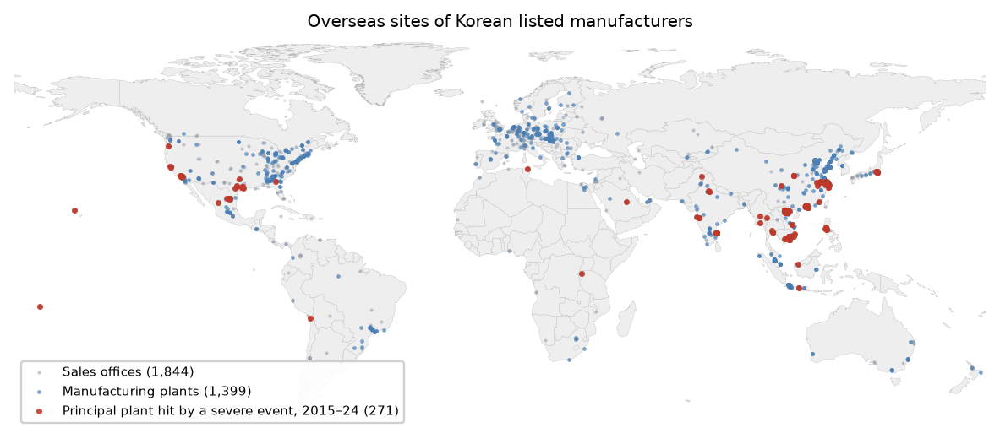
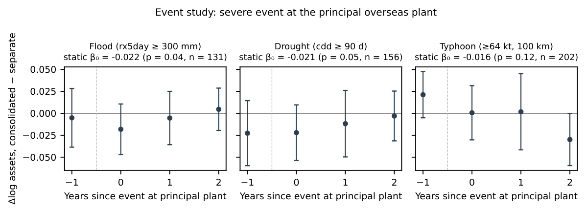
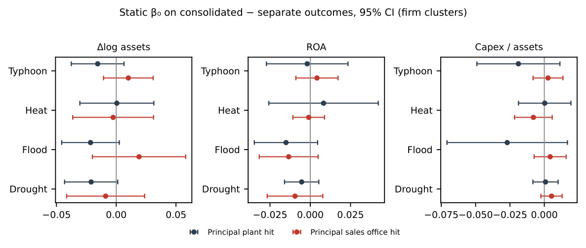
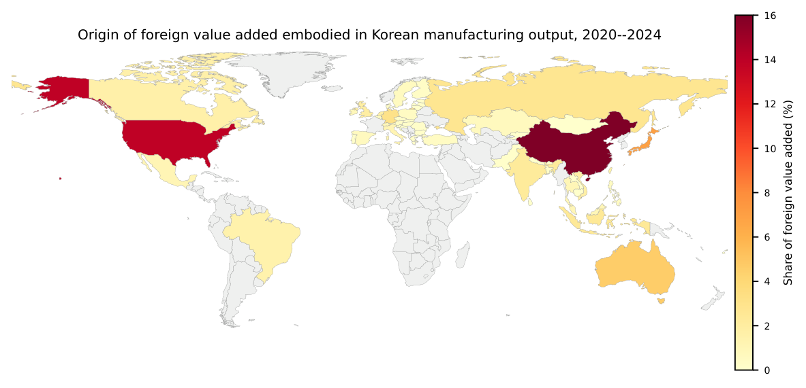
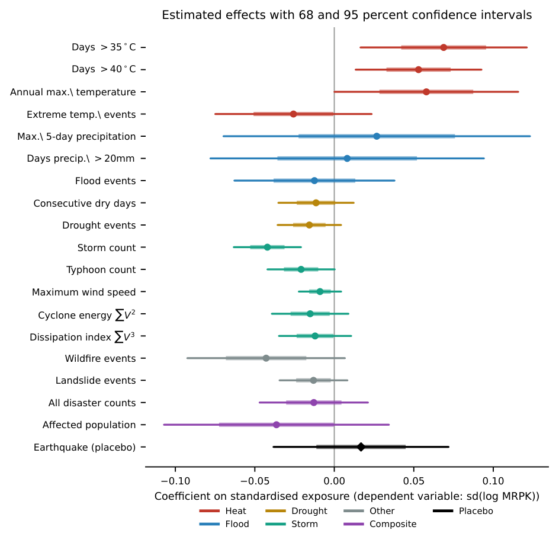

::: {.callout-note appearance="simple"}
**English version** — [Where Imported Climate Risk Stops](../2026-09-imported-climate-risk-en/)

공장과 판매법인 좌표는 상장 제조기업 사업보고서의 종속회사 표에서 추출했다. 2024년 보고서를 기준으로 하되 2024년 전에 사라진 공장은 2022년 주소를 사용했으며, 각 사업장의 일별 기상은 2015~2024년 ERA5·ERA5-Land로 산출했다. 사업체 패널은 2002~2024년 광업제조업조사이며 사용 가능한 조사연도는 21개다.
:::

## 해외에서 실현된 기후 충격은 한국 제조기업의 재무제표까지 얼마나 전달되는가?

해외에서 실현된 물리적 기후리스크는 제조업 경제에 두 경로로 닿는다. 기업은 점점 더 덥고 건조해지며 자주 침수되는 나라에서 중간재를 사들이고, 같은 나라에 공장을 두고 있다. 감독당국은 두 경로 모두를 해외 재해가 국내 재무건전성을 훼손할 수 있는 통로로 보며, 둘 다 이미 스트레스 테스트 체계에 들어와 있다.

두 경로가 실제로 유의미한 크기로 작동하는지는 실증의 문제다. 답하려면 충격이 실제로 떨어지는 지점에서 익스포저를 측정하고, 거기서부터 한 단계씩 따라가야 한다. 이 연구는 종속회사 공시를 좌표로 변환한 자료, 일별 재분석 기상, 국제산업연관표, 관세자료, 사업체 마이크로데이터를 사용해 2015~2024년 한국 제조업에 대해 그 작업을 수행한다. 가장 뚜렷한 결과는 충격이 회계에 닿은 뒤 거기서 멈춘다는 점이다. 주력 해외 공장의 극심한 홍수나 가뭄이 발생하면 연결 자산증가율이 모기업 별도 기준보다 약 2%포인트 낮아지고, 그 밖의 어떤 것도 움직이지 않는다.

### 핵심 요약

| 항목 | 값 |
|:--|--:|
| 좌표를 확보한 해외 공장 | 1,399개 |
| 주력 공장 극심 홍수 후 연결 자산증가율(별도 대비) | −2.15%포인트 |
| 수익성·설비투자·공장 존속에 대한 효과 | 없음 |
| 설비투자 최소검출효과 | 0.18σ |
| 산업 최대 해외 원산지 1σ 가무의 투입비용 효과 | 0.22% |
| 자본 오배분에서 배제되는 크기 | 분산의 2% 초과 |
| 국가평균이 태국 공장 폭염을 과대평가하는 배수 | 3.6배 |

## 1. 두 경로, 그리고 충격이 떨어지는 지점에서 측정 가능한 쪽

무역 경로는 아시아개발은행의 국제산업연관표에서 만들었다. 한국 제조업 산출에 체화된 부가가치를 원산지 국가까지 역추적하는 자료다. 해외 부가가치는 제조업 총산출의 3분의 1가량을 차지하며 — 연도에 따라 28~41%이고, 아래 희석 계산에 쓰는 기준으로는 32.8%다 — 그 해외 부분 안에서 단일 최대 원산지가 산업별로 평균 23.5%를 차지한다. 공급국의 재해지표는 각 원산지가 해당 산업의 해외 부가가치에서 차지하는 비중으로 가중하되, 날씨를 알기 전에 가중치가 확정되도록 1년 시차를 두고 합이 1이 되도록 재정규화한다. 그래야 이 측정치가 해외 조달 규모에 따라 기계적으로 커지는 값이 아니라 해당 산업 해외 공급국의 평균 리스크가 된다. 이 측정의 해상도는 국가-연도이고, 그것이 이 측정의 근본적 한계다.

소유 경로에서는 해상도를 훨씬 높일 수 있다. 한국 상장기업은 연결대상 종속회사의 주소를 모두 공시하기 때문이다. 상장 제조기업 2,240개의 사업보고서에서, 주된 사업이 생산이고 주소가 국외인 종속회사를 추리면 2,269개 레코드, 고유 주소 1,859개가 남는다.

이 주소를 좌표로 바꾸는 작업은 보기보다 어렵고, 그 어려움 자체가 공시자료로 무엇을 할 수 있는지 알려준다. 원문 주소를 그대로 지명 데이터베이스에 넣으면 48%만 도시 수준 이상의 좌표로 변환된다. 실패는 무작위가 아니다. 한국 공시는 중국·베트남 지명을 한글 음차나 한자 독음으로 표기하고, 현지에서는 통용되는 산업단지 이름이 공개 지명 데이터베이스에는 없다. 음차 사전, 주소 토큰에 대한 슬라이딩 윈도 질의, 반복 출현하는 산업단지명과 소재 도시의 매핑을 더하면 개발용 200개 표본에서 92%, 전체 주소에서 73%까지 올라간다.

실패보다 중요한 것은 두 종류의 겉보기 성공이었다. 조용히 통과하기 때문이다. 96개 레코드는 업종 필터가 걸러내지 못한 로마자 표기 국내 주소였다. 지명 데이터베이스는 이를 정확히 변환하지만, 변환된 좌표가 한국이다. 다른 96개는 주소 문자열 안에 적힌 국가명과 모순되는 국가로 변환됐다. “U.S.A”라고만 적힌 주소가 필리핀의 같은 이름 거리에 대응되고, 베트남 주소가 캐나다의 건물에 대응되는 식이다. 두 부류 모두 제거했다.

각 사업장 좌표에서 ERA5-Land 기온과 ERA5 강수·풍속의 일별 값을 산출한다. 중국 소재 사업장에 대해 코페르니쿠스 원자료와 대조한 검증에서 상관계수는 1.000, 평균제곱근 차이는 0.03℃였다. 열대저기압 익스포저는 1995~2025년 중 열대폭풍 강도, 즉 34노트 이상에 도달한 IBTrACS 폭풍 2,775개로 별도로 구성했다. 경로점이 일정 반경 안을 지나면 그 공장-연도를 노출로 본다. 그 지리적 분포는 좌표 자체에 대한 점검이 된다. 필리핀 79%, 일본 78%인 반면 중국 34%, 적도 부근 인도네시아 0.3%, 내륙 유럽 0%라는 노출률은 별도 조정 없이 열대저기압의 실제 발생 분포를 그대로 재현한다.

## 2. 국가평균은 생산이 아니라 국토를 서술한다

같은 재해를 국가-연도와 공장 좌표 두 방식으로 측정하면, 국가-연도 관행이 기업이 실제로 겪는 위험을 얼마나 잘못 말하는지 물을 수 있다. 두 값은 체계적으로 어긋나며, 폭염과 강우에서 방향이 반대다.

| 국가 | 공장 수 | 35℃ 초과일, 공장 | 35℃ 초과일, 국가 | Rx5day(mm), 공장 | Rx5day(mm), 국가 |
|:--|--:|--:|--:|--:|--:|
| 중국 | 434 | 5.8 | 7.0 | 145 | 59 |
| 미국 | 228 | 9.9 | 14.6 | 94 | 45 |
| 베트남 | 194 | 16.5 | 14.2 | 169 | 135 |
| 인도 | 78 | 74.7 | 81.1 | 173 | 132 |
| 브라질 | 19 | 7.7 | 32.5 | 116 | 90 |
| 태국 | 15 | 14.3 | 51.4 | 124 | 113 |

: 이 연구 표의 12개국 중 범위를 보여주도록 고른 6개국이다. 2015~2024년 연간값의 연도 평균. "공장"은 해당 국가 내 한국계 제조 공장 각각의 좌표에서 산출한 값의 평균이고, "국가"는 같은 재분석 자료로 산출된 세계은행 기후변화지식포털의 국가-연도 값이다. Rx5day는 최대 5일 누적강수량이다. 생략한 두 행이 요점을 더 분명히 한다. 폴란드 공장의 35℃ 초과일은 0.1일인데 국가값은 0.4일이고, 말레이시아 공장은 0일인데 국가값은 4.2일이다.

한국 공장이 더운 나라의 온대 지역이나 해안에 몰려 있는 곳에서는 국가평균이 극단 고온을 과대평가한다. 태국에서 3.6배인데, 공장이 내륙이 아니라 방콕 일대와 동부 해안에 있기 때문이다. 브라질은 4.2배다. 반대로 공장이 그 나라의 더운 지역에 있는 베트남 같은 경우에는 국가평균이 공장이 겪는 폭염을 과소평가한다. 그리고 내륙이 건조한 나라의 습한 해안에 공장이 있는 곳에서는 극단 강우를 과소평가한다. 중국의 국가 기준 5일 최대 강수량은 59mm인 반면 공장 기준은 145mm이고, 미국은 45mm 대 94mm다.

이 차이는 잡음이 아니라 생산이 어디에 자리 잡고 있는지를 그대로 반영한 결과다. 국가-연도 자료로 만든 모든 익스포저 측정치가 이 오차를 물려받으며, 이 연구의 무역 경로도 예외가 아니다. 무역 경로에서 이 편의는 폭염 효과를 찾기는 더 어렵게, 홍수 효과를 찾기는 더 쉽게 만든다. 반면 좌표에서 직접 측정한 공장 단위 결과는 이 오차에서 자유롭고, 그래서 대응하는 집계 결과보다 무게가 실린다. 국가-연도 자료로 해외 물리적 리스크를 배분하는 감독 체계는 잘못된 재해를 잘못된 기업에 배분하고 있으며, 오차의 방향은 재해마다 다르다.

## 3. 피해는 연결재무제표까지 닿고 거기서 멈춘다

소유 경로의 설계는 해외 종속회사를 포함하는 연결재무제표와 이를 제외하는 별도재무제표를 대조한다. 해외 공장의 충격이라면 앞의 것은 움직이고 뒤의 것은 움직이지 않아야 한다.

한 패턴이 두드러진다. 주력 공장에서 극심한 홍수나 가뭄이 발생한 뒤 연결 기준 자산증가율은 별도 기준보다 약 2%포인트 낮다. 구성요소의 부호도 해외에서 발생한 효과라면 나타나야 할 방향과 일치한다. 연결 기준은 떨어지고 별도 기준은 떨어지지 않는다.

| 주력 공장에서의 사건 | Δlog 자산 | ROA | 설비투자 / 전기말 자산 | 사건 수 |
|:--|--:|--:|--:|--:|
| 홍수 | −0.0215 (0.04) | −0.0151 (0.07) | −0.0270 (0.08) | 119 |
| 가뭄 | −0.0210 (0.05) | −0.0053 (0.29) | +0.0009 (0.83) | 152 |
| 태풍 | −0.0155 (0.12) | −0.0019 (0.89) | −0.0188 (0.13) | 183 |
| 폭염 | +0.0005 (0.97) | +0.0083 (0.88) | +0.0003 (0.98) | 192 |
| 태풍 ∩ 홍수 | −0.0398 (0.09) | −0.0389 (0.07) | −0.0579 (0.22) | 64 |

: 연결−별도 차이에 대한 정태 모형 계수. 기업 및 소재국×연도 고정효과 포함. 괄호 안은 와일드 클러스터 부트스트랩 p값이며 기업 군집은 474개다. 마지막 행은 태풍과 홍수가 기업-연도의 49%에서 동시에 발생하기 때문에 정의한 복합 지표이며, 매출 사전추세가 유의해 아래에서 할인한다.

차이를 움직이는 두 재해, 즉 홍수와 가뭄에 대해 별도 기준 계수는 작고 양수이며 유의하지 않은 반면(자산증가율 +0.017, +0.001) 연결 기준 구성요소는 음수다. 이 대비가 그 차이를 해외 효과로 읽는 수치적 근거다.

이 결과는 발견이 아니라 흔적으로 보고한다. 이유는 세 가지다. 사건연구 전체 표의 375개 계수 중 24개가 5% 유의수준에 도달하는데 귀무가설 하 기대치는 18.8개이고, Benjamini–Hochberg 보정을 q = 0.05에서 통과하는 계수는 없다. 가뭄의 사전추세는 사건 계수만큼 음수다. 그리고 표에서 가장 큰 계수를 갖는 태풍∩홍수 복합 지표는 매출에서 유의한 사전추세를 보인다. 깨끗한 것은 홍수 패턴뿐이다.

충격이 일으키지 않는 일은 일으키는 일보다 더 분명하게 식별된다. 연결 자산증가율 2% 하락이 생산 손실을 반영한다면 수익성에 나타나야 하고, 피해 사업장에 덜 투자하기로 한 결정이라면 설비투자에 나타나야 하며, 철수라면 공장 폐쇄에 나타나야 한다. 어디에도 나타나지 않는다.

**수익성.** 네 재해를 하나의 극단 사건 더미로 묶으면 연결−별도 계수는 −0.0005 (p = 0.96)다. 개별 재해 넷 가운데 가장 큰 홍수 계수 −0.015 (p = 0.07)는 사건이 공장이 아니라 판매법인에서 발생한 경우에도 같은 크기로 나타나므로 생산 효과가 아니다.

**설비투자.** 어느 재해도 통상적 유의수준에서 이를 움직이지 못한다. 가뭄에서는 0이 정밀하게 추정되어 +0.001 (p = 0.83), 최소검출효과 — 유의수준 5%, 검정력 80%에서 기각할 수 있는 가장 작은 계수 — 는 0.18 표준편차이며, 가장 큰 계수인 홍수 −0.027은 10%에서만 유의하며 표에 적용한 보정을 통과하지 못한다. 반응하지 않는 것은 축적된 장부가액이 아니라 투자 결정 자체다.

**공장 존속.** 2022년 사업보고서에 익스포저와 함께 기재된 1,189개 공장 중, 2022년에 극단 사건을 겪은 공장의 12.8%가 2024년 보고서에서 사라졌고 전체 소멸률은 약 15%였다. 단순 비교는 오히려 피격 공장에 유리한 방향이다. 회귀 추정치도 어느 방향으로든 더 많은 정보를 주지 않는다. 소재국 고정효과에서 +1.8%포인트 (p = 0.65), 모기업 고정효과를 추가하면 −0.3%포인트 (p = 0.96)다. 이 설계는 폐쇄율이 두 배가 되는 수준만 검출할 수 있으므로, 사다리 전체에서 가장 느슨한 경계값이다.

종합하면 연결 자산에 남은 흔적은 손상차손이다. 회계가 기록하지만 기업이 그로 인해 손실을 내지도, 투자로 대응하지도, 사업장을 떠나지도 않는 종류의 피해다.

## 4. 세 개의 위약검정이 함께 움직이는 세 교란요인을 분리한다

지진은 폭풍과 똑같이 생산설비를 파괴하지만 기후와는 무관하다. 연결재무제표는 해외 종속회사를 포함하고 별도재무제표는 제외한다. 판매법인은 공장과 같은 나라에 있지만 아무것도 생산하지 않는다. 첫 번째 대조는 성과지표가 자본 오배분인 무역 경로에서, 두 번째와 세 번째는 성과지표가 기업 재무제표인 소유 경로에서 수행한다.

| 대조 | 제거하는 교란요인 | 결과 |
|:--|:--|:--|
| 지진 대 기후재해 (무역 경로) | 재해 노출 자체의 효과 | 동등한 정밀도에서 0: +0.017, 부트스트랩 p = 0.64, 0.28σ |
| 연결 대 별도 재무제표 | 공장 소재지와 상관된 모기업 측 충격 | 연결에만 신호, 별도에는 없음 |
| 공장 대 판매법인 | 생산과 무관한 "해외 진출" 효과 | 판매법인에서 0, 태풍은 동등한 검정력 |

자산증가율의 흔적은 두 번째 검정을 통과한다. 수익성과 투자의 무효과 결과는 셋 모두를 통과한다.

## 5. 무역 경로를 거친 충격은 0.2%로 줄어든다

조달이 분산되어 있어 충격이 희석된다는 정성적 주장은 크기에 대한 질문을 남긴다. 아래 계산의 모든 항은 가정이 아니라 이 연구에서 추정한 값이다.

해외 부가가치는 한국 제조업 총산출의 32.8%다. 그 해외 부분 안에서 단일 최대 원산지가 산업별로 평균 23.5%를 차지한다. 그리고 상대국 가뭄 익스포저가 1 표준편차 증가하면 해당국으로부터의 한국 수입은 2.8% 감소한다. 이 감소가 공급 교란 때문인지 상대국 경제의 수축 때문인지는 이 산술에서 중요하지 않다. 어느 쪽이든 한국 산업이 실제로 겪는 투입 감소이기 때문이다. 세 크기를 곱하면 된다.

$$0.328 \times 0.235 \times 0.0284 = 0.22\%$$

반대로 모든 해외 공급국이 동시에 1 표준편차 가뭄을 겪는 반사실을 가정해 보자. 집중도 항을 빼면 0.93%다. 그 상한조차 투입비용을 사실상 움직이지 못한다.

희석의 배경이 되는 조달 구조는 사업자등록과 관세자료를 연결한 통계에서 직접 확인된다. 거래 상대국 수의 수입액 가중평균은 7개 산업군 중 5개에서 18~23개이고 여섯 번째가 13.1개이며, 10개국 이상과 거래하는 기업이 제조업 수입의 약 75%를 차지한다. 한 산업이 뚜렷하게 예외다. 섬유·가죽은 가중평균이 8.5개국이고 수입의 5분의 1이 단일 상대국 의존 기업에서 나온다.

가장 자연스러운 대안 설명 — 기업이 기후 스트레스를 인지하고 조달처를 바꾼다는 것으로, Pankratz and Schiller (2024)가 공급망 거래관계에서, Blaum, Esposito and Heise (2026)가 미국 제조기업 조달에서 발견한 바다 — 은 여기서 검정 가능하며 기각된다. 가뭄 스트레스를 받은 나라와의 교역은 실제로 줄지만, 수입과 수출이 같은 크기만큼 줄어든다. 이는 한국 기업의 조달처 전환이 아니라 상대국 경제의 수축이 남기는 흔적이다. 다른 재해에서는 어느 방향도 움직이지 않는다.

| 재해 | 수입 | 수출 | 수입/수출 비율 | 최소검출효과(비율) |
|:--|--:|--:|--:|--:|
| 가뭄 | −0.0284 (0.027) | −0.0282 (0.010) | −0.0008 (0.961) | 0.017 |
| 폭염 35℃ 초과 | −0.0064 (0.605) | −0.0072 (0.495) | +0.0010 (0.909) | 0.011 |
| 홍수 | +0.0006 (0.976) | +0.0002 (0.992) | −0.0010 (0.953) | 0.021 |

: 익스포저 1 표준편차당 상대국으로부터의 로그 수입액, 상대국으로의 로그 수출액, 그리고 두 값의 로그 비율. 산업×연도 및 산업×국가 고정효과 포함, 괄호 안은 부트스트랩 p값이다. 교역 금액 기준으로 약 2%를 넘는 수입에서만 나타나는 재배분은 모든 재해에서 배제된다.

수입 측에 남는 패턴이 하나 있다. 폭염은 스트레스를 받은 상대국으로부터 수입하는 한국 기업 수를 0.67% 줄이지만 수입 금액은 줄이지 않고 수출도 움직이지 않는다. 이는 국가 간 재배분이 아니라 대형 수입기업으로의 집중을 뜻한다. 이 연구는 이를 보고하되 여기에 아무것도 쌓지 않는다.

여기서 충격이 흡수되는 것은 기업이 어떻게 반응해서가 아니라 조달 구조 자체가 그렇게 짜여 있기 때문이다. 20개 원산지에서 조달하는 기업은 애초에 움직일 이유가 별로 없다. 어느 한 곳의 재해가 투입비용의 작은 몫만 움직이기 때문이다.

## 6. 대부분의 재해는 정밀한 무효과 결과이고, 홍수가 예외다

무효과 결과의 가치는 그것이 함께 제시하는 경계값만큼이다. 최소검출효과 — 유의수준 5%, 검정력 80%에서 기각할 수 있는 가장 작은 계수 — 는 재해에 따라 7배까지 차이가 나므로, 하나의 요약 수치로 말하면 증거를 잘못 전달하게 된다.

| 재해 측정 | 최소검출효과(성과지표 표준편차) | 판정 |
|:--|--:|:--|
| 최대 풍속 | 0.07 | 0으로 정밀하게 추정 |
| 가뭄 사건 수 | 0.10 | 0으로 정밀하게 추정 |
| 폭풍 횟수, 태풍 횟수 | 0.11 | 아래 참조 |
| 가뭄, 연속 무강수일 | 0.12 | 0으로 정밀하게 추정 |
| 소산지수, ACE | 0.12 | 0으로 정밀하게 추정 |
| 폭염, 40℃ 초과일 | 0.20 | **효과 발견** |
| 홍수 사건 수 | 0.26 | 중간 |
| 폭염, 35℃ 초과일 | 0.27 | **효과 발견** |
| 홍수, 20mm 초과 강수일 | 0.44 | 약함 |
| 홍수, 최대 5일 강수량 | 0.49 | 약함 |

: 논문이 보고하는 16개 행 중 일부를 정밀도 순으로 추린 것이다. 종속변수는 자본의 한계수입생산(log MRPK)의 산업 내 표준편차로, Hsieh and Klenow (2009)를 따라 사업체-연도 관측치 111만 개에서 구성했다.

이 표가 아무 결론도 허용하지 않는 지점은 강수 기반 홍수 측정치다. 0.44σ와 0.49σ로, 실현된 홍수 재해 건수로 만든 측정치의 0.26σ와 대비된다. 공급망을 교란한다고 가장 흔히 가정되는 재해이므로 이 연구는 이를 그대로 두지 않는다. 정밀도가 낮은 원인은 기계적이고 교정 가능한 것으로 드러난다. 군집 표준오차 팽창의 사실상 전부가 코크스·석유정제, 즉 익스포저 측정치가 실제 조달을 가장 적게 포괄하는 산업에서 나온다. 이 산업을 제외하면 홍수 표준오차가 0.049에서 0.021로, 최소검출효과가 0.49σ에서 0.25σ로 — 분산의 약 10%에서 4.2%로 — 줄어들며, 점추정치는 여전히 0과 구분되지 않는다. 두 번째 독립적인 교정, 즉 강수 대리변수를 전체 표본의 재해 건수로 바꾸면 0.26σ에 도달한다. 서로 다른 두 교정이 같은 곳으로 수렴하는 편이 어느 한쪽보다 안심할 만하지만, 이 연구는 그럼에도 보수적인 0.49σ를 대표 경계값으로 유지한다.

폭풍 측정치는 이 연구에서 가장 시사적인 무효과 결과다. 강도를 얼마나 무겁게 반영하는지에 따라 늘어놓으면 — 단순 횟수는 모든 폭풍을 동일하게 취급하고, 태풍 횟수는 문턱을 적용하며, 최대 풍속은 정점을 취하고, 누적에너지와 소산지수는 V²와 V³로 가중한다 — 부트스트랩 p값이 그 순서를 따라 단조 증가한다. 0.019, 0.145, 0.320, 0.479, 0.553이다.

풍해가 한국의 자본배분으로 전달되고 있다면 이 기울기는 반대로 나타나야 한다. 피해는 소산된 에너지에 비례하므로 V³ 측정치가 신호를 담아야 한다. 관측된 것은 그 반대다. 강도 정보가 전혀 없는 측정치가 통상적 유의수준에서 유의하고 — 보고된 19개 재해 측정치에 대한 보정을 거치면 유의하지 않다 — 그것도 어떤 교란 메커니즘도 예측하지 않는 음의 부호이며, 피해를 가장 잘 대표하는 측정치가 표에서 가장 약하다. 강해지는 열대저기압이 홍수 없이도 공급국에 피해를 줄 수 있다고 보는 독자에게는 직접 답할 수 있다. 그 경로는 피해가 발생하는 강도 수준에서 측정되었고, 표준편차의 약 10분의 1을 넘는 효과는 배제된다.

## 7. 극단 고온은 증거가 갈리는 지점이다

폭염은 표에서 가장 큰 계수를 만드는 재해이고, 교란 경로가 예측하는 부호를 가진 유의 계수도 폭염뿐이다. 익스포저 1 표준편차당 35℃ 초과일은 +0.069, 40℃ 초과일은 +0.053이다. 표의 점추정치는 대부분 음수이고, 양수인 두 홍수 계수는 0과 구분되지 않는다. 이 계수는 기각할 수도 받아들일 수도 없어 따로 검토가 필요하며, 세 개의 필터를 통과하고 세 곳에서 실패한다.

**통과한 것.** 다중검정 보정을 개별 측정치가 아니라 7개 재해 수준에서 적용하면 두 계수 모두 Bonferroni와 Benjamini–Hochberg 문턱을 넘는다. 반면 19개 개별 측정치 수준에서 적용하면 둘 다 넘지 못한다. 40℃ 추정치는 p = 0.003으로 문턱 0.0026에, 35℃ 추정치는 p = 0.007로 같은 문턱에 미치지 못하고, 거짓발견율 5%의 Benjamini–Hochberg 절차는 아무것도 기각하지 않는다. 이 연구는 유리한 쪽만 고르지 않고 두 답을 모두 보고하며, 어느 쪽에도 주장을 걸지 않는다. 문턱 기반 측정치는 세 성과지표 모두에서 양의 부호로 p값 0.021~0.105로 들어간다. 다만 다른 두 폭염 측정치는 호응하지 않으며 이 연구도 이를 밝힌다. 연최고기온은 유의하지 않고 (p = 0.120), EM-DAT 극단기온 사건 수는 반대 부호다 (−0.026, p = 0.325). 결과는 두 개의 재분석 문턱 측정치에만 기대고 있다. 그리고 지구물리 위약검정이 성립한다. 동일한 방식으로 만든 지진 익스포저는 +0.017, 부트스트랩 p = 0.642이며, 정밀도는 0.28σ로 폭염 측정치의 0.27σ와 사실상 같다. 폭염이 만드는 크기의 효과를 찾아낼 검정력이 있는데도 아무것도 찾지 못한다.

**실패한 것.** 세 가지 점검이 반대 방향을 가리키며, 이 연구는 그 양상을 분명히 적는다. 이 연관은 하나의 공급국에서, 두 가지 방어 가능한 익스포저 정규화 중 하나에서, 그리고 두 가지 방어 가능한 재해 표준화 중 하나에서만 성립한다.

첫째는 원산지다. 익스포저를 중국 기여분과 나머지로 나누면 효과가 전부 중국에 몰린다. +0.0859 (p = 0.039) 대 +0.0063 (p = 0.766)이다. 검정력의 문제가 아니다. 비중국 성분이 더 정밀하게 추정되며, 그 신뢰구간 [−0.036, 0.049]는 중국에서 나온 크기의 효과를 배제한다. 특정 산업 하나가 만든 결과도 아니다. 14개 산업을 하나씩 제외해도 35℃ 계수는 0.048~0.091 사이에 머물고 14번 모두 유의하다.

이 첫 번째 균열 안에 더 날카로운 문제가 있다. 폭염이 생산에 피해를 준다면 효과는 공급국이 가장 더운 곳에서 가장 커야 한다. 세 갈래로 나누면 순서가 정반대로 나온다.

| 성분 | 35℃ 초과일(장기 평균) | β | 부트스트랩 p | 최소검출효과 |
|:--|--:|--:|--:|--:|
| 중국 | 5.8 | +0.0711 | 0.042 | 0.33σ |
| 그 밖의 더운 공급국 | 높음 | −0.0373 | 0.185 | 0.24σ |
| 온대 공급국 | ≈ 0 | +0.0361 | 0.098 | 0.17σ |

: 더운 공급국은 35℃ 초과일 장기 평균이 5일 이상인 나라로, 해외 부가가치의 약 21%를 차지한다. 인도(78.7일), 호주(80.2일), 태국(43.6일), 브라질(22.1일), 미국(12.5일), 베트남(10.0일)이다. 온대 공급국에는 일본(0.6일), 독일(0.3일), 영국과 대만(둘 다 ≈ 0)이 포함된다. 분류는 장기 수준을 기준으로 하며 추정 전에 확정했다. 이 열의 35℃ 초과일은 국가 단위 장기 평균이므로 2절 표의 2015~2024년 값과는 산출 기간이 다르다.

폭염 메커니즘은 더운 곳 > 중국 > 온대의 순서를 예측한다. 자료가 주는 순서는 중국 > 온대 > 더운 곳이고, 더운 공급국 성분은 중국보다 높은 정밀도로 추정된다. 두 사실이 동시에 성립한다. 중국 안에서 그 연관은 중국의 특정 연도가 아니라 폭염에 국한되어 나타나고, 국가 간으로 보면 공급국이 실제로 겪는 폭염의 양과 아무 관계가 없다. 이 연구는 둘을 정합적으로 설명하지 못한다.

둘째는 정규화다. 재정규화한 익스포저 측정치를 정규화하지 않은 것으로 바꾸면 추정치가 살아남지 못한다 (p = 0.831, 0.587). 해외 부가가치 비중을 따로 통제해도 회복되지 않으며(−0.032, p = 0.802), 재정규화 계수는 그대로다(+0.057, p = 0.003). 가장 그럴듯한 추측이 기각된 셈이고, 이 연구는 두 구성 방식이 왜 그렇게 크게 다른지 설명할 길이 없다고 적는다.

셋째는 재해의 표준화다. 표준화 아노말리가 아니라 일수로 측정하면 계수의 부호가 뒤집히고 유의성을 잃는다. 반면 가뭄과 홍수의 무효과 결과는 같은 선택에 전혀 민감하지 않다. 이 민감성은 폭염에만 특유한데, 폭염은 기준선이 거의 0에 가까운 문턱 계수를 측정치로 쓰는 유일한 재해이기 때문이다.

공장 단위 검정도 이를 해결하지 못한다. 국가 간 표준화가 필요 없는 공장 좌표에서 폭염은 나타나지 않는다. 그러나 한국 공장은 40℃ 초과일이 드문 곳에 있으므로, 이 검정은 설계상 약하다. 이 연구 자신의 판정은 수입된 폭염이 전파된다고도, 전파되지 않는다고도 주장하지 않는다는 것이다. 이 설계가 확립하는 것은 경계값이며, 폭염은 점검 결과가 서로 엇갈리는 유일한 재해다.

## 8. 현재 증거가 허용하는 결론의 경계

**확인된 것.** 주력 해외 공장의 극심한 홍수나 가뭄은 연결 자산증가율에 약 2%포인트의 흔적을 남기며, 이 흔적은 모기업 별도재무제표에도 판매법인에도 없다. 국가평균 익스포저는 가장 더운 공급국에서 공장이 겪는 폭염을 3~4배 과대평가하고 극단 강우는 과소평가하는데, 생산이 해안과 하천 유역에 있기 때문이다. 산업의 최대 해외 원산지에서 발생한 1 표준편차 가뭄은 투입비용을 0.22% 움직이는 데 그치고, 스트레스를 받은 상대국과의 교역은 양방향으로 대칭적으로 감소한다.

**배제할 수 있는 해석.** 그 흔적이 생산 손실, 투자 축소 결정, 또는 철수를 반영한다는 해석. 수익성·설비투자·공장 존속이 모두 영이고 설비투자 영 결과는 0.18σ로 정밀하다. 한국 기업이 기후 스트레스를 받은 공급국에서 조달을 옮긴다는 해석. 약 2%를 넘는 수입에서만 나타나는 재배분은 모든 재해에서 배제된다. 해외 물리적 리스크가 국내 사업체 간 자본배분을 움직인다는 해석. 폭풍·가뭄·산사태는 분산의 2%, 홍수는 석유정제 산업의 잡음을 제거한 뒤 4~5%를 넘는 효과가 배제된다. 그리고 이것이 기후가 아니라 재해 노출 일반의 효과라는 해석. 지진은 동등한 정밀도에서 영이다.

**여전히 가능한 설명.** Baqaee and Farhi (2019)가 정식화하고 Barrot and Sauvagnat (2016), Boehm, Flaaen and Pandalai-Nayar (2019)가 기록한 생산 네트워크 증폭이 이 설계가 경계 짓는 수준 아래에서 작동할 수 있다. 보험·재고·대체 사업장을 갖출 가능성이 낮은 중소기업은 다르게 반응할 수 있으며, 표본은 종속회사를 공시하는 상장 제조기업이다. 한 분기를 눌렀다가 회계연도 안에 회복되는 교란은 연간 재무제표에 흔적을 남기지 않으므로, 자산의 흔적은 일시적 피해의 하한이다. 그리고 폭염은 이 설계가 잘못 읽는 경로를 통해 여전히 중요할 수 있다.

**미해결인 것.** 폭염 연관이 애초에 기후 효과인지 여부. 그것은 한 공급국에 국한되고 다른 곳의 공급국 기후와는 반대로 움직인다. 소유 경로에서 보험금 수령, 다른 사업장으로의 생산 이전, 재고 중 무엇이 흡수하는지. 셋 모두 수익성을 건드리지 않는 상각과 양립하며 자료는 이를 구분하지 못한다. 그리고 설명되지 않은 음의 폭풍 횟수 계수. 세 성과지표 모두에서 안정적이지만 같은 재해의 모든 강도 가중 측정치와 모순된다.

## 9. 더 긴 표본이 아니라 더 정밀한 해상도가 필요하다

위의 한계는 같은 자료를 더 오래 모은다고 해소되지 않는다. 각각이 다른 종류의 정보를 가리킨다.

**분기 이하 빈도의 성과지표.** 분기나 월 단위 재무자료는 연간 재무제표가 평균으로 지워버리는 교란을 포착하고, 일시적 피해의 하한을 추정치로 바꿀 수 있다.

**기업 단위 조달자료.** 산업 내 한계수입생산 분산은 모든 사업체에 동일하게 작용하는 충격에는 반응하지 않는다. 사업자등록에 연결된 관세자료를 기업×상대국 수준으로 쓰면 익스포저가 산업 안에서 달라질 수 있는데, 이것이 성과지표가 요구하는 조건이고 국가-연도 자료가 줄 수 없는 것이다.

**보험금 청구와 재고 기록.** 소유 경로의 세 흡수 메커니즘 후보를 분리할 수 있으며, 재무제표만으로는 할 수 없는 일이다.

**재해가 구속력을 갖는 공장.** 공장 단위 폭염 검정이 약한 것은 한국 공장이 서늘한 곳에 있기 때문이다. 인도와 태국에 있는 한국 공장의 사업장 단위 생산자료를 얻거나, 같은 설계를 더 더운 나라에 본사를 둔 기업에 적용하면 검정력이 생긴다.

**완충장치의 가격.** 충격이 흡수되는 지점 — 무역 측면의 분산된 조달, 소유 측면의 보험·재고·대체 사업장의 어떤 조합 — 은 그 자체로 유지 비용이 든다. 그 비용이야말로 이 설계가 가격을 매기지 못한 수입된 물리적 리스크의 일부이며, 감독당국이 가장 알고 싶어 할 부분이다.

## Working paper

영문 Working Paper에는 전체 추정식, 좌표 변환 파이프라인과 그 검증, 두 익스포저 측정치의 구성, 사업체 마이크로데이터로 구성 가능한 모든 성과지표와 모든 재해의 전체 격자, 그리고 각 경계값의 근거가 되는 강건성 점검이 수록되어 있다. 부록에는 음의 결과와 중단된 분석도 함께 담았다.

[PDF 내려받기](https://khdouble.github.io/files/wp/imported-physical-climate-risk-supply-chains.pdf)

### 권장 인용

> Kim, Hyun Hak (2026). "Where Imported Physical Climate Risk Stops: Supply Chains, Overseas Plants, and the Manufacturing Balance Sheet." Working Paper, September 1.

### 데이터와 코드

분석에는 공개 자료와 이용이 제한된 자료가 함께 쓰였습니다. 종속회사 공시는 금융감독원 [DART](https://dart.fss.or.kr), 일별 기상은 ERA5 및 ERA5-Land, 열대저기압 경로는 IBTrACS, 재해 기록은 재배포가 허용되지 않는 EM-DAT, 국제산업연관표는 아시아개발은행, 무역통계는 통계청 자료입니다. 사업체 패널은 통계청 [마이크로데이터 통합서비스](https://mdis.kostat.go.kr) 등록 이용자에게 제공되는 광업제조업조사 공개용 마이크로데이터이며, 이용약관상 재배포가 허용되지 않습니다.

코드와 재현 자료는 논문의 게재본과 함께 공개할 예정입니다. 그 전까지 학술적 재현·검증을 위한 공유 요청은 개별적으로 처리합니다. 문의는 [hyunhak.kim@kookmin.ac.kr](mailto:hyunhak.kim@kookmin.ac.kr)로 주시기 바랍니다.

### 연구 지원

이 연구는 기후에너지환경부 기후변화특성화대학원 사업의 일환으로 수행되었습니다.

### 참고문헌

Baqaee, D. R. and Farhi, E. (2019). The macroeconomic impact of microeconomic shocks: beyond Hulten's theorem. *Econometrica*, 87(4), 1155–1203.

Barrot, J.-N. and Sauvagnat, J. (2016). Input specificity and the propagation of idiosyncratic shocks in production networks. *Quarterly Journal of Economics*, 131(3), 1543–1592.

Blaum, J., Esposito, F. and Heise, S. (2026). Input sourcing under climate risk: evidence from U.S. manufacturing firms. *Review of Economic Studies*, forthcoming.

Boehm, C. E., Flaaen, A. and Pandalai-Nayar, N. (2019). Input linkages and the transmission of shocks: firm-level evidence from the 2011 Tōhoku earthquake. *Review of Economics and Statistics*, 101(1), 60–75.

Hsieh, C.-T. and Klenow, P. J. (2009). Misallocation and manufacturing TFP in China and India. *Quarterly Journal of Economics*, 124(4), 1403–1448.

Pankratz, N. M. C. and Schiller, C. (2024). Climate change and adaptation in global supply-chain networks. *Review of Financial Studies*, 37(6), 1729–1777.
