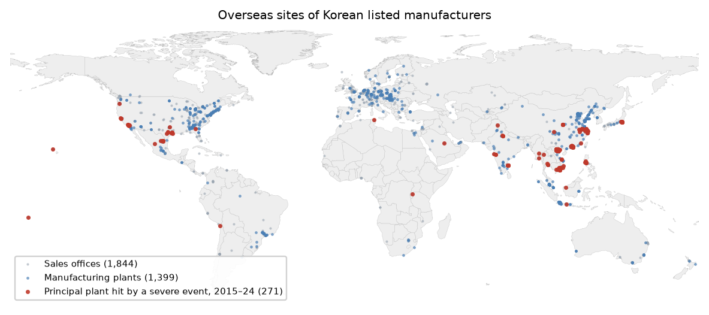
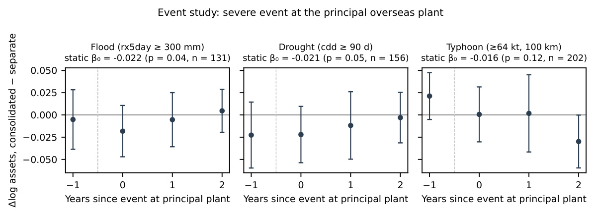
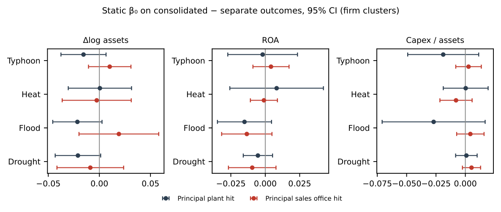
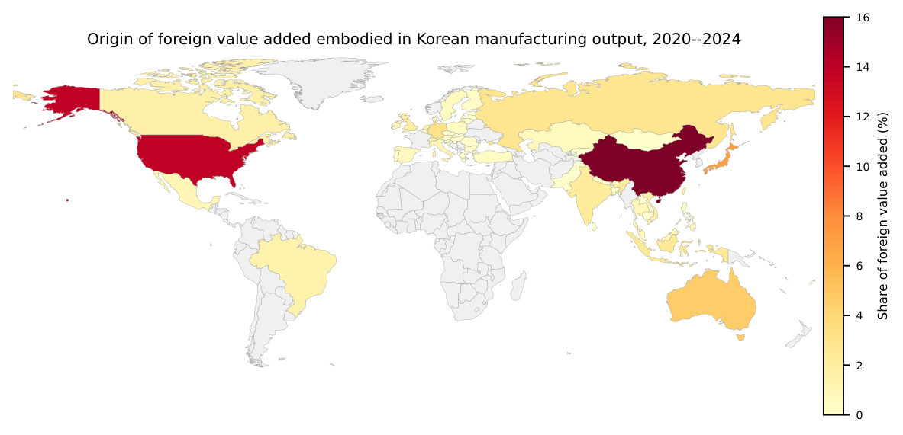
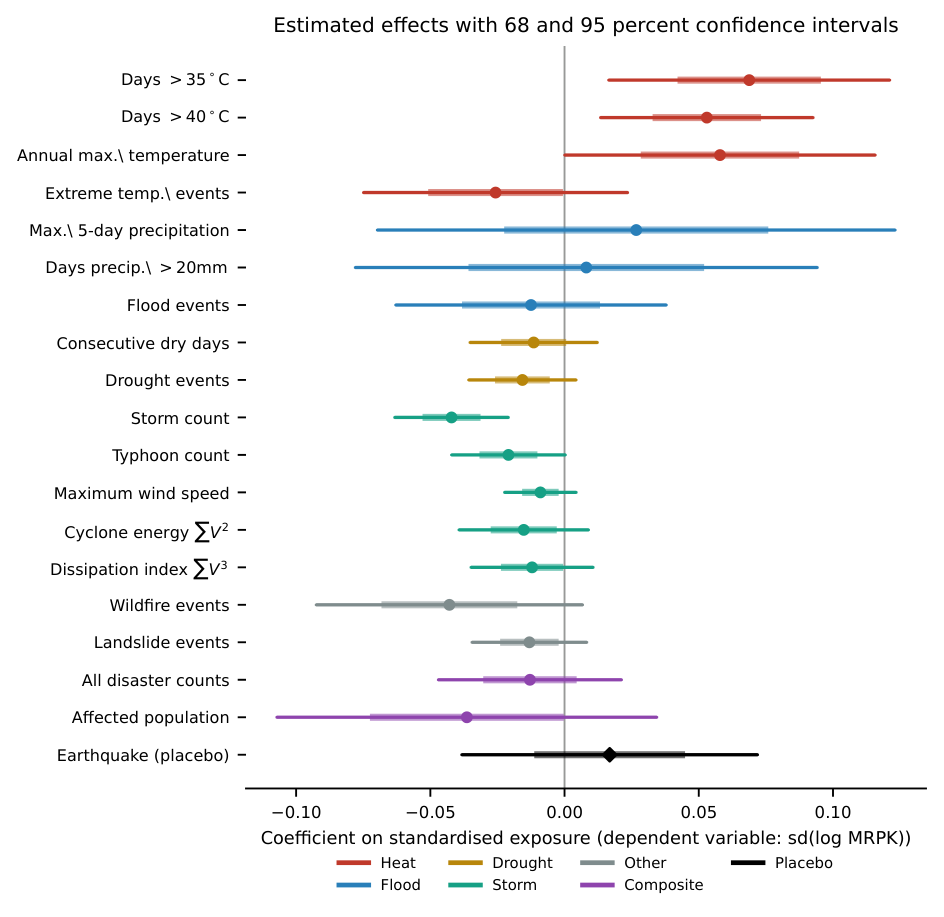

::: {.callout-note appearance="simple"}
**English version** — [Where Imported Climate Risk Stops](../2026-09-imported-climate-risk-en/)

공장 및 판매법인 좌표는 상장 제조기업 사업보고서의 종속회사 표에서 추출하였다. 2024년 보고서를 기준으로 하되 2024년 이전에 소멸한 공장은 2022년 주소를 사용하였으며, 각 사업장의 일별 기상은 2015~2024년 ERA5 및 ERA5-Land 자료로 산출하였다. 사업체 패널은 2002~2024년 광업제조업조사이며 이용 가능한 조사연도는 21개이다.
:::

## 검토 배경

해외에서 실현된 물리적 기후리스크는 두 가지 경로를 통해 제조업에 전달된다. 기업은 기온 상승과 건조화가 진행되고 침수가 빈번해지는 국가로부터 중간재를 조달하는 한편, 동일 국가에 생산설비를 보유하고 있다. 감독당국은 두 경로 모두를 해외 재해가 국내 재무건전성에 영향을 미칠 수 있는 통로로 인식하고 있으며, 양자 모두 이미 스트레스 테스트 체계에 반영되어 있다.

두 경로가 실제로 유의미한 규모로 작동하는지는 실증적으로 판단할 문제이다. 이를 위해서는 충격이 실제로 발생하는 지점에서 익스포저를 측정하고 전달 단계를 순차적으로 추적하여야 한다. 본고에서는 종속회사 공시를 좌표로 변환한 자료, 일별 재분석 기상자료, 국제산업연관표, 관세자료 및 사업체 마이크로데이터를 이용하여 2015~2024년 중 한국 제조업을 대상으로 이를 수행하였다. 분석 결과 충격은 회계에 반영된 후 더 이상 전달되지 않는 것으로 나타났다. 주력 해외 공장에서 극심한 홍수 또는 가뭄이 발생할 경우 연결 기준 자산증가율이 모기업 별도 기준보다 약 2%포인트 낮아지나, 그 외의 지표는 유의하게 반응하지 않았다.

### 주요 수치

| 항목 | 값 |
|:--|--:|
| 좌표를 확보한 해외 공장 | 1,399개 |
| 주력 공장 극심 홍수 후 연결 자산증가율(별도 대비) | −2.15%포인트 |
| 수익성·설비투자·공장 존속에 대한 효과 | 없음 |
| 설비투자 최소검출효과 | 0.18σ |
| 산업 최대 해외 원산지 1σ 가무의 투입비용 효과 | 0.22% |
| 자본 오배분에서 배제되는 크기 | 분산의 2% 초과 |
| 국가평균이 태국 공장 폭염을 과대평가하는 배수 | 3.6배 |

## 1. 두 가지 전달경로와 측정 가능성

무역 경로는 아시아개발은행의 국제산업연관표를 이용하여 구성하였다. 동 자료는 한국 제조업 산출에 체화된 부가가치를 원산지 국가까지 역추적할 수 있게 한다. 해외 부가가치는 제조업 총산출의 3분의 1가량(연도에 따라 28~41%이며, 후술하는 희석 계산에는 32.8%를 적용)을 차지하며, 해외 부분 내에서 단일 최대 원산지가 산업별로 평균 23.5%를 점한다. 공급국의 재해지표는 각 원산지가 해당 산업 해외 부가가치에서 차지하는 비중으로 가중하되, 기상 실현치를 알기 전에 가중치가 확정되도록 1년의 시차를 두고 합이 1이 되도록 재정규화하였다. 이를 통해 동 측정치는 해외 조달 규모에 따라 기계적으로 확대되는 값이 아니라 해당 산업 해외 공급국의 평균 리스크를 나타내게 된다. 다만 이 측정의 해상도는 국가-연도 수준이며, 이것이 근본적 제약으로 작용한다.

반면 소유 경로에서는 해상도를 크게 높일 수 있다. 한국 상장기업이 연결대상 종속회사의 주소를 모두 공시하기 때문이다. 상장 제조기업 2,240개의 사업보고서에서 주된 사업이 생산이고 소재지가 국외인 종속회사를 추출한 결과 2,269개 레코드, 고유 주소 1,859개가 확인되었다.

주소를 좌표로 변환하는 작업은 예상보다 까다로우며, 그 난이도 자체가 공시자료의 활용 가능성을 보여준다. 원문 주소를 그대로 지명 데이터베이스에 입력할 경우 48%만이 도시 수준 이상의 좌표로 변환된다. 변환 실패는 무작위로 발생하지 않는다. 한국 공시는 중국 및 베트남 지명을 한글 음차 또는 한자 독음으로 표기하며, 현지에서 통용되는 산업단지명이 공개 지명 데이터베이스에 등재되어 있지 않은 경우가 많다. 음차 사전, 주소 토큰에 대한 슬라이딩 윈도 질의, 반복 출현하는 산업단지명과 소재 도시의 매핑을 추가한 결과 변환율은 개발용 200개 표본에서 92%, 전체 주소에서 73%로 상승하였다.

변환 실패보다 유의해야 할 것은 두 유형의 외견상 성공 사례이다. 이들은 오류로 인식되지 않은 채 통과하기 때문이다. 96개 레코드는 업종 필터가 걸러내지 못한 로마자 표기 국내 주소였다. 지명 데이터베이스는 이를 정확히 변환하나 그 좌표는 국내에 위치한다. 다른 96개는 주소 문자열에 기재된 국가명과 상충하는 국가로 변환되었다. "U.S.A"로만 기재된 주소가 필리핀의 동일 명칭 도로에 대응되거나, 베트남 주소가 캐나다 소재 건물에 대응되는 사례이다. 두 유형 모두 제외하였다.

각 사업장 좌표에 대하여 ERA5-Land 기온과 ERA5 강수 및 풍속의 일별 값을 산출하였다. 중국 소재 사업장을 대상으로 코페르니쿠스 원자료와 대조한 결과 상관계수 1.000, 평균제곱근 차이 0.03℃로 확인되었다. 열대저기압 익스포저는 1995~2025년 중 열대폭풍 강도, 즉 34노트 이상에 도달한 IBTrACS 폭풍 2,775개를 이용하여 별도로 구성하였으며, 경로점이 일정 반경 내를 통과할 경우 해당 공장-연도를 노출로 처리하였다. 그 지리적 분포는 좌표의 정확성을 점검하는 수단이 된다. 노출률은 필리핀 79%, 일본 78%인 반면 중국 34%, 적도 인근 인도네시아 0.3%, 내륙 유럽 0%로, 별도 조정 없이 열대저기압의 실제 발생 분포를 그대로 재현한다.

## 2. 국가평균은 생산 입지가 아닌 국토를 서술한다

동일 재해를 국가-연도 단위와 공장 좌표 단위로 각각 측정하면, 통상적인 국가-연도 방식이 기업이 실제로 직면하는 위험을 어느 정도 왜곡하는지 확인할 수 있다. 두 측정치는 체계적으로 괴리되며, 폭염과 강우에서 괴리의 방향이 반대로 나타난다.

| 국가 | 공장 수 | 35℃ 초과일, 공장 | 35℃ 초과일, 국가 | Rx5day(mm), 공장 | Rx5day(mm), 국가 |
|:--|--:|--:|--:|--:|--:|
| 중국 | 434 | 5.8 | 7.0 | 145 | 59 |
| 미국 | 228 | 9.9 | 14.6 | 94 | 45 |
| 베트남 | 194 | 16.5 | 14.2 | 169 | 135 |
| 인도 | 78 | 74.7 | 81.1 | 173 | 132 |
| 브라질 | 19 | 7.7 | 32.5 | 116 | 90 |
| 태국 | 15 | 14.3 | 51.4 | 124 | 113 |

: 이 연구 표의 12개국 중 범위를 보여주도록 고른 6개국이다. 2015~2024년 연간값의 연도 평균. "공장"은 해당 국가 내 한국계 제조 공장 각각의 좌표에서 산출한 값의 평균이고, "국가"는 같은 재분석 자료로 산출된 세계은행 기후변화지식포털의 국가-연도 값이다. Rx5day는 최대 5일 누적강수량이다. 생략한 두 행이 요점을 더 분명히 한다. 폴란드 공장의 35℃ 초과일은 0.1일인데 국가값은 0.4일이고, 말레이시아 공장은 0일인데 국가값은 4.2일이다.

한국 기업의 공장이 고온 국가의 온대 지역이나 해안에 집중된 경우 국가평균은 극단 고온을 과대평가한다. 태국의 경우 3.6배에 달하는데, 공장이 내륙이 아니라 방콕 일대와 동부 해안에 소재하기 때문이다. 브라질은 4.2배이다. 반대로 공장이 해당국의 고온 지역에 소재한 베트남의 경우에는 국가평균이 공장이 실제 겪는 폭염을 과소평가한다. 또한 내륙이 건조한 국가의 습윤한 해안에 공장이 있는 경우 극단 강우를 과소평가한다. 중국의 국가 기준 5일 최대 강수량은 59mm인 반면 공장 기준은 145mm이며, 미국은 각각 45mm와 94mm이다.

이러한 괴리는 측정오차가 아니라 생산설비의 입지를 반영한 결과이다. 국가-연도 자료로 구성한 모든 익스포저 측정치가 이 오차를 승계하며, 본고의 무역 경로 역시 예외가 아니다. 무역 경로에서 이러한 편의는 폭염 효과의 탐지를 어렵게 하는 반면 홍수 효과의 탐지는 용이하게 한다. 반면 좌표에서 직접 측정한 공장 단위 결과는 이 오차로부터 자유로우므로 대응하는 집계 결과보다 신뢰도가 높다. 국가-연도 자료를 기준으로 해외 물리적 리스크를 배분하는 감독 체계는 실제와 다른 재해를 실제와 다른 기업에 배분하고 있으며, 오차의 방향은 재해별로 상이하다.

## 3. 피해는 연결재무제표까지 전달된 후 소멸한다

소유 경로의 식별전략은 해외 종속회사를 포함하는 연결재무제표와 이를 제외하는 별도재무제표를 대조하는 것이다. 해외 공장에서 발생한 충격이라면 전자는 반응하고 후자는 반응하지 않아야 한다.

분석 결과 한 가지 패턴이 뚜렷하게 나타난다. 주력 공장에서 극심한 홍수 또는 가뭄이 발생한 이후 연결 기준 자산증가율은 별도 기준 대비 약 2%포인트 낮게 나타난다. 구성요소의 부호 역시 해외에서 발생한 효과라면 예상되는 방향과 일치한다. 즉 연결 기준은 하락하는 반면 별도 기준은 하락하지 않는다.

| 주력 공장에서의 사건 | Δlog 자산 | ROA | 설비투자 / 전기말 자산 | 사건 수 |
|:--|--:|--:|--:|--:|
| 홍수 | −0.0215 (0.04) | −0.0151 (0.07) | −0.0270 (0.08) | 119 |
| 가뭄 | −0.0210 (0.05) | −0.0053 (0.29) | +0.0009 (0.83) | 152 |
| 태풍 | −0.0155 (0.12) | −0.0019 (0.89) | −0.0188 (0.13) | 183 |
| 폭염 | +0.0005 (0.97) | +0.0083 (0.88) | +0.0003 (0.98) | 192 |
| 태풍 ∩ 홍수 | −0.0398 (0.09) | −0.0389 (0.07) | −0.0579 (0.22) | 64 |

: 연결−별도 차이에 대한 정태 모형 계수. 기업 및 소재국×연도 고정효과 포함. 괄호 안은 와일드 클러스터 부트스트랩 p값이며 기업 군집은 474개다. 마지막 행은 태풍과 홍수가 기업-연도의 49%에서 동시에 발생하기 때문에 정의한 복합 지표이며, 매출 사전추세가 유의해 아래에서 할인한다.

격차를 발생시키는 두 재해, 즉 홍수와 가뭄의 경우 별도 기준 계수는 작은 양(+)의 값으로 유의하지 않은 반면(자산증가율 +0.017, +0.001), 연결 기준 구성요소는 음(−)의 값을 보인다. 이러한 대비가 동 격차를 해외 효과로 해석하는 수치적 근거이다.

다만 본고는 이를 확정적 결과가 아니라 흔적으로 보고한다. 근거는 세 가지이다. 첫째, 사건연구 전체 표의 375개 계수 중 24개가 5% 유의수준에 도달하나 귀무가설 하 기대치가 18.8개이며, Benjamini–Hochberg 보정을 q = 0.05에서 통과하는 계수는 없다. 둘째, 가뭄의 사전추세가 사건 계수와 동일한 크기의 음(−)의 값을 보인다. 셋째, 표에서 계수가 가장 큰 태풍∩홍수 복합 지표는 매출에서 유의한 사전추세를 나타낸다. 이러한 점검을 모두 통과하는 것은 홍수 패턴뿐이다.

충격이 유발하지 않는 결과는 유발하는 결과보다 명확하게 식별된다. 연결 자산증가율 2% 하락이 생산 손실을 반영한다면 수익성에, 피해 사업장에 대한 투자 축소 결정이라면 설비투자에, 철수라면 공장 폐쇄에 각각 나타나야 한다. 그러나 어느 지표에서도 확인되지 않는다.

**수익성.** 네 재해를 하나의 극단 사건 더미로 묶으면 연결−별도 계수는 −0.0005 (p = 0.96)다. 개별 재해 넷 가운데 가장 큰 홍수 계수 −0.015 (p = 0.07)는 사건이 공장이 아니라 판매법인에서 발생한 경우에도 같은 크기로 나타나므로 생산 효과가 아니다.

**설비투자.** 어느 재해도 통상적 유의수준에서 이를 움직이지 못한다. 가뭄에서는 0이 정밀하게 추정되어 +0.001 (p = 0.83), 최소검출효과 — 유의수준 5%, 검정력 80%에서 기각할 수 있는 가장 작은 계수 — 는 0.18 표준편차이며, 가장 큰 계수인 홍수 −0.027은 10%에서만 유의하며 표에 적용한 보정을 통과하지 못한다. 반응하지 않는 것은 축적된 장부가액이 아니라 투자 결정 자체다.

**공장 존속.** 2022년 사업보고서에 익스포저와 함께 기재된 1,189개 공장 중, 2022년에 극단 사건을 겪은 공장의 12.8%가 2024년 보고서에서 사라졌고 전체 소멸률은 약 15%였다. 단순 비교는 오히려 피격 공장에 유리한 방향이다. 회귀 추정치도 어느 방향으로든 더 많은 정보를 주지 않는다. 소재국 고정효과에서 +1.8%포인트 (p = 0.65), 모기업 고정효과를 추가하면 −0.3%포인트 (p = 0.96)다. 이 설계는 폐쇄율이 두 배가 되는 수준만 검출할 수 있으므로, 사다리 전체에서 가장 느슨한 경계값이다.

종합하면 연결 자산에 남은 흔적은 손상차손으로 판단된다. 회계상으로는 기록되나 기업이 이로 인해 손실을 시현하거나, 투자로 대응하거나, 사업장을 철수하지는 않는 유형의 피해이다.

## 4. 세 가지 위약검정으로 교란요인을 분리하였다

지진은 폭풍과 동일하게 생산설비를 파괴하나 기후와는 무관하다. 연결재무제표는 해외 종속회사를 포함하는 반면 별도재무제표는 이를 제외한다. 판매법인은 공장과 동일 국가에 소재하나 생산활동을 하지 않는다. 첫 번째 대조는 성과지표가 자본 오배분인 무역 경로에서, 두 번째와 세 번째는 성과지표가 기업 재무제표인 소유 경로에서 각각 수행하였다.

| 대조 | 제거하는 교란요인 | 결과 |
|:--|:--|:--|
| 지진 대 기후재해 (무역 경로) | 재해 노출 자체의 효과 | 동등한 정밀도에서 0: +0.017, 부트스트랩 p = 0.64, 0.28σ |
| 연결 대 별도 재무제표 | 공장 소재지와 상관된 모기업 측 충격 | 연결에만 신호, 별도에는 없음 |
| 공장 대 판매법인 | 생산과 무관한 "해외 진출" 효과 | 판매법인에서 0, 태풍은 동등한 검정력 |

자산증가율의 흔적은 두 번째 검정을 통과한다. 수익성과 투자의 무효과 결과는 세 검정을 모두 통과한다.

## 5. 무역 경로를 거친 충격은 0.2% 수준으로 축소된다

조달처가 분산되어 있어 충격이 희석된다는 정성적 설명은 그 크기에 대한 의문을 남긴다. 아래 계산에 사용된 모든 항은 가정치가 아니라 본고에서 추정한 값이다.

해외 부가가치는 한국 제조업 총산출의 32.8%를 차지한다. 해외 부분 내에서 단일 최대 원산지가 산업별로 평균 23.5%를 점한다. 또한 상대국 가뭄 익스포저가 1 표준편차 증가할 경우 해당국으로부터의 한국 수입은 2.8% 감소한다. 이 감소가 공급 교란에 기인하는지 상대국 경제의 위축에 기인하는지는 본 계산에서 중요하지 않다. 어느 경우이든 한국 산업이 실제로 직면하는 투입 감소이기 때문이다. 세 값을 곱하여 산출한다.

$$0.328 \times 0.235 \times 0.0284 = 0.22\%$$

한편 모든 해외 공급국이 동시에 1 표준편차 가뭄을 겪는 반사실을 상정할 경우, 집중도 항을 제외하면 0.93%가 산출된다. 이러한 상한값조차 투입비용에 실질적인 영향을 미치지 못한다.

희석의 배경이 되는 조달 구조는 사업자등록 자료와 관세자료를 연결한 통계에서 직접 확인된다. 거래 상대국 수의 수입액 가중평균은 7개 산업군 중 5개에서 18~23개, 나머지 하나가 13.1개이며, 10개국 이상과 거래하는 기업이 제조업 수입의 약 75%를 차지한다. 다만 한 산업은 뚜렷한 예외이다. 섬유·가죽은 가중평균이 8.5개국이며 수입의 5분의 1이 단일 상대국에 의존하는 기업에서 발생한다.

가장 자연스러운 대안 설명 — 기업이 기후 스트레스를 인지하고 조달처를 바꾼다는 것으로, Pankratz and Schiller (2024)가 공급망 거래관계에서, Blaum, Esposito and Heise (2026)가 미국 제조기업 조달에서 발견한 바다 — 은 여기서 검정 가능하며 기각된다. 가뭄 스트레스를 받은 나라와의 교역은 실제로 줄지만, 수입과 수출이 같은 크기만큼 줄어든다. 이는 한국 기업의 조달처 전환이 아니라 상대국 경제의 수축이 남기는 흔적이다. 다른 재해에서는 어느 방향도 움직이지 않는다.

| 재해 | 수입 | 수출 | 수입/수출 비율 | 최소검출효과(비율) |
|:--|--:|--:|--:|--:|
| 가뭄 | −0.0284 (0.027) | −0.0282 (0.010) | −0.0008 (0.961) | 0.017 |
| 폭염 35℃ 초과 | −0.0064 (0.605) | −0.0072 (0.495) | +0.0010 (0.909) | 0.011 |
| 홍수 | +0.0006 (0.976) | +0.0002 (0.992) | −0.0010 (0.953) | 0.021 |

: 익스포저 1 표준편차당 상대국으로부터의 로그 수입액, 상대국으로의 로그 수출액, 그리고 두 값의 로그 비율. 산업×연도 및 산업×국가 고정효과 포함, 괄호 안은 부트스트랩 p값이다. 교역 금액 기준으로 약 2%를 넘는 수입에서만 나타나는 재배분은 모든 재해에서 배제된다.

수입 측면에서 한 가지 패턴이 확인된다. 폭염은 스트레스를 받은 상대국으로부터 수입하는 한국 기업 수를 0.67% 감소시키나 수입 금액은 감소시키지 않으며 수출에도 영향을 미치지 않는다. 이는 국가 간 재배분이 아니라 대형 수입기업으로의 집중을 의미한다. 본고는 이를 보고하되 이에 기초한 추가적 해석은 제시하지 않는다.

충격이 흡수되는 것은 기업의 대응 때문이 아니라 조달 구조 자체에 기인한다. 20개 원산지에서 조달하는 기업은 조달처를 변경할 유인이 크지 않다. 특정 국가의 재해가 투입비용의 일부만을 변동시키기 때문이다.

## 6. 대부분의 재해는 정밀한 무효과 결과이며 홍수가 예외이다

무효과 결과의 가치는 함께 제시되는 경계값에 의해 결정된다. 최소검출효과(유의수준 5%, 검정력 80%에서 기각 가능한 최소 계수)는 재해에 따라 최대 7배의 차이를 보이므로, 이를 단일 요약치로 제시할 경우 증거를 잘못 전달하게 된다.

| 재해 측정 | 최소검출효과(성과지표 표준편차) | 판정 |
|:--|--:|:--|
| 최대 풍속 | 0.07 | 0으로 정밀하게 추정 |
| 가뭄 사건 수 | 0.10 | 0으로 정밀하게 추정 |
| 폭풍 횟수, 태풍 횟수 | 0.11 | 아래 참조 |
| 가뭄, 연속 무강수일 | 0.12 | 0으로 정밀하게 추정 |
| 소산지수, ACE | 0.12 | 0으로 정밀하게 추정 |
| 폭염, 40℃ 초과일 | 0.20 | **효과 발견** |
| 홍수 사건 수 | 0.26 | 중간 |
| 폭염, 35℃ 초과일 | 0.27 | **효과 발견** |
| 홍수, 20mm 초과 강수일 | 0.44 | 약함 |
| 홍수, 최대 5일 강수량 | 0.49 | 약함 |

: 논문이 보고하는 16개 행 중 일부를 정밀도 순으로 선별한 것이다. 종속변수는 자본의 한계수입생산(log MRPK)의 산업 내 표준편차로, Hsieh and Klenow (2009)를 따라 사업체-연도 관측치 111만 개에서 구성하였다.

동 표에서 결론을 도출할 수 없는 부분은 강수 기반 홍수 측정치이다. 0.44σ 및 0.49σ로, 실현된 홍수 재해 건수로 구성한 측정치의 0.26σ와 대비된다. 공급망 교란의 주된 원인으로 가장 흔히 상정되는 재해이므로 본고는 이를 추가로 검토하였다. 정밀도 저하의 원인은 기계적이며 교정 가능한 것으로 확인되었다. 군집 표준오차 확대의 대부분이 코크스·석유정제, 즉 익스포저 측정치가 실제 조달을 가장 적게 포괄하는 산업에서 발생한다. 동 산업을 제외할 경우 홍수 표준오차는 0.049에서 0.021로, 최소검출효과는 0.49σ에서 0.25σ로(분산의 약 10%에서 4.2%로) 축소되며, 점추정치는 여전히 0과 구별되지 않는다. 두 번째 독립적 교정, 즉 강수 대리변수를 전체 표본의 재해 건수로 대체할 경우 0.26σ에 도달한다. 상이한 두 교정이 동일한 수준으로 수렴한다는 점은 어느 한쪽보다 신뢰할 만하나, 본고는 보수적으로 0.49σ를 대표 경계값으로 유지한다.

폭풍 측정치는 본고에서 가장 시사적인 무효과 결과이다. 강도 반영 정도에 따라 측정치를 배열하면(단순 횟수는 모든 폭풍을 동일하게 취급, 태풍 횟수는 문턱 적용, 최대 풍속은 정점 사용, 누적에너지와 소산지수는 각각 V²와 V³로 가중) 부트스트랩 p값이 그 순서를 따라 단조 증가한다. 각각 0.019, 0.145, 0.320, 0.479, 0.553이다.

풍해가 한국의 자본배분으로 전달되고 있다면 이러한 기울기는 반대 방향으로 나타나야 한다. 피해는 소산된 에너지에 비례하므로 V³ 측정치가 신호를 포함하여야 하기 때문이다. 그러나 관측된 결과는 이와 상반된다. 강도 정보를 전혀 포함하지 않는 측정치가 통상적 유의수준에서 유의하며(보고된 19개 재해 측정치에 대한 보정을 적용하면 유의하지 않다), 그 부호 또한 어떠한 교란 메커니즘도 예측하지 않는 음(−)이고, 피해를 가장 잘 대표하는 측정치가 표에서 가장 약하게 나타난다. 강도가 높아진 열대저기압이 홍수를 수반하지 않고도 공급국에 피해를 줄 수 있다는 견해에 대해서는 다음과 같이 답할 수 있다. 해당 경로는 피해가 발생하는 강도 수준에서 측정되었으며, 표준편차의 약 10분의 1을 상회하는 효과는 배제된다.

## 7. 극단 고온은 증거가 엇갈리는 부분이다

폭염은 표에서 계수가 가장 큰 재해이며, 교란 경로가 예측하는 부호를 갖는 유의 계수도 폭염이 유일하다. 익스포저 1 표준편차당 35℃ 초과일은 +0.069, 40℃ 초과일은 +0.053이다. 표의 점추정치는 대부분 음(−)이며, 양(+)인 두 홍수 계수는 0과 구별되지 않는다. 동 계수는 기각하기도 수용하기도 어려워 별도의 검토가 필요하며, 세 가지 점검은 통과하나 다른 세 가지에서는 성립하지 않는다.

**통과한 것.** 다중검정 보정을 개별 측정치가 아니라 7개 재해 수준에서 적용하면 두 계수 모두 Bonferroni와 Benjamini–Hochberg 문턱을 넘는다. 반면 19개 개별 측정치 수준에서 적용하면 둘 다 넘지 못한다. 40℃ 추정치는 p = 0.003으로 문턱 0.0026에, 35℃ 추정치는 p = 0.007로 같은 문턱에 미치지 못하고, 거짓발견율 5%의 Benjamini–Hochberg 절차는 아무것도 기각하지 않는다. 이 연구는 유리한 쪽만 고르지 않고 두 답을 모두 보고하며, 어느 쪽에도 주장을 걸지 않는다. 문턱 기반 측정치는 세 성과지표 모두에서 양의 부호로 p값 0.021~0.105로 들어간다. 다만 다른 두 폭염 측정치는 호응하지 않으며 이 연구도 이를 밝힌다. 연최고기온은 유의하지 않고 (p = 0.120), EM-DAT 극단기온 사건 수는 반대 부호다 (−0.026, p = 0.325). 결과는 두 개의 재분석 문턱 측정치에만 기대고 있다. 그리고 지구물리 위약검정이 성립한다. 동일한 방식으로 만든 지진 익스포저는 +0.017, 부트스트랩 p = 0.642이며, 정밀도는 0.28σ로 폭염 측정치의 0.27σ와 사실상 같다. 폭염이 만드는 크기의 효과를 찾아낼 검정력이 있는데도 아무것도 찾지 못한다.

**실패한 것.** 세 가지 점검이 반대 방향을 가리키며, 이 연구는 그 양상을 분명히 적는다. 이 연관은 하나의 공급국에서, 두 가지 방어 가능한 익스포저 정규화 중 하나에서, 그리고 두 가지 방어 가능한 재해 표준화 중 하나에서만 성립한다.

첫째는 원산지이다. 익스포저를 중국 기여분과 그 외로 분할할 경우 효과가 전적으로 중국에 집중된다. 각각 +0.0859 (p = 0.039)와 +0.0063 (p = 0.766)이다. 이는 검정력의 문제가 아니다. 비중국 성분이 더 정밀하게 추정되며, 그 신뢰구간 [−0.036, 0.049]는 중국에서 나타난 크기의 효과를 배제한다. 특정 산업에 기인한 결과도 아니다. 14개 산업을 순차적으로 제외하여도 35℃ 계수는 0.048~0.091 범위에 유지되며 14회 모두 유의하다.

이 첫 번째 문제 안에 보다 근본적인 쟁점이 있다. 폭염이 생산에 피해를 준다면 효과는 공급국의 기온이 가장 높은 경우에 가장 크게 나타나야 한다. 그러나 세 부분으로 분할하면 순서가 정반대로 확인된다.

| 성분 | 35℃ 초과일(장기 평균) | β | 부트스트랩 p | 최소검출효과 |
|:--|--:|--:|--:|--:|
| 중국 | 5.8 | +0.0711 | 0.042 | 0.33σ |
| 그 밖의 더운 공급국 | 높음 | −0.0373 | 0.185 | 0.24σ |
| 온대 공급국 | ≈ 0 | +0.0361 | 0.098 | 0.17σ |

: 더운 공급국은 35℃ 초과일 장기 평균이 5일 이상인 나라로, 해외 부가가치의 약 21%를 차지한다. 인도(78.7일), 호주(80.2일), 태국(43.6일), 브라질(22.1일), 미국(12.5일), 베트남(10.0일)이다. 온대 공급국에는 일본(0.6일), 독일(0.3일), 영국과 대만(둘 다 ≈ 0)이 포함된다. 분류는 장기 수준을 기준으로 하며 추정 이전에 확정하였다. 이 열의 35℃ 초과일은 국가 단위 장기 평균이므로 2절 표의 2015~2024년 값과는 산출 기간이 다르다.

폭염 메커니즘은 고온 국가 > 중국 > 온대 국가의 순서를 예측한다. 그러나 자료가 제시하는 순서는 중국 > 온대 국가 > 고온 국가이며, 고온 공급국 성분은 중국보다 높은 정밀도로 추정된다. 두 사실이 동시에 성립한다. 중국 내에서 동 연관은 특정 연도가 아니라 폭염에 국한되어 나타나는 반면, 국가 간으로는 공급국이 실제 겪는 폭염의 정도와 무관하다. 본고는 이 두 가지를 정합적으로 설명하지 못한다.

둘째는 정규화 방식이다. 재정규화한 익스포저 측정치를 정규화하지 않은 측정치로 대체하면 추정치가 유지되지 않는다 (p = 0.831, 0.587). 해외 부가가치 비중을 별도로 통제하여도 회복되지 않으며(−0.032, p = 0.802), 재정규화 계수는 변하지 않는다(+0.057, p = 0.003). 가장 유력한 설명이 기각된 것이며, 본고는 두 구성 방식 간 차이가 이처럼 큰 이유를 설명하지 못함을 명시한다.

셋째는 재해의 표준화 방식이다. 표준화 아노말리가 아니라 일수로 측정하면 계수의 부호가 반전되고 유의성이 상실된다. 반면 가뭄과 홍수의 무효과 결과는 동일한 선택에 전혀 민감하지 않다. 이러한 민감성은 폭염에 국한되는데, 폭염은 기준선이 0에 가까운 문턱 계수를 측정치로 사용하는 유일한 재해이기 때문이다.

공장 단위 검정으로도 이를 해결하지 못한다. 국가 간 표준화가 불필요한 공장 좌표에서는 폭염 효과가 나타나지 않는다. 다만 한국 기업의 공장은 40℃ 초과일이 드문 지역에 소재하므로 동 검정은 설계상 검정력이 낮다. 따라서 본고는 수입된 폭염이 전파된다고도, 전파되지 않는다고도 주장하지 않는다. 본 설계가 확립하는 것은 경계값이며, 폭염은 점검 결과가 상호 엇갈리는 유일한 재해이다.

## 8. 현 시점의 증거가 뒷받침하는 결론의 범위

**확인된 것.** 주력 해외 공장의 극심한 홍수나 가뭄은 연결 자산증가율에 약 2%포인트의 흔적을 남기며, 이 흔적은 모기업 별도재무제표에도 판매법인에도 없다. 국가평균 익스포저는 가장 더운 공급국에서 공장이 겪는 폭염을 3~4배 과대평가하고 극단 강우는 과소평가하는데, 생산이 해안과 하천 유역에 있기 때문이다. 산업의 최대 해외 원산지에서 발생한 1 표준편차 가뭄은 투입비용을 0.22% 움직이는 데 그치고, 스트레스를 받은 상대국과의 교역은 양방향으로 대칭적으로 감소한다.

**배제할 수 있는 해석.** 그 흔적이 생산 손실, 투자 축소 결정, 또는 철수를 반영한다는 해석. 수익성·설비투자·공장 존속이 모두 영이고 설비투자 영 결과는 0.18σ로 정밀하다. 한국 기업이 기후 스트레스를 받은 공급국에서 조달을 옮긴다는 해석. 약 2%를 넘는 수입에서만 나타나는 재배분은 모든 재해에서 배제된다. 해외 물리적 리스크가 국내 사업체 간 자본배분을 움직인다는 해석. 폭풍·가뭄·산사태는 분산의 2%, 홍수는 석유정제 산업의 잡음을 제거한 뒤 4~5%를 넘는 효과가 배제된다. 그리고 이것이 기후가 아니라 재해 노출 일반의 효과라는 해석. 지진은 동등한 정밀도에서 영이다.

**여전히 가능한 설명.** Baqaee and Farhi (2019)가 정식화하고 Barrot and Sauvagnat (2016), Boehm, Flaaen and Pandalai-Nayar (2019)가 기록한 생산 네트워크 증폭이 이 설계가 경계 짓는 수준 아래에서 작동할 수 있다. 보험·재고·대체 사업장을 갖출 가능성이 낮은 중소기업은 다르게 반응할 수 있으며, 표본은 종속회사를 공시하는 상장 제조기업이다. 한 분기를 눌렀다가 회계연도 안에 회복되는 교란은 연간 재무제표에 흔적을 남기지 않으므로, 자산의 흔적은 일시적 피해의 하한이다. 그리고 폭염은 이 설계가 잘못 읽는 경로를 통해 여전히 중요할 수 있다.

**미해결인 것.** 폭염 연관이 애초에 기후 효과인지 여부. 그것은 한 공급국에 국한되고 다른 곳의 공급국 기후와는 반대로 움직인다. 소유 경로에서 보험금 수령, 다른 사업장으로의 생산 이전, 재고 중 무엇이 흡수하는지. 셋 모두 수익성을 건드리지 않는 상각과 양립하며 자료는 이를 구분하지 못한다. 그리고 설명되지 않은 음의 폭풍 횟수 계수. 세 성과지표 모두에서 안정적이지만 같은 재해의 모든 강도 가중 측정치와 모순된다.

## 9. 더 긴 표본이 아니라 더 정밀한 해상도가 필요하다

위의 한계는 같은 자료를 더 오래 모은다고 해소되지 않는다. 각각이 다른 종류의 정보를 가리킨다.

**분기 이하 빈도의 성과지표.** 분기나 월 단위 재무자료는 연간 재무제표가 평균으로 지워버리는 교란을 포착하고, 일시적 피해의 하한을 추정치로 바꿀 수 있다.

**기업 단위 조달자료.** 산업 내 한계수입생산 분산은 모든 사업체에 동일하게 작용하는 충격에는 반응하지 않는다. 사업자등록에 연결된 관세자료를 기업×상대국 수준으로 쓰면 익스포저가 산업 안에서 달라질 수 있는데, 이것이 성과지표가 요구하는 조건이고 국가-연도 자료가 줄 수 없는 것이다.

**보험금 청구와 재고 기록.** 소유 경로의 세 흡수 메커니즘 후보를 분리할 수 있으며, 재무제표만으로는 할 수 없는 일이다.

**재해가 구속력을 갖는 공장.** 공장 단위 폭염 검정이 약한 것은 한국 공장이 서늘한 곳에 있기 때문이다. 인도와 태국에 있는 한국 공장의 사업장 단위 생산자료를 얻거나, 같은 설계를 더 더운 나라에 본사를 둔 기업에 적용하면 검정력이 생긴다.

**완충장치의 가격.** 충격이 흡수되는 지점 — 무역 측면의 분산된 조달, 소유 측면의 보험·재고·대체 사업장의 어떤 조합 — 은 그 자체로 유지 비용이 든다. 그 비용이야말로 이 설계가 가격을 매기지 못한 수입된 물리적 리스크의 일부이며, 감독당국이 가장 알고 싶어 할 부분이다.

## Working paper

영문 Working Paper에는 전체 추정식, 좌표 변환 파이프라인과 그 검증, 두 익스포저 측정치의 구성, 사업체 마이크로데이터로 구성 가능한 모든 성과지표와 모든 재해의 전체 격자, 그리고 각 경계값의 근거가 되는 강건성 점검이 수록되어 있다. 부록에는 음의 결과와 중단된 분석도 함께 담았다.

[PDF 내려받기](https://khdouble.github.io/files/wp/imported-physical-climate-risk-supply-chains.pdf)

### 권장 인용

> Kim, Hyun Hak (2026). "Where Imported Physical Climate Risk Stops: Supply Chains, Overseas Plants, and the Manufacturing Balance Sheet." Working Paper, September 1.

### 데이터와 코드

분석에는 공개 자료와 이용이 제한된 자료가 함께 쓰였습니다. 종속회사 공시는 금융감독원 [DART](https://dart.fss.or.kr), 일별 기상은 ERA5 및 ERA5-Land, 열대저기압 경로는 IBTrACS, 재해 기록은 재배포가 허용되지 않는 EM-DAT, 국제산업연관표는 아시아개발은행, 무역통계는 통계청 자료입니다. 사업체 패널은 통계청 [마이크로데이터 통합서비스](https://mdis.kostat.go.kr) 등록 이용자에게 제공되는 광업제조업조사 공개용 마이크로데이터이며, 이용약관상 재배포가 허용되지 않습니다.

코드와 재현 자료는 논문의 게재본과 함께 공개할 예정입니다. 그 전까지 학술적 재현·검증을 위한 공유 요청은 개별적으로 처리합니다. 문의는 [hyunhak.kim@kookmin.ac.kr](mailto:hyunhak.kim@kookmin.ac.kr)로 주시기 바랍니다.

### 연구 지원

이 연구는 기후에너지환경부 기후변화특성화대학원 사업의 일환으로 수행되었습니다.

### 참고문헌

Baqaee, D. R. and Farhi, E. (2019). The macroeconomic impact of microeconomic shocks: beyond Hulten's theorem. *Econometrica*, 87(4), 1155–1203.

Barrot, J.-N. and Sauvagnat, J. (2016). Input specificity and the propagation of idiosyncratic shocks in production networks. *Quarterly Journal of Economics*, 131(3), 1543–1592.

Blaum, J., Esposito, F. and Heise, S. (2026). Input sourcing under climate risk: evidence from U.S. manufacturing firms. *Review of Economic Studies*, forthcoming.

Boehm, C. E., Flaaen, A. and Pandalai-Nayar, N. (2019). Input linkages and the transmission of shocks: firm-level evidence from the 2011 Tōhoku earthquake. *Review of Economics and Statistics*, 101(1), 60–75.

Hsieh, C.-T. and Klenow, P. J. (2009). Misallocation and manufacturing TFP in China and India. *Quarterly Journal of Economics*, 124(4), 1403–1448.

Pankratz, N. M. C. and Schiller, C. (2024). Climate change and adaptation in global supply-chain networks. *Review of Financial Studies*, 37(6), 1729–1777.
