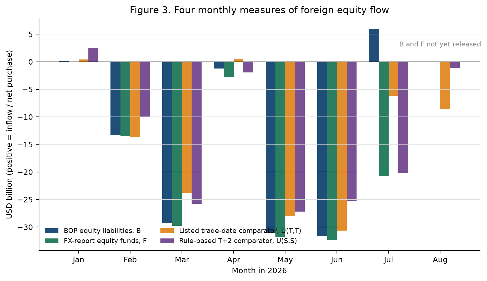

::: {.callout-note appearance="simple"}
**한국어판** — [환율 반전기의 자본흐름](../2026-09-krw-exchange-rate-reversal-ko/)

Exchange-rate data run to 31 August 2026; official monthly flow statistics run to July 2026.
:::

## Why did the won weaken, then strengthen faster?

The won depreciated over the first half of 2026 and then appreciated by a larger amount across July and August. Global dollar movements and comparable Asian currencies do not account for the size of that swing. But the residual cannot simply be labelled a domestic flow shock or a hedging effect either.

Rather than settle on a single cause, this study asks how far the available evidence actually carries — exchange rates, balance of payments, the foreign exchange market report, listed-equity trading, dollar futures, corporate disclosures, and accounting and hedging data. The clearest finding is that a large overseas share issuance in July was capable of reversing the sign of different "foreign equity flow" statistics.

### Headline figures

| Item | Value |
|:--|--:|
| Depreciation, January–June | 7.39 log points |
| Appreciation, July–August | 12.41 log points |
| Gap vs. Asia-3, July–August | 11.32 log points |
| Overseas share issuance, July | USD 26.5071 bn |
| Link from trade to spot FX order | Not observed |

## 1. The reversal was not a single-day event

The Bank of Korea 15:30 KRW/USD rate rose from 1,439.0 at end-2025 to 1,549.4 at end-June 2026. It reached 1,555.8 on 2 July — the peak of the frozen sample — before falling to 1,424.0 at end-July and 1,368.6 at end-August. A rising KRW/USD rate means a weaker won.

| Indicator | Value | Meaning |
|:--|--:|:--|
| 1,439.0 | End-2025 | Baseline for the analysis window |
| 1,555.8 | 2 July 2026 | Sample peak, identified ex post |
| +7.39 | January–June change | Log points, depreciation |
| −12.41 | July–August change | Log points, appreciation |

A starting point for interpretation: real growth alone does not make a depreciation a puzzle. Exchange rates also respond to expected conditions, risk appetite, international asset demand, hedging, and the market's capacity to absorb risk. The first task is therefore to measure which benchmarks fail, and by how much.

## 2. A large gap remains after global and regional co-movement

Two benchmarks are used. The first applies a fixed-coefficient global model, estimated on February 2015–December 2025 data, to the realised 2026 dollar factor, VIX, and Korea–US short rate differential. The second is Asia-3, an equally weighted average of daily log changes in JPY, TWD and SGD. Neither is a real-time forecast or a structural counterfactual; both are limited ex post benchmarks.

| Window | Actual KRW | Global fit | Actual − global | Asia-3 | KRW − Asia-3 |
|:--|--:|--:|--:|--:|--:|
| January–June 2026 | +7.39 | +2.37 | +5.02 | +2.03 | +5.36 |
| July–August 2026 | −12.41 | −1.73 | −10.68 | −1.09 | −11.32 |

: Units are log percentage points. Positive values denote depreciation against the dollar, negative values appreciation. Component differences may depart slightly from the displayed totals because of rounding.

Across 42 trading days — the length of the July–August window — the cumulative KRW − Asia-3 gap was the largest of the 282 overlapping windows available since 7 May 2025. This is a descriptive statement about a recent comparison period. Because the sample is short and the windows overlap, it is not interpreted as a long-run probability or a formal significance level.

## 3. "Foreign equity flows" is not one number

The balance of payments, the foreign exchange market report, and listed-equity trading differ in market and instrument coverage, residency, treatment of new issuance, recognition timing, and conversion method. Despite similar names, they cannot be added together or spliced.

| Label | Source | What it measures | Caveat |
|:--|:--|:--|:--|
| B | BOP non-resident equity liabilities | Monthly transactions on an accrual, economic-ownership basis | May include new issuance and OTC trades |
| F | Foreign equity funds, FX market report | Funds on the settlement basis the report states | Statistical coverage differs from the BOP |
| U(T,T) | KOSPI and KOSDAQ foreign net buying | Listed-equity benchmark on a trade-date basis | Not bank settlement or a spot FX order |
| U(S,S) | Rule-based shift of listed net buying | Benchmark on the KRX calendar T+2 settlement month | Not an observed settlement ledger |

Applying the calendar T+2 shift narrowed the absolute gap against F in three of the seven months to July, but widened it in four. Excluding July, the mean absolute gap rose from USD 2.560 bn on a trade-date basis to USD 3.772 bn on the rule-based settlement month. Settlement timing matters, but a calendar rule is not a substitute for an actual settlement and conversion record.

## 4. A large overseas issuance could flip the sign of the July statistics

In July the balance of payments alone recorded a net inflow; the other three measures showed outflows or net selling. In the same month SK Hynix issued overseas shares totalling USD 26.5071 bn.

| Measure | Value (USD bn) | Direction |
|:--|--:|:--|
| BOP, B | +5.982 | Net inflow |
| FX market, F | −20.700 | Net outflow |
| Listed equity, U(T,T) | −6.137 | Trade-date basis |
| Listed equity, U(S,S) | −20.252 | Rule-based T+2 |

$$\text{Adjusted BOP} = B - \alpha \times \text{gross overseas issuance}$$

Here $\alpha$ is the share of gross issuance actually attributed to the July balance of payments. Once $\alpha$ exceeds 22.5675%, the adjusted figure turns negative. Assuming the entire gross amount entered July's B, the adjusted figure is −USD 20.5251 bn, leaving a gap of only USD 0.1749 bn against F.

Conditional arithmetic is not a causal effect. The actual $\alpha$, the bank receipts net of fees, the receiving entities and accounts, internal transfers, dollar balances held, and hedging and spot conversion are none of them established in the public record. Two official numbers converging changes how the statistics should be read; it does not demonstrate a cause of the appreciation.

## 5. Market, accounting and hedging data narrow the candidates without completing the chain

**Same-day equity trading.** Across 162 trading days in 2026, foreign net buying of listed equities moved together with won appreciation on the same day. The coefficient was −0.102 log points per trillion won, but simultaneity rules out reading it as a causal effect.

**Dollar futures.** Foreign net buying of dollar futures moved from +USD 1.165 bn in June to −USD 1.381 bn in July and −USD 2.900 bn in August. Including equities and futures together still leaves much of the July appreciation unexplained.

**Corporate accounting.** In an independently reconstructed panel of 135 observations across seven firms, the coefficient on net USD financial balances was −0.0162, with a 95% interval of −0.1948 to 0.1624. The strong initial result did not replicate.

**Public hedging data.** ETF contract linkage succeeded on three of the ten days planned. Without total foreign-currency assets and derivative positions, the same decline in futures balances is consistent with a rising, unchanged or falling hedge ratio.

## 6. The boundary of what the current evidence supports

**Established.** The July–August appreciation was far larger than the limited global benchmark and the fixed-weight Asia-3 imply. July saw an overseas issuance large enough to change the interpretation of the BOP equity inflow, and the four equity-flow series genuinely differed in direction.

**Ruled out.** The July BOP inflow cannot be equated with a turn in conventional net buying of domestic equities. The calendar T+2 shift alone does not reconcile the statistical differences, and the global residual cannot be called the magnitude of a domestic financial shock.

**Still admissible.** Global and domestic news and revisions to expectations, an easing of prior selling pressure, packaged trades across equities, futures, forwards and spot, anticipated or realised issuance flows, hedge adjustment, and dealer risk absorption may all have operated together.

**Unresolved.** The causal contribution of each channel, the BOP attribution rate of the issuance proceeds, net dollar cash, the receiving entities and accounts, and the amount, direction and timing of hedging and spot conversion cannot be determined from the public data as they stand.

## 7. Linked data, not more data

Adding further accounting reports in the same format increases the number of balance observations, but those observations may not connect to payments or conversions. Even on a small sample, linking disclosure, pricing, bank receipt, internal transfer, hedging and the spot FX order for a single transaction is more informative for a causal judgement.

**A cross-country panel at a common observation time.** Aligning the won, Asian currencies, NDFs and VIX at the same observation time tests whether the relative movement is an artefact of market closing times.

**Actual settlement and conversion ledgers.** Linking realised trades, settlement, custody and spot FX orders — rather than a calendar T+2 rule — tests whether secondary-market equity demand led the exchange rate.

**Entity-level tracing of issuance proceeds.** Connecting BOP attribution, net bank receipts, fees, entity-level internal transfers, end use, dollar balances held, and hedging and conversion records.

**Consolidated position data.** Observing equities, futures, forwards and NDFs, foreign-currency assets and spot FX orders together at the account and fund level, so that hedging of new acquisitions can be separated from re-hedging of existing assets.

## Working paper

The English working paper contains the full estimating equations, sample definitions, sensitivity analysis, and a set of 26 figures and 31 tables including negative results and abandoned analyses.

[Download the PDF](https://khdouble.github.io/krw-exchange-rate-reversal/downloads/capital-flows-exchange-rate-reversal-korea.pdf)

### Suggested citation

> Kim, Hyun Hak (2026). "Capital Flows in an Exchange-Rate Reversal: Evidence from Korea." Working Paper, Expanded Version 3, September 14.

### Data and code

The raw data, processed datasets and analysis code used in this study are not included on this public website or in any public repository.

Requests for academic replication or verification are handled individually, subject to the author's explicit approval after review of the research purpose, the data required and the intended scope of use. Material subject to third-party licensing or redistribution restrictions may be excluded. Please write to [hyunhak.kim@kookmin.ac.kr](mailto:hyunhak.kim@kookmin.ac.kr).
