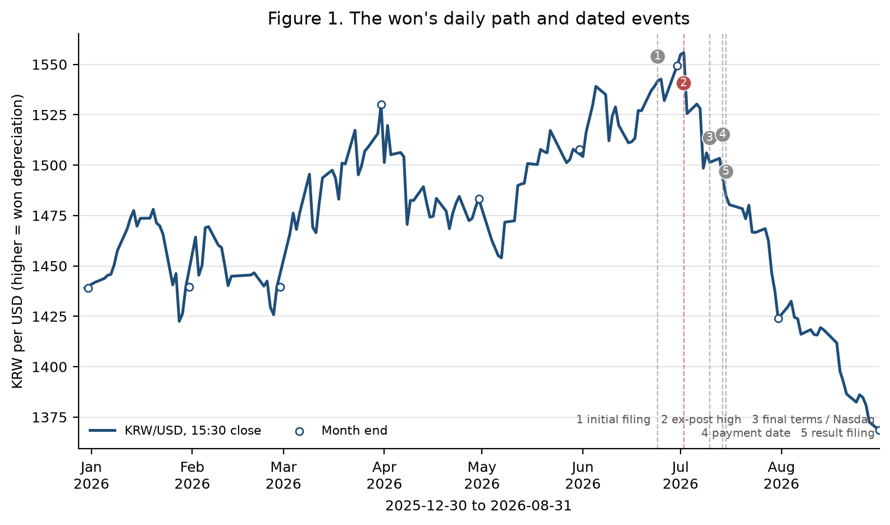
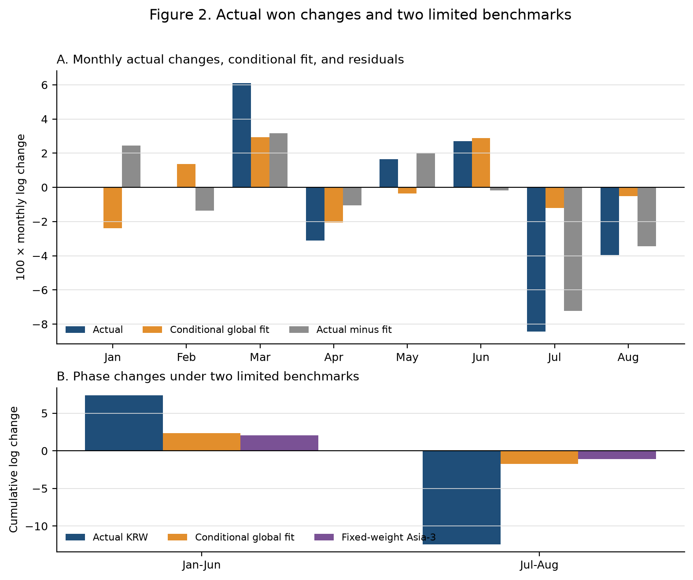
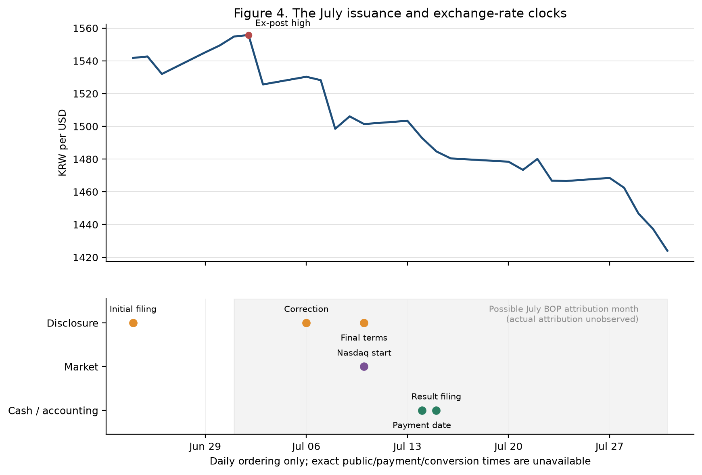
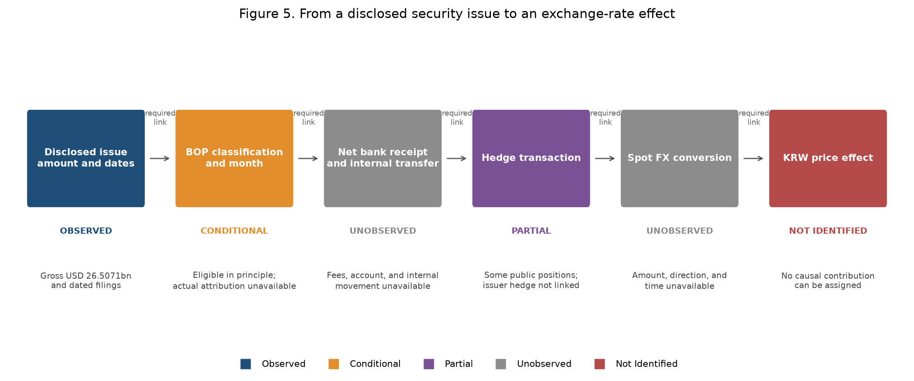

::: {.callout-note appearance="simple"}
**English version** — [Capital Flows in an Exchange-Rate Reversal](../2026-09-krw-exchange-rate-reversal-en/)

환율 자료는 2026년 8월 31일까지, 공식 월별 자금흐름은 2026년 7월까지 반영했다.
:::

## 원화는 왜 약해졌다가 더 빠르게 강해졌는가?

2026년 원화는 상반기에 약세를 보인 뒤 7월과 8월에 그보다 큰 폭으로 강세 전환했다. 글로벌 달러 움직임과 아시아 비교통화만으로는 변화의 크기를 충분히 요약하기 어렵다. 그러나 남은 차이를 곧바로 국내 자금수급 충격이나 환헤지 효과라고 부를 수도 없다.

이 연구는 하나의 원인을 선택하기보다, 지금까지 확보한 환율·국제수지·외환시장 보고서·상장주식 거래·달러선물·기업공시·회계 및 헤지 자료가 어느 주장까지 지지하는지를 점검한다. 가장 뚜렷한 결과는 7월의 대규모 해외 신주발행이 서로 다른 "외국인 주식자금" 통계의 방향을 바꿀 수 있었다는 점이다.

### 핵심 요약

| 항목 | 값 |
|:--|--:|
| 1~6월 원화 약세 | 7.39 로그포인트 |
| 7~8월 원화 강세 | 12.41 로그포인트 |
| 7~8월 Asia-3 대비 차이 | 11.32 로그포인트 |
| 7월 해외 신주발행 | 265.071억 달러 |
| 거래에서 현물환 주문까지의 연결 | 미관측 |

## 1. 반전은 하루의 사건이 아니었다

한국은행 15시 30분 원/달러 환율은 2025년 말 1,439.0원에서 2026년 6월 말 1,549.4원으로 상승했다. 7월 2일에는 동결 표본의 고점인 1,555.8원을 기록한 뒤 7월 말 1,424.0원, 8월 말 1,368.6원으로 하락했다. 원/달러 상승은 원화 약세를 뜻한다.

| 지표 | 값 | 의미 |
|:--|--:|:--|
| 1,439.0 | 2025년 말 | 분석 구간의 기준점 |
| 1,555.8 | 2026년 7월 2일 | 사후 확인된 표본 고점 |
| +7.39 | 1~6월 누적 변화 | 로그포인트, 원화 약세 |
| −12.41 | 7~8월 누적 변화 | 로그포인트, 원화 강세 |

해석의 출발점: 실물경제가 성장했다는 사실만으로 환율 약세를 퍼즐이라고 규정할 수는 없다. 환율은 미래 여건, 위험선호, 국제 자산수요, 헤지와 시장의 위험흡수 능력에도 반응한다. 따라서 먼저 어떤 비교 기준이 얼마나 실패했는지를 측정해야 한다.

## 2. 글로벌·아시아 통화의 공통 움직임 뒤에도 큰 차이가 남았다

두 기준을 사용했다. 첫째, 2015년 2월~2025년 12월 자료로 추정한 고정계수 글로벌 모형에 2026년의 실현된 달러요인·VIX·한미 단기금리차를 대입했다. 둘째, JPY·TWD·SGD의 일별 로그변화를 동일 가중한 Asia-3를 만들었다. 둘 다 실시간 예측이나 구조적 반사실이 아니라 제한된 사후 비교 기준이다.

| 구간 | 실제 원화 | 글로벌 적합치 | 실제−글로벌 | Asia-3 | 원화−Asia-3 |
|:--|--:|--:|--:|--:|--:|
| 2026년 1~6월 | +7.39 | +2.37 | +5.02 | +2.03 | +5.36 |
| 2026년 7~8월 | −12.41 | −1.73 | −10.68 | −1.09 | −11.32 |

: 단위는 로그퍼센트포인트. 양수는 대미달러 약세, 음수는 강세. 반올림 때문에 구성요소의 차이가 표시값과 소폭 다를 수 있다.

7~8월과 같은 42거래일의 원화−Asia-3 누적 차이는 2025년 5월 7일 이후 만들 수 있는 282개 중첩구간 중 가장 컸다. 이는 최근 비교구간에서 두드러졌다는 서술통계다. 표본이 짧고 구간이 중첩되므로 장기 발생확률이나 공식적인 유의확률로 해석하지 않는다.

## 3. "외국인 주식자금"은 하나의 숫자가 아니다

국제수지, 외환시장 보고서와 상장주식 거래는 시장·상품·거주성·신규발행 포함범위·인식시점·환산방식이 다르다. 같은 이름처럼 보여도 서로 더하거나 이어 붙일 수 없다.

| 표기 | 자료 | 핵심 측정대상 | 주의점 |
|:--|:--|:--|:--|
| B | 국제수지 비거주자 주식부채 | 발생주의·경제적 소유권 기준 월별 거래 | 신규발행과 장외거래가 포함될 수 있음 |
| F | 외환시장 보고서 외국인 주식자금 | 보고서가 밝힌 결제 기준 자금 | 국제수지와 통계 범위가 다름 |
| U(T,T) | KOSPI·KOSDAQ 외국인 순매수 | 거래일 기준 상장주식 대조값 | 은행결제·현물환 주문이 아님 |
| U(S,S) | 상장주식 순매수의 규칙상 이동 | KRX 달력 T+2 결제월 대조값 | 실제 결제원장을 관측한 값이 아님 |

달력상 T+2 이동은 F와의 절대격차를 1~7월 중 3개월에는 줄였지만 4개월에는 키웠다. 7월을 제외하면 평균 절대격차는 거래일 기준 25.60억 달러에서 규칙상 결제월 기준 37.72억 달러로 늘었다. 결제시점은 중요하지만, 달력 규칙이 실제 결제·환전 기록을 대신할 수는 없다.

## 4. 대규모 해외 신주발행은 7월 통계의 방향을 바꿀 수 있었다

7월에는 국제수지만 순유입을 기록했고 다른 세 측정치는 유출 또는 순매도였다. 같은 달 SK하이닉스는 총 265.071억 달러 규모의 해외 신주를 발행했다.

| 측정 | 값 (억 달러) | 방향 |
|:--|--:|:--|
| 국제수지 B | +59.82 | 순유입 |
| 외환시장 F | −207.00 | 순유출 |
| 상장주식 U(T,T) | −61.37 | 거래일 기준 |
| 상장주식 U(S,S) | −202.52 | 규칙상 T+2 |

$$\text{조정 국제수지} = B - \alpha \times \text{해외 신주 발행총액}$$

$\alpha$는 발행총액 중 7월 국제수지에 실제 귀속된 비율이다. $\alpha$가 22.5675%를 넘으면 조정값의 부호가 음수로 바뀐다. 발행총액 전부가 7월 B에 들어갔다고 가정하면 조정 국제수지는 −205.251억 달러로 F와 1.749억 달러 차이만 남는다.

조건부 산술과 인과효과는 다르다. 실제 $\alpha$, 수수료 차감 후 은행 수취액, 수취 법인과 계좌, 내부 자금이동, 달러 보유, 헤지와 현물환 전환은 공개자료에서 확인되지 않았다. 두 공식 숫자가 가까워지는 것은 통계 해석을 바꾸지만 원화 강세의 원인을 입증하지 않는다.

## 5. 시장·회계·헤지 자료는 설명 후보를 좁혔지만 거래를 끝까지 연결하지 못했다

**당일 주식거래.** 2026년 162거래일에서 외국인 상장주식 순매수는 원화 강세와 같은 날 함께 움직였다. 1조원당 계수는 −0.102 로그포인트였으나 동시결정 때문에 인과효과로 읽을 수 없다.

**달러선물.** 외국인 달러선물 순매수는 6월 +11.65억 달러에서 7월 −13.81억, 8월 −29.00억 달러로 바뀌었다. 주식과 선물을 함께 넣어도 7월 강세의 큰 부분이 남았다.

**기업 회계.** 독립적으로 재구축한 7개 기업 135개 관측에서 순 USD 금융잔액 계수는 −0.0162, 95% 구간은 −0.1948~0.1624였다. 초기의 강한 결과는 재현되지 않았다.

**공개 헤지자료.** ETF 계약 연결은 예정한 10일 중 3일에 그쳤다. 전체 외화자산과 파생포지션이 없으면 같은 선물잔액 감소가 헤지율 상승·유지·하락과 모두 양립한다.

## 6. 현재 증거가 허용하는 결론의 경계

**확인된 것.** 7~8월 원화 강세는 제한된 글로벌 기준과 고정가중 Asia-3보다 훨씬 컸다. 7월에는 국제수지 주식유입의 해석을 바꿀 만큼 큰 해외 신주발행이 있었고, 네 주식자금 계열의 방향이 실제로 달랐다.

**배제할 수 있는 해석.** 7월 국제수지 유입을 기존 국내주식 순매수 전환과 같다고 볼 수 없다. 달력 T+2만으로 통계 차이를 해소할 수 없으며, 글로벌 잔차를 국내 금융충격의 크기라고 부를 수도 없다.

**여전히 가능한 설명.** 글로벌·국내 뉴스와 기대 변화, 기존 매도압력 완화, 주식·선물·선도·현물환의 결합거래, 신주발행의 예상 또는 실제 흐름, 헤지조정과 시장중개자의 위험흡수가 함께 작동했을 수 있다.

**미해결인 것.** 각 경로의 인과 기여도, 발행대금의 국제수지 귀속률, 순달러 현금, 수취 법인·계좌, 헤지와 현물환 전환의 금액·방향·시점은 현재 공개자료로 결정할 수 없다.

## 7. 더 많은 자료보다 연결된 자료가 필요하다

같은 형식의 회계보고서를 추가하면 잔액 관측은 늘어나지만 지급이나 환전과 연결되지 않을 수 있다. 표본이 작더라도 하나의 거래에 대해 공시, 가격결정, 은행수취, 내부이동, 헤지와 현물환 주문을 연결하면 인과판정에 더 많은 정보를 준다.

**동일 시각의 국제 비교패널.** 원화·아시아 통화·NDF·VIX를 같은 관측시각으로 정렬해 상대 움직임이 시장 마감시각 때문에 생겼는지 점검한다.

**실제 결제와 환전 원장.** 달력상 T+2가 아니라 실제 거래·결제·수탁·현물환 주문을 연결해 유통시장 주식수요가 환율보다 선행했는지 검증한다.

**신주발행 대금의 법인별 추적.** 국제수지 귀속, 순은행수취, 수수료, 법인별 내부이동, 사용처, 달러 보유와 헤지·환전 기록을 연결한다.

**통합 포지션 자료.** 계좌·펀드별 주식, 선물·선도·NDF, 외화자산과 현물환 주문을 함께 관측해 신규취득 헤지와 기존 자산의 재헤지를 분리한다.

## Working paper

영문 Working Paper에는 전체 추정식, 표본 정의, 민감도 분석, 음의 결과와 중단된 분석을 포함한 26개 그림과 31개 표 세트가 수록되어 있다.

[PDF 내려받기](https://khdouble.github.io/krw-exchange-rate-reversal/downloads/capital-flows-exchange-rate-reversal-korea.pdf)

### 권장 인용

> Kim, Hyun Hak (2026). "Capital Flows in an Exchange-Rate Reversal: Evidence from Korea." Working Paper, Expanded Version 3, September 14.

### 데이터와 코드

연구에 사용한 원자료, 가공 데이터셋과 분석 코드는 이 공개 웹사이트 및 공개 저장소에 포함하지 않습니다.

학술적 재현·검증을 위한 공유 요청은 연구 목적, 필요한 자료와 사용 범위를 검토한 뒤 저자의 명시적 승인에 따라 개별적으로 처리합니다. 제3자 라이선스나 재배포 제한이 있는 자료는 공유 범위에서 제외될 수 있습니다. 문의는 [hyunhak.kim@kookmin.ac.kr](mailto:hyunhak.kim@kookmin.ac.kr)로 주시기 바랍니다.
