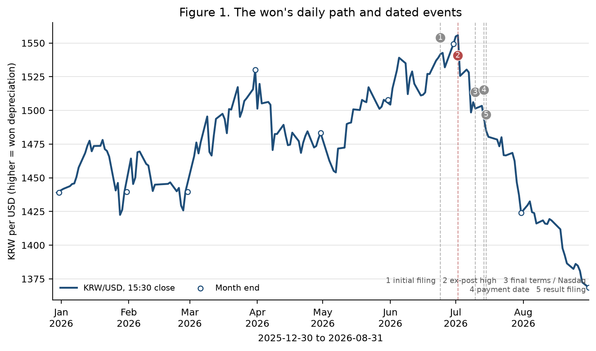
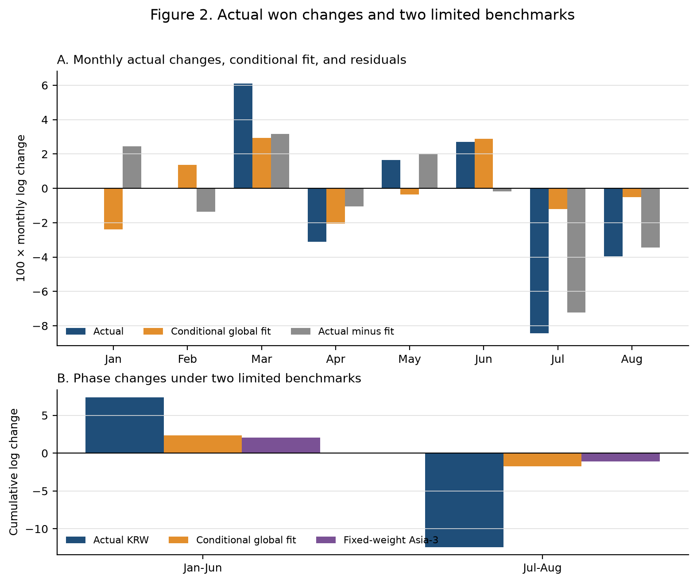
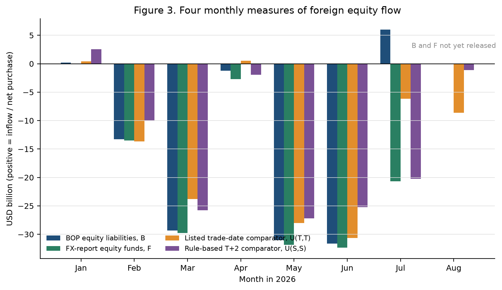
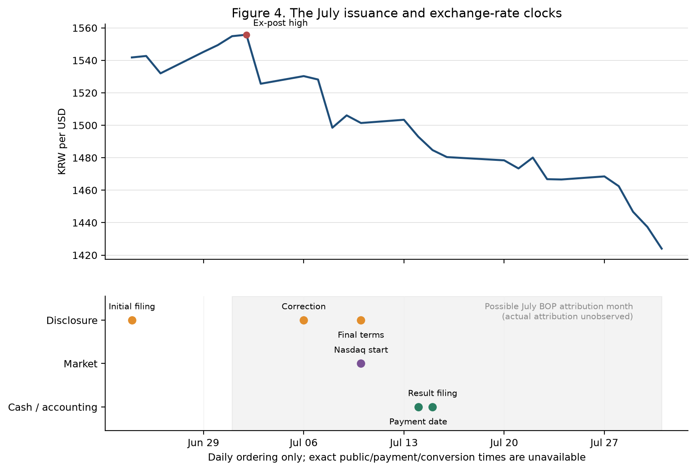
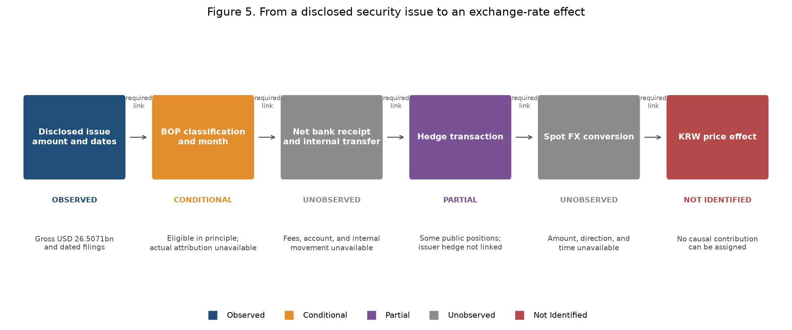

::: {.callout-note appearance="simple"}
**English version** — [Capital Flows in an Exchange-Rate Reversal](../2026-09-krw-exchange-rate-reversal-en/)

환율 자료는 2026년 8월 31일까지, 공식 월별 자금흐름 통계는 2026년 7월까지 반영하였다.
:::

## 검토 배경

2026년 중 원화는 상반기에 약세를 보인 뒤 7~8월 중 그보다 큰 폭으로 강세 전환하였다. 글로벌 달러 움직임과 역내 비교통화만으로는 이러한 변동 폭을 설명하기 어렵다. 다만 설명되지 않는 부분을 곧바로 국내 자금수급 충격이나 환헤지 효과로 규정하기도 어렵다.

본고에서는 특정 원인을 지목하기보다, 환율·국제수지·외환시장 보고서·상장주식 거래·달러선물·기업공시·회계 및 헤지 자료가 각각 어느 범위의 해석까지 뒷받침하는지를 점검하였다. 검토 결과 가장 뚜렷하게 확인된 사실은 7월 중 이루어진 대규모 해외 신주발행이 서로 다른 「외국인 주식자금」 통계의 부호를 좌우할 수 있었다는 점이다.

### 주요 수치

| 항목 | 값 |
|:--|--:|
| 1~6월 중 원화 약세 폭 | 7.39 로그포인트 |
| 7~8월 중 원화 강세 폭 | 12.41 로그포인트 |
| 7~8월 중 Asia-3 대비 격차 | 11.32 로그포인트 |
| 7월 중 해외 신주발행 규모 | 265.071억 달러 |
| 주식거래에서 현물환 주문까지의 연결 | 미관측 |

## 1. 환율 반전은 단일 시점의 사건이 아니었다

한국은행 15시 30분 기준 원/달러 환율은 2025년 말 1,439.0원에서 2026년 6월 말 1,549.4원으로 상승하였다. 이후 7월 2일 동결 표본 기준 고점인 1,555.8원을 기록한 뒤, 7월 말 1,424.0원, 8월 말 1,368.6원으로 하락하였다. 원/달러 환율의 상승은 원화 약세를 의미한다.

| 지표 | 값 | 내용 |
|:--|--:|:--|
| 1,439.0 | 2025년 말 | 분석 구간의 기준점 |
| 1,555.8 | 2026년 7월 2일 | 사후적으로 확인된 표본 고점 |
| +7.39 | 1~6월 누적 변화 | 로그포인트, 원화 약세 |
| −12.41 | 7~8월 누적 변화 | 로그포인트, 원화 강세 |

해석에 앞서 전제를 분명히 할 필요가 있다. 실물경제가 성장하였다는 사실만으로 환율 약세를 이례적 현상으로 규정할 수는 없다. 환율은 향후 여건, 위험선호, 국제 자산수요, 헤지 수요 및 시장의 위험흡수 능력에도 반응하기 때문이다. 따라서 어떤 비교기준이 어느 정도로 설명에 실패하는지를 먼저 측정하였다.

## 2. 글로벌·역내 공통요인으로 설명되지 않는 부분이 크다

두 가지 비교기준을 적용하였다. 첫째, 2015년 2월~2025년 12월 자료로 추정한 고정계수 글로벌 모형에 2026년 중 실현된 달러요인, VIX 및 한·미 단기금리차를 대입하였다. 둘째, 엔화·대만달러·싱가포르달러의 일별 로그변화를 동일 가중한 Asia-3 지수를 구성하였다. 두 기준 모두 실시간 예측이나 구조적 반사실이 아닌 제한적 사후 비교기준이다.

| 구간 | 실제 원화 | 글로벌 적합치 | 실제−글로벌 | Asia-3 | 원화−Asia-3 |
|:--|--:|--:|--:|--:|--:|
| 2026년 1~6월 | +7.39 | +2.37 | +5.02 | +2.03 | +5.36 |
| 2026년 7~8월 | −12.41 | −1.73 | −10.68 | −1.09 | −11.32 |

: 단위는 로그퍼센트포인트. 양수는 대미달러 약세, 음수는 강세를 의미한다. 반올림으로 구성요소의 차이가 표시값과 소폭 다를 수 있다.

7~8월과 동일한 42거래일 기준으로 볼 때, 원화와 Asia-3의 누적 격차는 2025년 5월 7일 이후 구성 가능한 282개 중첩구간 가운데 가장 컸다. 다만 이는 최근 비교구간에서 두드러졌다는 서술통계이다. 표본기간이 짧고 구간이 중첩되므로 장기 발생확률이나 통계적 유의수준으로 해석하지 않았다.

## 3. 외국인 주식자금은 단일 통계가 아니다

국제수지, 외환시장 보고서 및 상장주식 거래 통계는 대상 시장, 상품, 거주성, 신규발행 포함범위, 인식시점 및 환산방식이 각각 다르다. 명칭이 유사하더라도 서로 합산하거나 연결할 수 없다.

| 표기 | 자료 | 측정대상 | 유의사항 |
|:--|:--|:--|:--|
| B | 국제수지 비거주자 주식부채 | 발생주의·경제적 소유권 기준 월별 거래 | 신규발행 및 장외거래가 포함될 수 있음 |
| F | 외환시장 보고서 외국인 주식자금 | 보고서가 명시한 결제 기준 자금 | 국제수지와 통계 범위가 상이 |
| U(T,T) | 코스피·코스닥 외국인 순매수 | 거래일 기준 상장주식 대조값 | 은행결제 또는 현물환 주문이 아님 |
| U(S,S) | 상장주식 순매수의 규칙상 이동 | 거래소 달력 T+2 결제월 대조값 | 실제 결제원장을 관측한 값이 아님 |

달력 기준 T+2 이동을 적용한 결과, F와의 절대격차는 1~7월 중 3개월에서는 축소되었으나 4개월에서는 확대되었다. 7월을 제외할 경우 평균 절대격차는 거래일 기준 25.60억 달러에서 규칙상 결제월 기준 37.72억 달러로 확대되었다. 결제시점은 중요한 요인이나, 달력 규칙이 실제 결제·환전 기록을 대체할 수는 없다.

## 4. 대규모 해외 신주발행이 7월 통계의 부호를 좌우하였다

7월 중 국제수지만 순유입을 기록하였고 나머지 세 측정치는 유출 또는 순매도를 나타냈다. 동 기간 중 SK하이닉스는 총 265.071억 달러 규모의 해외 신주를 발행하였다.

| 측정치 | 값 (억 달러) | 방향 |
|:--|--:|:--|
| 국제수지 B | +59.82 | 순유입 |
| 외환시장 F | −207.00 | 순유출 |
| 상장주식 U(T,T) | −61.37 | 거래일 기준 |
| 상장주식 U(S,S) | −202.52 | 규칙상 T+2 |

$$\text{조정 국제수지} = B - \alpha \times \text{해외 신주 발행총액}$$

여기서 $\alpha$는 발행총액 중 7월 국제수지에 귀속된 비율이다. $\alpha$가 22.5675%를 상회하면 조정값의 부호가 음수로 전환된다. 발행총액 전액이 7월 B에 반영되었다고 가정할 경우 조정 국제수지는 −205.251억 달러로, F와의 격차는 1.749억 달러에 불과하다.

다만 조건부 산술과 인과효과는 구분되어야 한다. 실제 $\alpha$ 값, 수수료 차감 후 은행 수취액, 수취 법인 및 계좌, 내부 자금이동, 달러 보유 규모, 헤지 및 현물환 전환 내역은 공개자료로 확인되지 않는다. 두 공식 통계가 근접한다는 사실은 통계 해석을 바꾸지만 원화 강세의 원인을 입증하지는 않는다.

## 5. 시장·회계·헤지 자료는 설명을 좁혔으나 거래를 완결하지 못하였다

**당일 주식거래.** 2026년 중 162거래일을 대상으로 볼 때 외국인 상장주식 순매수는 원화 강세와 동일 시점에 함께 움직였다. 1조원당 계수는 −0.102 로그포인트로 추정되었으나, 동시결정 문제로 인과효과로 해석할 수 없다.

**달러선물.** 외국인의 달러선물 순매수는 6월 +11.65억 달러에서 7월 −13.81억 달러, 8월 −29.00억 달러로 전환되었다. 주식거래와 선물거래를 함께 고려하여도 7월 중 강세의 상당 부분은 설명되지 않았다.

**기업 회계.** 독립적으로 재구축한 7개 기업 135개 관측치를 이용한 결과, 순 USD 금융잔액 계수는 −0.0162, 95% 신뢰구간은 −0.1948~0.1624로 나타났다. 초기의 유의한 결과는 재현되지 않았다.

**공개 헤지자료.** ETF 계약 연결은 계획한 10일 중 3일에 그쳤다. 전체 외화자산과 파생포지션을 관측할 수 없는 상황에서는 동일한 선물잔액 감소가 헤지비율의 상승·유지·하락 어느 쪽과도 양립한다.

## 6. 현 시점의 증거가 뒷받침하는 결론의 범위

**확인된 사실.** 7~8월 중 원화 강세 폭은 제한적 글로벌 기준 및 고정가중 Asia-3가 시사하는 수준을 크게 상회하였다. 7월 중 국제수지상 주식유입의 해석을 바꿀 만한 대규모 해외 신주발행이 있었으며, 네 가지 주식자금 계열의 방향이 실제로 상이하였다.

**배제되는 해석.** 7월 중 국제수지 유입을 기존 국내주식 순매수의 전환과 동일시할 수 없다. 달력 기준 T+2만으로는 통계 간 격차가 해소되지 않으며, 글로벌 잔차를 국내 금융충격의 크기로 간주할 수도 없다.

**여전히 가능한 설명.** 국내외 뉴스 및 기대 변화, 기존 매도압력의 완화, 주식·선물·선도·현물환의 결합거래, 신주발행에 대한 사전 기대 또는 실제 자금흐름, 헤지조정 및 시장조성자의 위험흡수가 복합적으로 작용하였을 가능성이 있다.

**미해결 과제.** 각 경로의 인과 기여도, 발행대금의 국제수지 귀속률, 순 달러현금, 수취 법인 및 계좌, 헤지와 현물환 전환의 규모·방향·시점은 현행 공개자료로는 판별할 수 없다.

## 7. 자료의 양보다 연결이 필요하다

동일한 형식의 회계보고서를 추가할 경우 잔액 관측치는 증가하나, 이를 지급이나 환전과 연결하지 못할 수 있다. 표본 규모가 작더라도 단일 거래에 대하여 공시, 가격결정, 은행수취, 내부이동, 헤지 및 현물환 주문을 연결하는 편이 인과 판단에 더 많은 정보를 제공한다.

**동일 시각 기준 국제 비교패널.** 원화, 역내 통화, NDF 및 VIX를 동일한 관측시각으로 정렬하여 상대적 움직임이 시장 마감시각 차이에서 비롯되었는지 점검할 필요가 있다.

**실제 결제·환전 원장.** 달력 기준 T+2가 아닌 실제 거래·결제·수탁·현물환 주문을 연결하여 유통시장 주식수요가 환율에 선행하였는지 검증하여야 한다.

**신주발행 대금의 법인별 추적.** 국제수지 귀속, 순 은행수취, 수수료, 법인별 내부이동, 사용처, 달러 보유 및 헤지·환전 기록을 연결할 필요가 있다.

**통합 포지션 자료.** 계좌 및 펀드별 주식, 선물·선도·NDF, 외화자산과 현물환 주문을 함께 관측하여 신규취득에 대한 헤지와 기존 자산의 재헤지를 구분하여야 한다.

## Working paper

영문 Working Paper에는 전체 추정식, 표본 정의, 민감도 분석, 음의 결과 및 중단된 분석을 포함한 26개 그림과 31개 표가 수록되어 있다.

[PDF 내려받기](https://khdouble.github.io/krw-exchange-rate-reversal/downloads/capital-flows-exchange-rate-reversal-korea.pdf)

### 권장 인용

> Kim, Hyun Hak (2026). "Capital Flows in an Exchange-Rate Reversal: Evidence from Korea." Working Paper, Expanded Version 3, September 14.

### 데이터와 코드

연구에 사용한 원자료, 가공 데이터셋 및 분석 코드는 본 웹사이트와 공개 저장소에 포함하지 않는다.

학술적 재현·검증을 위한 공유 요청은 연구 목적, 필요 자료 및 사용 범위를 검토한 후 저자의 명시적 승인에 따라 개별적으로 처리한다. 제3자 라이선스나 재배포 제한이 적용되는 자료는 공유 대상에서 제외될 수 있다. 문의는 [hyunhak.kim@kookmin.ac.kr](mailto:hyunhak.kim@kookmin.ac.kr)로 주시기 바란다.
