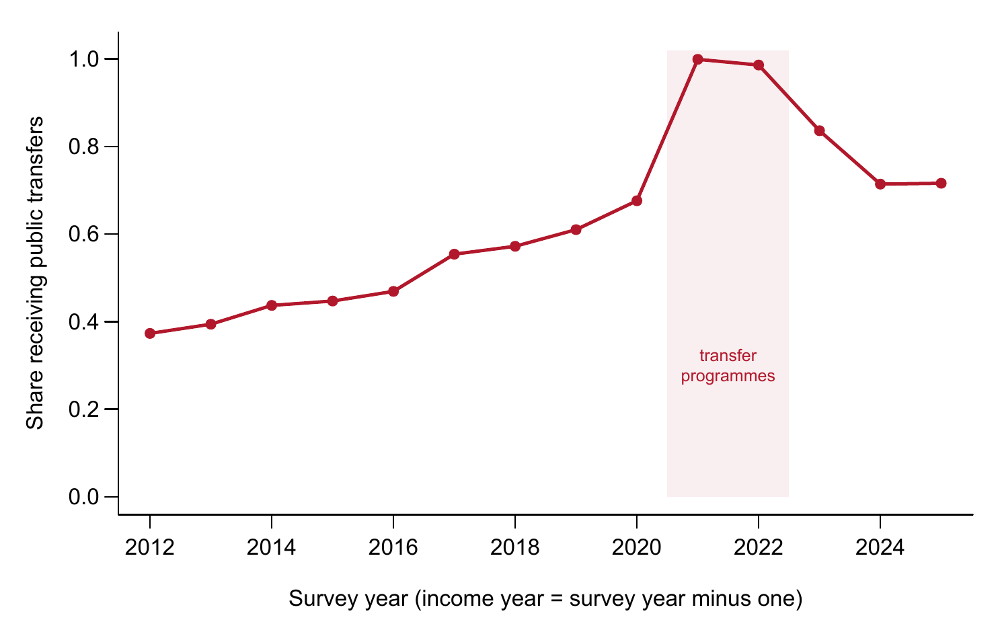
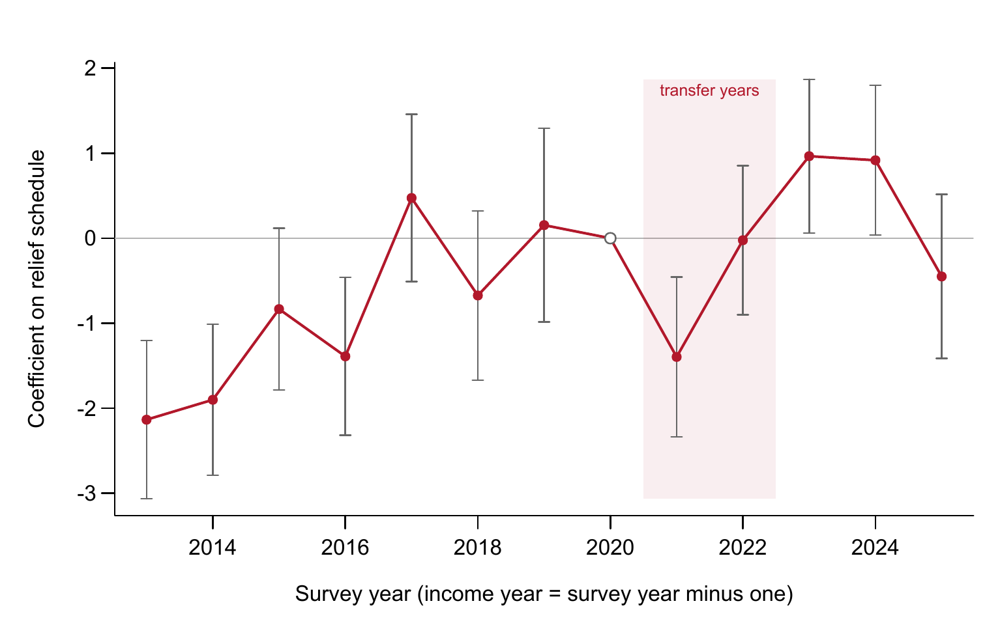
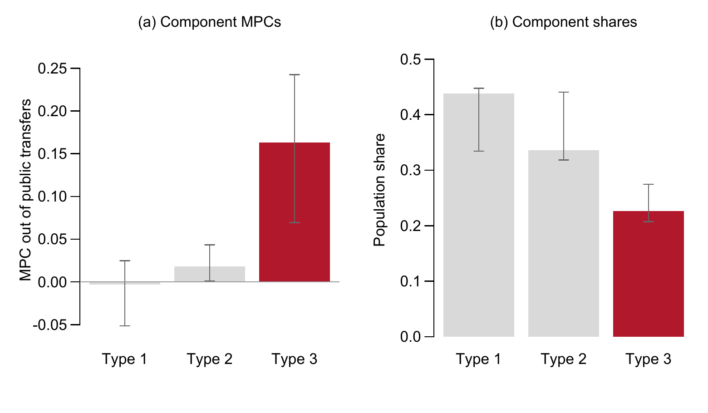
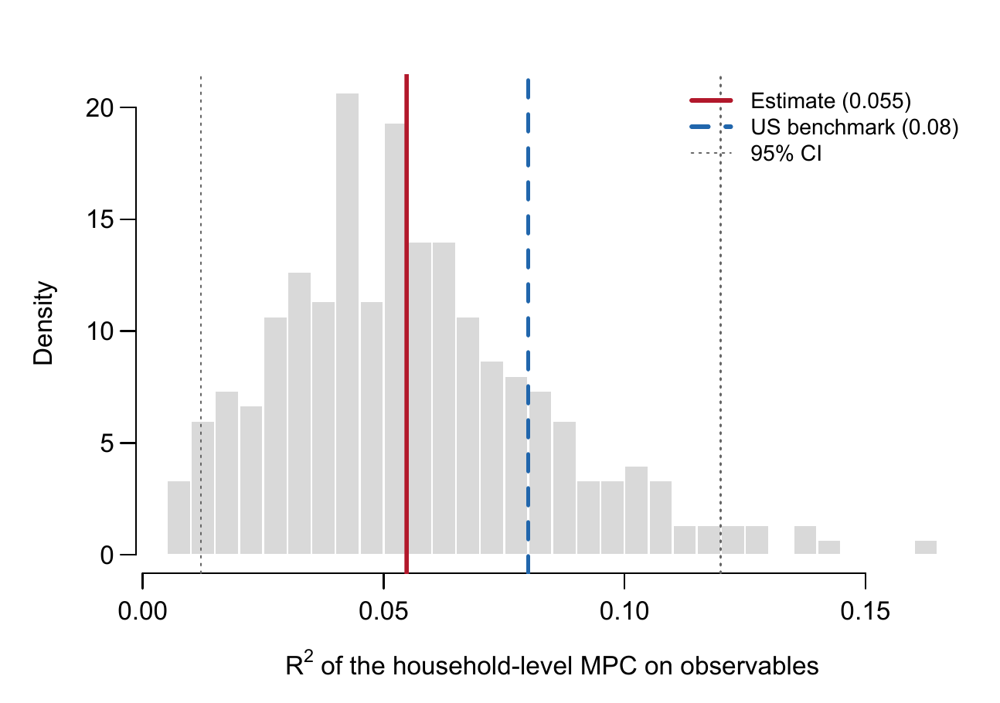
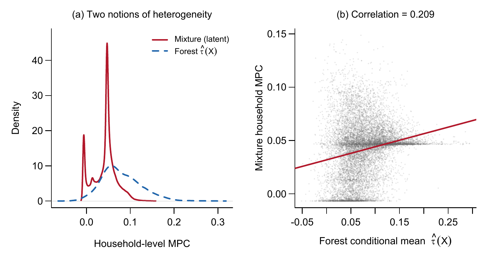
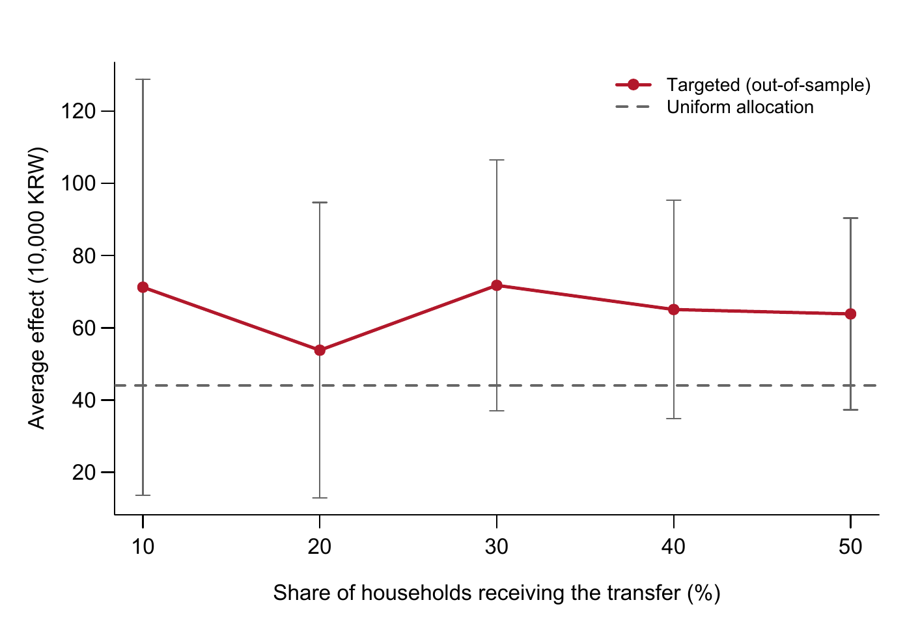

::: {.callout-note appearance="simple"}
**English version** — [The Distribution of Spending Out of Cash Transfers](../2026-09-mpc-heterogeneity-en/)

가계금융복지조사 공개용 자료의 2012~2025년 조사를 사용했다. 소득과 지출은 조사연도의 전년도 값이므로 2020년과 2021년 지원금은 각각 2021년과 2022년 조사에 나타난다.
:::

## 현금 이전소득은 얼마나, 그리고 누가 소비하는가?

2020년 5월 정부는 모든 가구에 보편 지원금을 지급했고, 2021년 9월에는 하위 88% 가구에 선별 지원금을 지급했다. 두 방식을 둘러싼 논쟁은 직접 검증된 적이 드문 전제 위에 서 있다. 이전소득을 많이 소비하는 가구를 행정당국이 실제로 가진 정보로 미리 가려낼 수 있다는 전제다. 저소득 가구의 평균 반응이 더 크다는 사실은 반응이 서로 다르다는 것을 보여줄 뿐, 선별규칙이 고반응 가구를 찾아낼 수 있다는 것을 보여주지는 않는다.

이 연구는 가계금융복지조사 14개 연도를 연결한 패널 — 45,241가구의 가구-연도 1차 차분 132,965개 — 로 두 질문을 분리한다. 먼저 이 자료가 평균 반응에 대해 말할 수 있는 것을 점검하고, 가구 간 반응의 분포를 추정한 뒤, 관측 가능한 특성이 그 분포를 얼마나 설명하는지 측정한다. 가장 뚜렷한 결과는 약 4분의 1의 가구가 총소비 반응의 대부분을 만들어내며, 소득·자산·유동성·부채·인구특성을 모두 합쳐도 그 가구가 누구인지를 6~10%밖에 설명하지 못한다는 점이다.

### 핵심 요약

| 항목 | 값 |
|:--|--:|
| 추정 표본 | 132,965 가구-연도 |
| 6개 추정량의 평균 한계소비성향 | 0.032~0.107 |
| 고반응 유형의 가구 비중 | 23% |
| 고반응 유형의 이전소득 한계소비성향 | 0.163 |
| 관측 특성이 설명하는 가구별 한계소비성향 변동 | 5.6~9.7% |
| 가구당 소비반응, 학습된 선별규칙 대 보편지급 | 40.9만 원 대 48.2만 원 |

## 1. 이 자료에서 코로나19 지원금은 자연실험이 되지 못한다

2020년 지원금은 가구원 수에 따라 늘었고 4인에서 상한이 걸렸다. 1인 가구 40만 원에서 4인 이상 가구 100만 원까지다. 2021년 지원금은 건강보험료 기준 하위 88% 가구에 1인당 25만 원을 상한 없이 지급했다. 두 지원금 모두 조사가 포착한 거의 모든 가구에 닿았다.

두 지원금을 활용한 설계를 두 가지 시도했다. 둘 다 실패했고, 실패 이유는 수치로 확인된다.

| 설계 | 1단계 | 실패 이유 |
|:--|:--|:--|
| 2020년 가구원 수별 지급액을 도구변수로 사용 | 계수 2.67, F = 287 | 계수가 1을 넘는다는 것은 가구원 수가 지원금 외 여러 코로나19 시기 이전소득을 함께 대리한다는 뜻이다. 2단계 최소자승 추정치는 1.53 |
| 2020년과 2021년 지급표의 기울기 반전 | 계수 1.16, F = 146 | 최소검출효과가 한계소비성향 기준 0.48이고, 지급 이전 연도의 계수가 지급 연도 계수만큼 크다 |

도구변수는 배제제약을 위배한다. 가구원 수는 생애주기를 통해 소비 증가에 직접 영향을 미치며, 2020년에 시행된 아동 돌봄 지원사업 역시 가구 구성에 연동되어 있었다. 기울기 반전 설계는 원리상 더 깔끔하다. 5인 이상 가구는 2020년에 상대적으로 적게, 2021년에 상대적으로 많이 받았기 때문이다. 그러나 연간 소비 변화의 표준편차 788만 원이 지급 예정액의 표준편차 28.2만 원을 압도하고, 그럴듯한 한계소비성향 값은 모두 검출 가능한 문턱 아래에 있다.

이는 분석 방법이 아니라 자료의 구조에서 비롯된 한계다. 연간 빈도, 연간 소비에 비해 작은 지원금, 보편 지급, 그리고 가구원 수와 상관된 거시 충격과의 시점 중첩이다. 이하의 모든 추정치는 자연실험에서 얻은 인과효과가 아니라, 사전에 결정된 특성을 통제한 조건부 연관성이다.

## 2. 평균 한계소비성향은 통제변수 하나와 추정량 선택에 좌우된다

기본 모형은 1차 차분으로 추정한다.

$$\Delta C_{it} = \alpha_t + \beta\,\Delta T_{it} + \gamma\,\Delta Y_{it} + X_{i,t-1}'\delta + \varepsilon_{it}$$

$\Delta C$는 연간 소비 변화, $\Delta T$는 공적 이전소득 변화, $\Delta Y$는 그 밖의 모든 소득 변화, $X_{i,t-1}$은 전년도 조사에서 측정한 20개 특성이다. 모든 통제변수에 시차를 두었다. 동시점 변수 — 예컨대 지원금으로 빚을 갚은 가구의 원리금상환비율 — 는 그 자체가 지원금의 결과이기 때문이다.

$\Delta Y$를 빼면 추정치가 0을 가로질러 움직인다. $\Delta Y$가 없으면 이전소득 계수는 −0.004, 넣으면 +0.048이다. 이전소득은 다른 소득이 줄 때 늘어나며(상관계수 −0.164), 이는 실업급여·기초생활보장·연금이 설계된 방식 그대로다. 소비를 이전소득만으로 회귀하면 이 음의 공변동이 이전소득 계수에 실린다.

| 추정량 | 이전소득 한계소비성향 | (표준오차) |
|:--|--:|--:|
| 최소자승법 | 0.032 | (0.006) |
| 인과 포레스트 DML, 그래디언트 부스팅 | 0.075 | (0.042) |
| 선형 DML, 그래디언트 부스팅 | 0.075 | (0.006) |
| 선형 DML, 라쏘 | 0.085 | (0.007) |
| 일반화 랜덤 포레스트 | 0.102 | (0.009) |
| 희소 선형 DML, 그래디언트 부스팅 | 0.107 | (0.034) |

: 모든 행이 같은 자료·추정대상·통제변수를 사용한다. 교차적합(cross-fitting) 폴드는 가구 단위로 나눴다. 무작위로 나누면 같은 가구의 서로 다른 연도가 분할의 양쪽에 놓인다.

모형을 고정해도 추정치는 고정되지 않는다. 범위는 3.4배이고, 유연한 추정량들 가운데 하나를 고를 원칙은 없다. 추정량 비교는 진단 장치 역할도 했다. 초기 모형은 동시점 통제변수를 넣어 처치변수의 표본외 $R^2$를 0.12에서 0.64로 높였고, DML 추정치를 0.058에서 0.019로 떨어뜨렸다. 이 오류는 두 추정량이 세 배 차이로 엇갈렸기 때문에 드러났다.

## 3. 국내 추정치는 단위를 맞추면 대체로 일치한다

국내 한계소비성향 추정치는 대략 0.07에서 0.61에 걸쳐 있다. 이 범위의 상당 부분은 행태의 차이가 아니라 측정의 차이다.

| 연구 | 자료와 방법 | 보고치 | 수준 한계소비성향 |
|:--|:--|--:|--:|
| Song (2020) | 가계금융복지조사 내부자료; 탄력성 | 0.180 (일시소득) | 0.085~0.107 |
| Hong (2021) | 한국노동패널·고령화연구패널; 탄력성 | 0.2 (일시소득) | 0.15 |
| Baek et al. (2023) | 카드자료; 시도별 이중차분 | 0.36~0.58 | 0.36~0.58 |
| Kim, Koh and Lyou (2023) | 서울 카드자료; 이중차분 | ≥ 0.59 | ≥ 0.59 |
| Kim and Oh (2020) | 카드·매출자료; 사건연구 | 0.26~0.36 | 0.26~0.36 |
| Lee, Kang and Woo (2022) | 가계동향조사; 삼중차분 | 0.36~0.48 | 0.36~0.48 |
| Noh (2021) | 가계금융복지조사 2019 횡단면; 회귀분석 | 0.07~0.21 | 0.07~0.21 |
| 본 연구 | 가계금융복지조사 공개자료 2013~2025; 포레스트·유한혼합모형 | 0.032~0.107 | 0.032~0.107 |

: 탄력성은 평균소비성향을 곱해 환산했다. Song (2020)에는 표본기간의 소비/가처분소득 비율 0.592를 적용하고, 비내구재 소비를 쓴 점을 반영해 0.47을 하한으로 두었다. Hong (2021)은 0.75로 직접 환산했다.

첫째는 단위의 차이다. Song (2020)은 로그 잔차로 추정하므로 계수가 탄력성이고, 전체 계수 0.288을 한계소비성향으로 읽으면 수준을 대략 두 배 과대평가하게 된다. 환산하면 그의 일시소득 추정치는 0.085~0.107이 되어, 본 연구의 포레스트 추정치 0.102를 포함한다.

둘째는 측정 대상의 차이다. 카드거래 연구는 지급 후 몇 주간의 지출을 관측한다. 즉각적 반응은 포착하지만 현금·계좌이체 지출은 놓치고, 그해 뒤에 일어나는 소비 대체를 상쇄하지 못한다. 연간 조사는 한 해 전체의 순변화를 기록하므로 기계적으로 더 작은 값을 낸다. 둘을 한데 묶어 비교해서는 안 된다. 셋째는 방법의 차이다. 같은 자료에서도 추정량 선택만으로 3.4배가 벌어진다.

## 4. 반응은 넓게 흩어져 있고, 소수가 총반응의 대부분을 만든다

적합값의 분산만으로는 이질성의 증거가 되지 않는다. 표본외 자료에 대한 보정검정(calibration test)에서 포레스트의 차등예측 계수는 1.02(표준오차 0.165, p = 3 × 10⁻¹⁰)로, 포레스트가 포착한 변동은 적합 과정의 산물이 아니다. 소비 변화의 분포를 따라가면 이전소득 계수는 10분위 0.029에서 90분위 0.098로 세 배 넘게 커지지만, 다른 소득의 계수는 0.071에서 0.128로 늘어나는 데 그친다.

분위수는 이전소득이 소비 변화의 분포를 어떻게 움직이는지 보여줄 뿐, 가구 간에 반응이 어떻게 분포하는지는 보여주지 않는다. 이를 위해 Lewis, Melcangi and Pilossoph (2024)를 따라 각 가구가 관측되지 않는 $K$개 유형 중 하나에 속하고, 유형마다 고유한 이전소득 계수를 갖는다고 본다.

$$\Delta C_{it} = \alpha_k + \beta_k\,\Delta T_{it} + \gamma_k\,\Delta Y_{it} + \varepsilon_{it}, \qquad \varepsilon_{it} \sim N(0, \sigma_k^2)$$

| 유형 | 이전소득 한계소비성향 | 95% 구간 | 가구 비중 | 95% 구간 |
|:--|--:|--:|--:|--:|
| 유형 1 | −0.003 | −0.051~0.025 | 43.8% | 33.4~44.8 |
| 유형 2 | 0.018 | 0.001~0.043 | 33.6% | 31.8~44.1 |
| 유형 3 | 0.163 | 0.070~0.243 | 22.6% | 20.7~27.5 |

: 가구-연도 1차 차분 123,609개에 대한 3개 성분 혼합모형으로, 무작위 시작점 5개에서 EM 알고리즘으로 추정했다. 구간은 가구 단위로 재표집한 부트스트랩 300회의 백분위이며, 각 반복에서 성분을 한계소비성향 순으로 정렬했다.

확률가중 평균은 0.042로 선형 추정치의 범위 안에 있다. 혼합모형은 다른 평균을 만들어내는 것이 아니라 같은 평균을 매우 불균등한 부분들로 분해하며, 유형 3 하나가 그 평균의 10분의 9 가까이를 차지한다.

세 유형은 간결한 요약이지 행동 범주가 아니다. 정보기준은 성분 7개까지 계속 낮아지며, 이때 고반응 유형의 한계소비성향은 0.26, 비중은 15%다. 크기는 이상치 절단 방식에도 민감하다. 가장 약하게 절단하면 고반응 성분은 0.071에 비중 48.5%, 가장 강하게 절단하면 0.266에 비중 20.0%다. 모든 변형에서 유지되는 것은 모양이다. 넓은 분산, 그리고 소수의 고반응 가구다.

## 5. 관측 가능한 특성은 누가 소비하는지를 거의 설명하지 못한다

하위집단 비교만 보면 유동성 제약의 강한 증거처럼 보인다. 유동자산 최하위 4분위의 한계소비성향은 0.169, 최상위는 0.065다. 그러나 변수를 함께 넣은 투영에서는 전년도 소득과 원리금상환비율만 유의하게 남는다. 유동성과 소득은 함께 움직이며, 유동성 기울기는 대체로 상관된 대리변수를 거쳐 나타난 소득의 효과다.

더 엄밀한 검정은 혼합모형에서 얻은 가구별 사후 기대 한계소비성향을 행정당국이 관측할 수 있는 변수 — 소득, 소비, 유동자산, 순자산, 부채, 원리금상환, 가구원 수, 연령, 연도 — 에 투영하는 것이다.

| 측정 | 설명 비중 |
|:--|--:|
| 선형 투영, 3개 유형 | 5.6% (95% 구간 1.2~12.0%) |
| 선형 투영, 7개 유형 | 7.0% |
| 회귀 포레스트, 표본외(out-of-bag), 7개 유형 | 9.7% |
| 미국 (Lewis, Melcangi and Pilossoph, 2024) | 약 8% |

어떤 측정으로 보든, 가구가 이전소득을 소비하는 방식의 변동 가운데 약 90%는 상세한 가계 재무상태 조사로도 보이지 않는다. 설명되는 작은 부분도 대부분 익숙한 자원 기울기다. 전년도 소비와 소득만으로 설명된 변동의 98%가 나오며, 유동성 변수 묶음 전체를 빼도 1.4%, 부채와 원리금상환 묶음을 빼도 0.3%만 줄어든다.

포레스트의 조건부 효과와 혼합모형의 가구별 한계소비성향은 거의 직교한다(상관계수 0.21). 통제변수는 예측 반응을 실제로 퍼뜨린다. 포레스트의 표준편차는 0.045로 혼합모형의 0.027보다 크다. 그러나 그 퍼짐은 총소비를 좌우하는 잠재 이질성과 맞아떨어지지 않는다.

## 6. 선별규칙은 원당 소비반응을 높이지만 총반응은 줄인다

선별의 가치는 규칙 학습에 쓰지 않은 가구에서 평가해야 한다. 같은 표본에서 순위를 매기고 평가하면 상위 5분의 1에만 지급할 때 원당 효과가 1.84배로 커지는 것처럼 보인다. 학습에 쓰지 않은 가구에서 그 이득은 1.2~1.6배이며, 선별 범위를 좁혀도 커지지 않는다.

| 지급 대상 | 효과 (만 원) | (표준오차) | 균등지급 대비 |
|:--|--:|--:|--:|
| 전체 (균등지급) | 43.98 | — | 1.00 |
| 상위 50% | 63.84 | (13.55) | 1.45 |
| 상위 40% | 65.06 | (15.43) | 1.48 |
| 상위 30% | 71.75 | (17.72) | 1.63 |
| 상위 20% | 53.79 | (20.89) | 1.22 |
| 상위 10% | 71.24 | (29.39) | 1.62 |

: 별도의 가구 집합에서 추정한 조건부 효과로 순위를 매겨 상위 k%에 든 가구의 평균 이중강건 점수. 표본을 가구 단위로 학습용 22,620가구와 평가용 22,621가구로 나눴다.

재무상태 변수로 학습한 깊이 2의 정책나무(Athey and Wager, 2021)는 예상대로 작동한다. 유동자산비율로 먼저 나눈 뒤 순자산 2억 6,700만 원 초과 또는 유동자산 2억 9,600만 원 초과 가구, 즉 눈에 띄게 부유한 가구를 제외하고 전체 가구의 80%에 지급을 배정한다. 배정된 가구의 중위소득은 2,900만 원, 제외된 가구는 6,460만 원이다. 통제변수가 모두 관측된 평가용 가구에서 이 규칙의 가구당 소비반응은 40.9만 원으로, 모든 가구에 지급할 때의 48.2만 원보다 작다.

제외된 5분의 1은 소비하지 않는 가구가 아니다. 이들의 평균 조건부 한계소비성향도 0.036이다. 이들을 빼서 줄어드는 총량이, 나머지 80%에 집중해서 늘어나는 반응보다 크다. 선별은 원당 반응을 높이지만, 가구를 제외하면 총량이 줄어든다. 선택은 효율과 규모 사이에 있으며, 어느 쪽을 택할지는 예산과 목표 부양 규모 가운데 무엇이 제약인지에 달려 있다.

## 7. 현재 증거가 허용하는 결론의 경계

**확인된 것.** 이전소득 한계소비성향의 이질성은 실재한다. 보정검정은 일정한 반응을 기각하고, 유형 간 분산은 0과 구별되게 추정된다. 소수의 가구가 총반응의 대부분을 차지한다. 관측 특성은 가구별 변동의 6~10%를 설명하며, 이는 미국 수치와 통계적으로 구별되지 않는다.

**배제할 수 있는 해석.** 연간 조사자료에서 2020·2021년 지원금을 자연실험으로 읽는 것. 단위·관측기간·추정량을 맞추기 전에 국내 추정치의 분산을 행태에 대한 불일치로 보는 것. 하위집단 기울기로 선별규칙의 가치를 추론하는 것. 소득 최하위 5분위의 한계소비성향 0.165(최상위 0.045)는 보편지급을 능가하는 배분규칙으로 이어지지 않는다.

**여전히 가능한 설명.** 유동성은 이 자료가 보여주는 것보다 중요할 수 있다. 공개자료는 내부자료에 기록된 현금 보유액이 아니라 저축성 예금을 측정하며, 측정오차는 유동성 계수를 0 쪽으로 약화시킨다. 더 풍부한 자료를 가진 행정당국은 더 나은 규칙을 만들 수 있고, 이 평가가 다루지 않는 분배나 보험 목적에서 선별이 정당화될 수도 있다.

**미해결인 것.** 한계소비성향의 인과적 수준. 보고된 소비의 측정오차를 고려하면 조사 기반 수준은 하한으로 읽는 것이 적절하다. 이상치 절단과 성분 수에 따라 달라지는 고반응 유형의 정확한 크기와 비중. 그리고 한계소비성향이 0.16인 가구와 다른 조건은 비슷하지만 0인 가구를 실제로 구분하는 요인.

## 8. 같은 조사의 표본 확대보다 연결된 자료가 필요하다

위의 한계는 같은 종류의 관측을 늘려서는 해소되지 않는다. 각 한계가 서로 다른 정보원을 가리킨다.

**거래기록과 연결된 조사 가구.** 카드·행정 지출기록에는 식별에 필요한 시점 정밀도가, 조사에는 그 기록에 없는 재무상태 정보가 있다. 둘을 연결하면 두 장점을 결합할 수 있다.

**시간에 걸친 반응.** 14개 연도의 연결 패널은 이제 이전소득 지출이 여러 해에 걸쳐 어떻게 전개되는지, 즉 이질적 경제주체 모형이 입력값으로 쓰는 시점 간 한계소비성향(Auclert, Rognlie and Straub, 2024)을 추적할 만큼 길다.

**가상 소득에 대한 응답 조사.** 재무상태가 누가 소비하는지를 이토록 적게 설명한다면, 의도된 반응을 묻는 설문(Colarieti, Mei and Stantcheva, 2024)이 재무자료로는 닿을 수 없는 선호와 기대에 이르는 가장 직접적인 경로다.

**현금 보유액.** 내부자료의 현금 보유액으로 투영을 다시 하면 유동성이 실제로 정보가 없는지, 단지 잘못 측정된 것인지 판별할 수 있다.

## Working paper

영문 Working Paper에는 전체 추정식, 14개 연도 패널 구축 과정, 배포된 변수 매핑의 교정 내용, 그리고 코로나19 시기 조사연도·이상치 절단·표본 구성·패널 이탈·혼합 성분 수에 대한 강건성 점검이 18개 표와 8개 그림, 부록으로 수록되어 있다.

[PDF 내려받기](https://khdouble.github.io/files/wp/unobservable-heterogeneity-mpc-korea.pdf)

### 권장 인용

> Kim, Hyun Hak (2026). "Unobservable Heterogeneity in the Marginal Propensity to Consume: Evidence from Korean Household Panel Data." Working Paper, August 25.

### 데이터와 코드

이 연구는 통계청·한국은행·금융감독원이 공동으로 작성하는 가계금융복지조사 공개용 마이크로데이터를 사용했으며, 이 자료는 통계청 [마이크로데이터 통합서비스(MDIS)](https://mdis.kostat.go.kr)에 등록한 이용자에게 제공됩니다. 이용약관상 재배포가 허용되지 않으므로 원자료는 이곳에 포함하지 않습니다.

코드와 재현 자료는 논문 출판 시 공개할 예정입니다. 그 전까지 학술적 재현·검증을 위한 요청은 개별적으로 처리합니다. 문의는 [hyunhak.kim@kookmin.ac.kr](mailto:hyunhak.kim@kookmin.ac.kr)로 주시기 바랍니다.

### 참고문헌

Athey, S. and Wager, S. (2021). Policy learning with observational data. *Econometrica*, 89(1), 133–161.

Auclert, A., Rognlie, M. and Straub, L. (2024). The intertemporal Keynesian cross. *Journal of Political Economy*, 132(12), 4068–4121.

Baek, S., Kim, S., Rhee, T. and Shin, W. (2023). How effective are universal payments for raising consumption? Evidence from a natural experiment. *Empirical Economics*, 65, 1–30.

Colarieti, R., Mei, P. and Stantcheva, S. (2024). The how and why of household reactions to income shocks. NBER Working Paper 32191.

Hong, K. (2021). *Analysis of the Marginal Propensity to Consume Considering Household Characteristics*. National Assembly Budget Office. 국문.

Kim, M. and Oh, Y. (2020). *Analysis of the Effects of the Emergency Disaster Relief Payments*. Korea Development Institute. 국문.

Kim, S., Koh, K. and Lyou, W. (2023). Means-tested COVID-19 stimulus payment and consumer spending: Evidence from card transaction data in South Korea. *Economic Analysis and Policy*, 78, 1359–1371.

Lee, W., Kang, C. and Woo, S. (2022). The effects of the 2020 COVID-19 emergency income support on household consumption in Korea. *Korean Journal of Economic Studies*, 70(1). 국문.

Lewis, D. J., Melcangi, D. and Pilossoph, L. (2024). Latent heterogeneity in the marginal propensity to consume. *Review of Economic Studies*, forthcoming.

Noh, Y. (2021). Consumption effects of transfer payments: Estimating the marginal propensity to consume. *Health and Social Welfare Review*, 41(2). 국문.

Song, S. (2020). Leverage, hand-to-mouth households, and heterogeneity of the marginal propensity to consume: Evidence from South Korea. *Review of Economics of the Household*, 18(4), 1213–1244.
