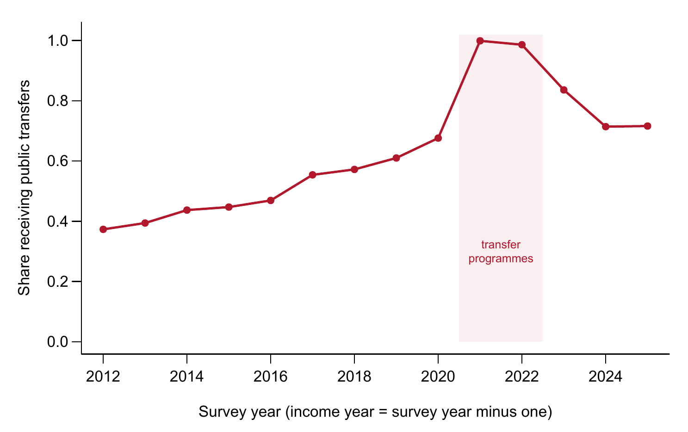
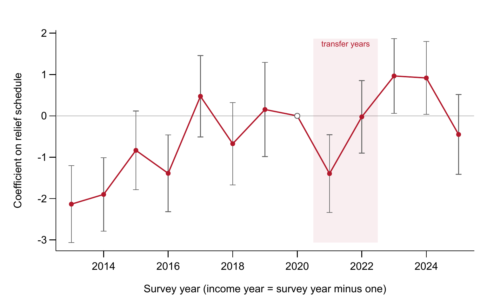
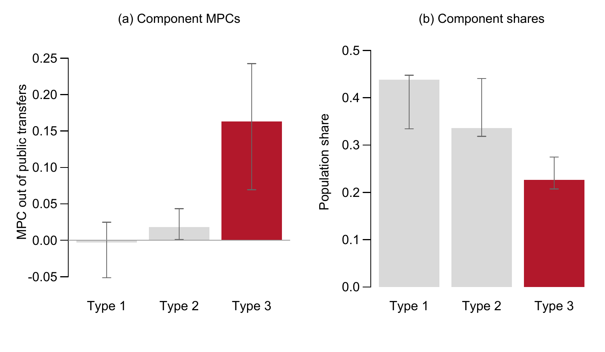
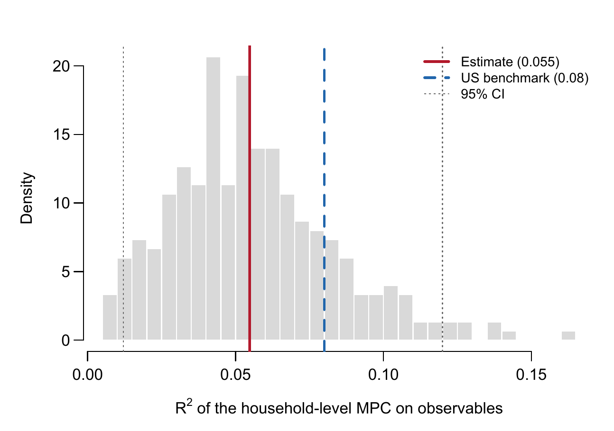
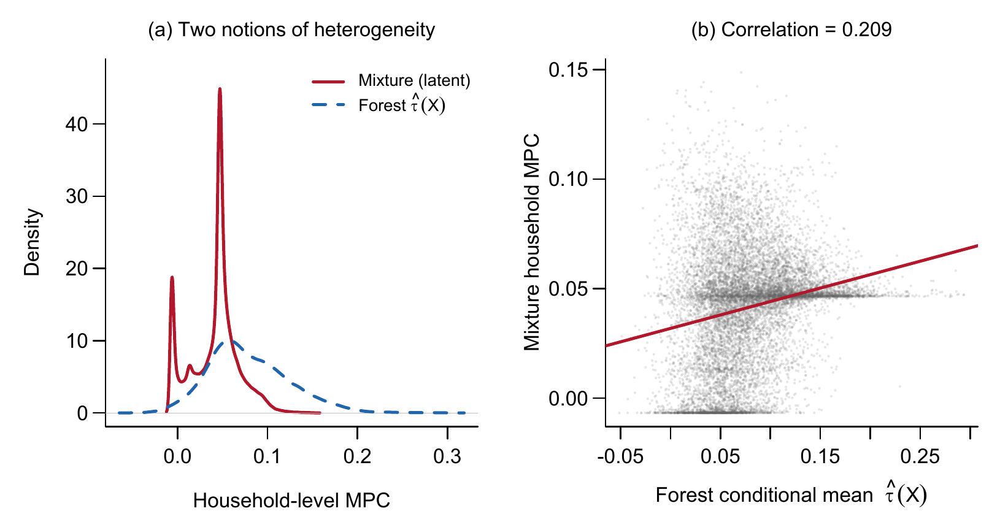
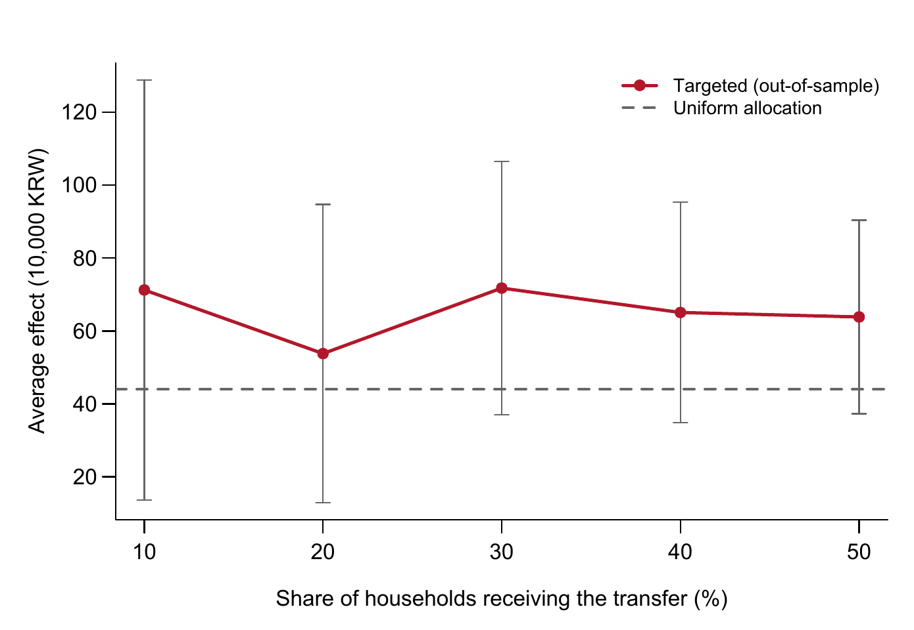

::: {.callout-note appearance="simple"}
**English version** — [The Distribution of Spending Out of Cash Transfers](../2026-09-mpc-heterogeneity-en/)

가계금융복지조사 공개용 자료 중 2012~2025년 조사를 이용하였다. 소득과 지출은 조사연도의 전년도 값이므로 2020년 및 2021년 지원금은 각각 2021년과 2022년 조사에 반영되어 있다.
:::

## 검토 배경

정부는 2020년 5월 전 가구를 대상으로 보편 지원금을 지급하였고, 2021년 9월에는 소득 하위 88% 가구에 선별 지원금을 지급하였다. 두 방식을 둘러싼 논의는 직접 검증된 바가 드문 전제에 기초하고 있다. 이전소득을 많이 소비하는 가구를 행정당국이 보유한 정보만으로 사전에 식별할 수 있다는 전제이다. 저소득 가구의 평균 반응이 크다는 사실은 가구 간 반응이 상이함을 보여줄 뿐, 선별규칙이 고반응 가구를 실제로 가려낼 수 있음을 뒷받침하지는 않는다.

본고에서는 가계금융복지조사 14개 연도를 연결한 패널(45,241가구, 가구-연도 1차 차분 132,965개)을 이용하여 두 가지 질문을 구분하여 검토하였다. 먼저 본 자료가 평균 반응에 대해 뒷받침할 수 있는 범위를 점검하고, 가구 간 반응의 분포를 추정한 후, 관측 가능한 특성이 그 분포를 어느 정도 설명하는지를 측정하였다. 검토 결과 약 4분의 1의 가구가 총소비 반응의 대부분을 차지하는 것으로 나타났으며, 소득·자산·유동성·부채 및 인구특성을 모두 고려하여도 해당 가구를 식별하는 설명력은 6~10%에 그쳤다.

### 주요 수치

| 항목 | 값 |
|:--|--:|
| 추정 표본 | 132,965 가구-연도 |
| 6개 추정량의 평균 한계소비성향 | 0.032~0.107 |
| 고반응 유형의 가구 비중 | 23% |
| 고반응 유형의 이전소득 한계소비성향 | 0.163 |
| 관측 특성이 설명하는 가구별 한계소비성향 변동 | 5.6~9.7% |
| 가구당 소비반응, 학습된 선별규칙 대 보편지급 | 40.9만 원 대 48.2만 원 |

## 1. 코로나19 지원금은 본 자료에서 자연실험으로 활용하기 어렵다

2020년 지원금은 가구원 수에 따라 증가하되 4인에서 상한이 적용되었으며, 지급액은 1인 가구 40만 원에서 4인 이상 가구 100만 원까지였다. 2021년 지원금은 건강보험료 기준 하위 88% 가구에 1인당 25만 원을 상한 없이 지급하였다. 두 지원금 모두 조사가 포착한 대부분의 가구에 지급되었다.

두 지원금을 활용한 식별전략을 두 가지 검토하였으나 모두 성립하지 않았으며, 그 사유는 아래와 같이 수치로 확인된다.

| 설계 | 1단계 | 실패 이유 |
|:--|:--|:--|
| 2020년 가구원 수별 지급액을 도구변수로 사용 | 계수 2.67, F = 287 | 계수가 1을 넘는다는 것은 가구원 수가 지원금 외 여러 코로나19 시기 이전소득을 함께 대리한다는 뜻이다. 2단계 최소자승 추정치는 1.53 |
| 2020년과 2021년 지급표의 기울기 반전 | 계수 1.16, F = 146 | 최소검출효과가 한계소비성향 기준 0.48이고, 지급 이전 연도의 계수가 지급 연도 계수만큼 크다 |

도구변수 접근은 배제제약을 충족하지 못한다. 가구원 수는 생애주기를 통해 소비 증가에 직접 영향을 미치며, 2020년 중 시행된 아동 돌봄 지원사업 역시 가구 구성에 연동되어 있었다. 지급표 기울기 반전을 이용한 설계는 원리상 보다 명확하다. 5인 이상 가구가 2020년에는 상대적으로 적게, 2021년에는 상대적으로 많이 수령하였기 때문이다. 다만 연간 소비 변화의 표준편차 788만 원이 지급 예정액의 표준편차 28.2만 원을 크게 상회하며, 현실적으로 가능한 한계소비성향 값은 모두 검출 가능 수준을 하회한다.

이는 분석 방법이 아니라 자료의 구조에서 비롯된 제약이다. 연간 단위의 관측주기, 연간 소비 대비 작은 지원금 규모, 보편적 지급, 그리고 가구원 수와 상관된 거시충격과의 시점 중첩이 그것이다. 따라서 이하의 추정치는 자연실험을 통해 식별한 인과효과가 아니라, 사전에 결정된 특성을 통제한 조건부 연관성으로 해석하여야 한다.

## 2. 평균 한계소비성향은 통제변수와 추정량 선택에 크게 좌우된다

기본 모형은 1차 차분으로 추정한다.

$$\Delta C_{it} = \alpha_t + \beta\,\Delta T_{it} + \gamma\,\Delta Y_{it} + X_{i,t-1}'\delta + \varepsilon_{it}$$

여기서 $\Delta C$는 연간 소비 변화, $\Delta T$는 공적 이전소득 변화, $\Delta Y$는 그 외 소득의 변화, $X_{i,t-1}$은 전년도 조사에서 측정한 20개 특성이다. 모든 통제변수에는 시차를 부여하였다. 동시점 변수, 예컨대 지원금으로 부채를 상환한 가구의 원리금상환비율은 그 자체가 지원금 지급의 결과이기 때문이다.

$\Delta Y$의 포함 여부에 따라 추정치의 부호가 달라진다. $\Delta Y$를 제외하면 이전소득 계수는 −0.004, 포함하면 +0.048로 나타난다. 이전소득은 여타 소득이 감소할 때 증가하며(상관계수 −0.164), 이는 실업급여·기초생활보장·연금의 제도 설계상 당연한 결과이다. 소비를 이전소득만으로 회귀할 경우 이러한 음(−)의 공변동이 이전소득 계수에 반영된다.

| 추정량 | 이전소득 한계소비성향 | (표준오차) |
|:--|--:|--:|
| 최소자승법 | 0.032 | (0.006) |
| 인과 포레스트 DML, 그래디언트 부스팅 | 0.075 | (0.042) |
| 선형 DML, 그래디언트 부스팅 | 0.075 | (0.006) |
| 선형 DML, 라쏘 | 0.085 | (0.007) |
| 일반화 랜덤 포레스트 | 0.102 | (0.009) |
| 희소 선형 DML, 그래디언트 부스팅 | 0.107 | (0.034) |

: 모든 행이 같은 자료·추정대상·통제변수를 사용한다. 교차적합(cross-fitting) 폴드는 가구 단위로 분할하였다. 무작위로 분할할 경우 동일 가구의 상이한 연도가 분할의 양쪽에 배치되기 때문이다.

모형을 동일하게 설정하여도 추정치는 수렴하지 않는다. 추정치의 범위는 3.4배에 이르며, 유연한 추정량 가운데 하나를 선택할 객관적 기준은 없다. 한편 추정량 간 비교는 진단 수단으로도 활용되었다. 초기 모형에서는 동시점 통제변수를 포함함에 따라 처치변수의 표본외 $R^2$가 0.12에서 0.64로 상승하고 DML 추정치가 0.058에서 0.019로 하락하였는데, 이러한 설정 오류는 두 추정량이 3배의 격차를 보임에 따라 발견되었다.

## 3. 단위를 조정하면 국내 추정치는 대체로 수렴한다

국내 한계소비성향 추정치는 0.07에서 0.61 수준에 분포한다. 이러한 편차의 상당 부분은 가계 행태의 차이가 아니라 측정방식의 차이에 기인한다.

| 연구 | 자료와 방법 | 보고치 | 수준 한계소비성향 |
|:--|:--|--:|--:|
| Song (2020) | 가계금융복지조사 내부자료; 탄력성 | 0.180 (일시소득) | 0.085~0.107 |
| Hong (2021) | 한국노동패널·고령화연구패널; 탄력성 | 0.2 (일시소득) | 0.15 |
| Baek et al. (2023) | 카드자료; 시도별 이중차분 | 0.36~0.58 | 0.36~0.58 |
| Kim, Koh and Lyou (2023) | 서울 카드자료; 이중차분 | ≥ 0.59 | ≥ 0.59 |
| Kim and Oh (2020) | 카드·매출자료; 사건연구 | 0.26~0.36 | 0.26~0.36 |
| Lee, Kang and Woo (2022) | 가계동향조사; 삼중차분 | 0.36~0.48 | 0.36~0.48 |
| Noh (2021) | 가계금융복지조사 2019 횡단면; 회귀분석 | 0.07~0.21 | 0.07~0.21 |
| 본 연구 | 가계금융복지조사 공개자료 2013~2025; 포레스트·유한혼합모형 | 0.032~0.107 | 0.032~0.107 |

: 탄력성은 평균소비성향을 곱하여 환산하였다. Song (2020)에는 표본기간의 소비/가처분소득 비율 0.592를 적용하고, 비내구재 소비를 사용한 점을 반영하여 0.47을 하한으로 설정하였다. Hong (2021)은 0.75를 적용하여 환산하였다.

첫째, 단위의 차이이다. Song (2020)은 로그 잔차를 이용하므로 계수가 탄력성에 해당하며, 전체 계수 0.288을 한계소비성향으로 해석할 경우 그 수준을 약 2배 과대평가하게 된다. 이를 환산하면 동 연구의 일시소득 추정치는 0.085~0.107로, 본고의 포레스트 추정치 0.102를 포함한다.

둘째, 측정대상의 차이이다. 카드거래 자료를 이용한 연구는 지급 후 수 주간의 지출을 관측한다. 즉각적 반응은 포착하나 현금 및 계좌이체를 통한 지출은 포착하지 못하며, 이후 발생하는 소비 대체를 반영하지 못한다. 반면 연간 조사는 해당 연도 전체의 순변화를 기록하므로 구조적으로 작은 값이 산출된다. 따라서 양자를 직접 비교하는 것은 적절하지 않다. 셋째, 방법론의 차이이다. 동일한 자료에서도 추정량 선택만으로 3.4배의 격차가 발생한다.

## 4. 반응은 폭넓게 분산되어 있으며 소수 가구가 총반응의 대부분을 차지한다

적합값의 분산만으로는 이질성의 근거가 되지 못한다. 표본외 자료를 이용한 보정검정(calibration test)에서 포레스트의 차등예측 계수는 1.02(표준오차 0.165, p = 3 × 10⁻¹⁰)로 추정되어, 포레스트가 포착한 변동이 적합 과정의 산물이 아님을 확인하였다. 소비 변화의 분포를 따라 살펴보면 이전소득 계수는 10분위 0.029에서 90분위 0.098로 3배 이상 확대되는 반면, 여타 소득의 계수는 0.071에서 0.128로 증가하는 데 그친다.

다만 분위수 분석은 이전소득이 소비 변화의 분포를 어떻게 이동시키는지를 보여줄 뿐, 가구 간 반응의 분포를 직접 보여주지는 않는다. 이에 Lewis, Melcangi and Pilossoph (2024)에 따라 각 가구가 관측되지 않는 $K$개 유형 중 하나에 속하며 유형별로 고유한 이전소득 계수를 갖는 모형을 설정하였다.

$$\Delta C_{it} = \alpha_k + \beta_k\,\Delta T_{it} + \gamma_k\,\Delta Y_{it} + \varepsilon_{it}, \qquad \varepsilon_{it} \sim N(0, \sigma_k^2)$$

| 유형 | 이전소득 한계소비성향 | 95% 구간 | 가구 비중 | 95% 구간 |
|:--|--:|--:|--:|--:|
| 유형 1 | −0.003 | −0.051~0.025 | 43.8% | 33.4~44.8 |
| 유형 2 | 0.018 | 0.001~0.043 | 33.6% | 31.8~44.1 |
| 유형 3 | 0.163 | 0.070~0.243 | 22.6% | 20.7~27.5 |

: 가구-연도 1차 차분 123,609개에 대한 3개 성분 혼합모형으로, 무작위 시작점 5개에서 EM 알고리즘으로 추정하였다. 구간은 가구 단위로 재표집한 부트스트랩 300회의 백분위이며, 각 반복에서 성분을 한계소비성향 순으로 정렬하였다.

확률가중 평균은 0.042로 선형 추정치의 범위 내에 있다. 혼합모형은 상이한 평균을 산출하는 것이 아니라 동일한 평균을 불균등한 구성요소로 분해하며, 유형 3이 그 평균의 약 90%를 차지한다.

세 유형은 간결한 요약일 뿐 행태적 범주는 아니다. 정보기준은 성분 7개까지 계속 하락하며, 이 경우 고반응 유형의 한계소비성향은 0.26, 비중은 15%로 나타난다. 추정치의 크기는 이상치 절단 방식에도 민감하다. 절단을 가장 약하게 적용하면 고반응 성분은 0.071에 비중 48.5%, 가장 강하게 적용하면 0.266에 비중 20.0%이다. 다만 모든 설정에서 공통적으로 유지되는 것은 분포의 형태, 즉 넓은 분산과 소수의 고반응 가구이다.

## 5. 관측 가능한 특성으로는 고반응 가구를 식별하기 어렵다

하위집단 비교만으로는 유동성 제약의 강한 증거로 보인다. 유동자산 최하위 4분위의 한계소비성향은 0.169, 최상위 4분위는 0.065이다. 다만 변수를 함께 포함한 투영에서는 전년도 소득과 원리금상환비율만이 유의하게 나타난다. 유동성과 소득은 동행하며, 유동성 기울기는 대체로 상관된 대리변수를 통해 발현된 소득효과로 판단된다.

보다 엄밀한 검정은 혼합모형에서 도출한 가구별 사후 기대 한계소비성향을 행정당국이 관측 가능한 변수, 즉 소득·소비·유동자산·순자산·부채·원리금상환·가구원 수·연령·연도에 투영하는 것이다.

| 측정 | 설명 비중 |
|:--|--:|
| 선형 투영, 3개 유형 | 5.6% (95% 구간 1.2~12.0%) |
| 선형 투영, 7개 유형 | 7.0% |
| 회귀 포레스트, 표본외(out-of-bag), 7개 유형 | 9.7% |
| 미국 (Lewis, Melcangi and Pilossoph, 2024) | 약 8% |

어떠한 측정방식을 적용하더라도 가구의 이전소득 소비행태 변동 가운데 약 90%는 상세한 가계 재무상태 조사로도 포착되지 않는다. 설명되는 부분 역시 대부분 통상적인 자원 관련 변수에 기인한다. 전년도 소비와 소득만으로 설명된 변동의 98%가 확보되며, 유동성 변수 전체를 제외하여도 1.4%, 부채 및 원리금상환 변수를 제외하여도 0.3% 감소하는 데 그친다.

포레스트의 조건부 효과와 혼합모형의 가구별 한계소비성향은 거의 직교한다(상관계수 0.21). 통제변수는 예측 반응의 분산을 실제로 확대시킨다. 포레스트의 표준편차는 0.045로 혼합모형의 0.027을 상회한다. 다만 그 분산은 총소비를 좌우하는 잠재적 이질성과 일치하지 않는다.

## 6. 선별지급은 원당 반응을 높이나 총반응은 축소시킨다

선별의 효과는 규칙 학습에 사용하지 않은 가구를 대상으로 평가하여야 한다. 동일 표본에서 순위를 산정하고 평가할 경우 상위 20%에만 지급할 때 원당 효과가 1.84배로 확대되는 것으로 나타난다. 그러나 학습에 사용하지 않은 가구에서는 그 이득이 1.2~1.6배에 그치며, 선별 범위를 축소하여도 확대되지 않는다.

| 지급 대상 | 효과 (만 원) | (표준오차) | 균등지급 대비 |
|:--|--:|--:|--:|
| 전체 (균등지급) | 43.98 | — | 1.00 |
| 상위 50% | 63.84 | (13.55) | 1.45 |
| 상위 40% | 65.06 | (15.43) | 1.48 |
| 상위 30% | 71.75 | (17.72) | 1.63 |
| 상위 20% | 53.79 | (20.89) | 1.22 |
| 상위 10% | 71.24 | (29.39) | 1.62 |

: 별도의 가구 집합에서 추정한 조건부 효과로 순위를 매겨 상위 k%에 든 가구의 평균 이중강건 점수. 표본은 가구 단위로 학습용 22,620가구와 평가용 22,621가구로 분할하였다.

재무상태 변수로 학습한 깊이 2의 정책나무(Athey and Wager, 2021)는 예상대로 작동한다. 유동자산비율로 먼저 분할한 후 순자산 2억 6,700만 원 초과 또는 유동자산 2억 9,600만 원 초과 가구, 즉 자산수준이 뚜렷이 높은 가구를 제외하고 전체 가구의 80%에 지급을 배정한다. 배정 가구의 중위소득은 2,900만 원, 제외 가구는 6,460만 원이다. 통제변수가 모두 관측된 평가용 가구를 기준으로 동 규칙의 가구당 소비반응은 40.9만 원으로, 전 가구 지급 시의 48.2만 원을 하회한다.

제외된 20%가 소비를 하지 않는 가구인 것은 아니다. 이들의 평균 조건부 한계소비성향도 0.036 수준이다. 이들을 제외함으로써 감소하는 총량이 나머지 80%에 집중함으로써 증가하는 반응을 상회한다. 즉 선별은 원당 반응을 제고하나 대상 가구를 축소함에 따라 총량은 감소한다. 이는 효율과 규모 간의 선택 문제이며, 어느 쪽을 우선할지는 예산과 목표 부양 규모 중 무엇이 제약으로 작용하는지에 따라 달라진다.

## 7. 현 시점의 증거가 뒷받침하는 결론의 범위

**확인된 사실.** 이전소득 한계소비성향의 이질성은 실재한다. 보정검정은 반응의 동질성을 기각하며, 유형 간 분산은 0과 구별되게 추정된다. 소수 가구가 총반응의 대부분을 차지한다. 관측 특성은 가구별 변동의 6~10%를 설명하며, 이는 미국의 추정치와 통계적으로 구별되지 않는다.

**배제되는 해석.** 연간 조사자료에서 2020년 및 2021년 지원금을 자연실험으로 해석하는 것은 타당하지 않다. 단위·관측기간·추정량을 조정하기 전에 국내 추정치의 편차를 가계 행태의 불일치로 간주하는 것도 적절하지 않다. 하위집단 기울기로 선별규칙의 효과를 추론하는 것 역시 마찬가지이다. 소득 최하위 5분위의 한계소비성향 0.165(최상위 0.045)는 보편지급을 상회하는 배분규칙으로 이어지지 않는다.

**여전히 가능한 설명.** 유동성의 중요도는 본 자료가 시사하는 수준보다 클 수 있다. 공개자료는 내부자료에 기록된 현금 보유액이 아니라 저축성 예금을 측정하며, 이러한 측정오차는 유동성 계수를 0 방향으로 약화시킨다. 보다 풍부한 자료를 보유한 행정당국은 개선된 규칙을 설계할 수 있으며, 본 평가가 다루지 않은 분배 또는 보험 목적에서 선별이 정당화될 여지도 있다.

**미해결 과제.** 한계소비성향의 인과적 수준은 규명되지 않았다. 보고된 소비의 측정오차를 감안하면 조사 기반 추정치는 하한으로 해석하는 것이 적절하다. 이상치 절단과 성분 수에 따라 달라지는 고반응 유형의 정확한 크기와 비중, 그리고 한계소비성향이 0.16인 가구와 여타 조건이 유사하되 0인 가구를 실제로 구분하는 요인도 과제로 남는다.

## 8. 표본 확대보다 자료의 연결이 필요하다

앞서 제시한 한계는 동일한 종류의 관측치를 늘리는 방식으로는 해소되지 않는다. 각 한계는 서로 다른 정보원을 필요로 한다.

**거래기록과 연결된 조사 가구.** 카드 및 행정 지출기록은 식별에 필요한 시점 정밀도를 갖추고 있으며, 조사자료는 그러한 기록에 없는 재무상태 정보를 보유하고 있다. 양자를 연결하면 두 자료의 장점을 결합할 수 있다.

**시계열적 반응.** 14개 연도의 연결 패널은 이전소득 지출이 여러 해에 걸쳐 전개되는 양상, 즉 이질적 경제주체 모형의 입력값으로 사용되는 시점 간 한계소비성향(Auclert, Rognlie and Straub, 2024)을 추적하기에 충분한 기간을 확보하였다.

**가상 소득에 대한 응답조사.** 재무상태의 설명력이 이처럼 제한적이라면, 의도된 반응을 직접 질문하는 설문(Colarieti, Mei and Stantcheva, 2024)이 재무자료로는 접근할 수 없는 선호와 기대를 파악하는 가장 직접적인 방법이다.

**현금 보유액.** 내부자료의 현금 보유액을 이용하여 투영을 재수행하면, 유동성이 실제로 설명력이 없는 것인지 아니면 단지 측정이 부정확한 것인지를 판별할 수 있다.

## Working paper

영문 Working Paper에는 전체 추정식, 14개 연도 패널 구축 과정, 배포 변수 매핑의 교정 내용, 그리고 코로나19 시기 조사연도·이상치 절단·표본 구성·패널 이탈·혼합 성분 수에 대한 강건성 점검이 18개 표와 8개 그림 및 부록으로 수록되어 있다.

[PDF 내려받기](https://khdouble.github.io/files/wp/unobservable-heterogeneity-mpc-korea.pdf)

### 권장 인용

> Kim, Hyun Hak (2026). "Unobservable Heterogeneity in the Marginal Propensity to Consume: Evidence from Korean Household Panel Data." Working Paper, August 25.

### 데이터와 코드

본 연구는 통계청·한국은행·금융감독원이 공동으로 작성하는 가계금융복지조사 공개용 마이크로데이터를 이용하였다. 동 자료는 통계청 [마이크로데이터 통합서비스(MDIS)](https://mdis.kostat.go.kr)에 등록한 이용자에게 제공되며, 이용약관상 재배포가 허용되지 않으므로 원자료는 본 사이트에 포함하지 않는다.

코드와 재현 자료는 논문 출판 시 공개할 예정이다. 그 전까지 학술적 재현·검증을 위한 요청은 개별적으로 처리한다. 문의는 [hyunhak.kim@kookmin.ac.kr](mailto:hyunhak.kim@kookmin.ac.kr)로 주시기 바란다.

### 참고문헌

Athey, S. and Wager, S. (2021). Policy learning with observational data. *Econometrica*, 89(1), 133–161.

Auclert, A., Rognlie, M. and Straub, L. (2024). The intertemporal Keynesian cross. *Journal of Political Economy*, 132(12), 4068–4121.

Baek, S., Kim, S., Rhee, T. and Shin, W. (2023). How effective are universal payments for raising consumption? Evidence from a natural experiment. *Empirical Economics*, 65, 1–30.

Colarieti, R., Mei, P. and Stantcheva, S. (2024). The how and why of household reactions to income shocks. NBER Working Paper 32191.

Hong, K. (2021). *Analysis of the Marginal Propensity to Consume Considering Household Characteristics*. National Assembly Budget Office. 국문.

Kim, M. and Oh, Y. (2020). *Analysis of the Effects of the Emergency Disaster Relief Payments*. Korea Development Institute. 국문.

Kim, S., Koh, K. and Lyou, W. (2023). Means-tested COVID-19 stimulus payment and consumer spending: Evidence from card transaction data in South Korea. *Economic Analysis and Policy*, 78, 1359–1371.

Lee, W., Kang, C. and Woo, S. (2022). The effects of the 2020 COVID-19 emergency income support on household consumption in Korea. *Korean Journal of Economic Studies*, 70(1). 국문.

Lewis, D. J., Melcangi, D. and Pilossoph, L. (2024). Latent heterogeneity in the marginal propensity to consume. *Review of Economic Studies*, forthcoming.

Noh, Y. (2021). Consumption effects of transfer payments: Estimating the marginal propensity to consume. *Health and Social Welfare Review*, 41(2). 국문.

Song, S. (2020). Leverage, hand-to-mouth households, and heterogeneity of the marginal propensity to consume: Evidence from South Korea. *Review of Economics of the Household*, 18(4), 1213–1244.
