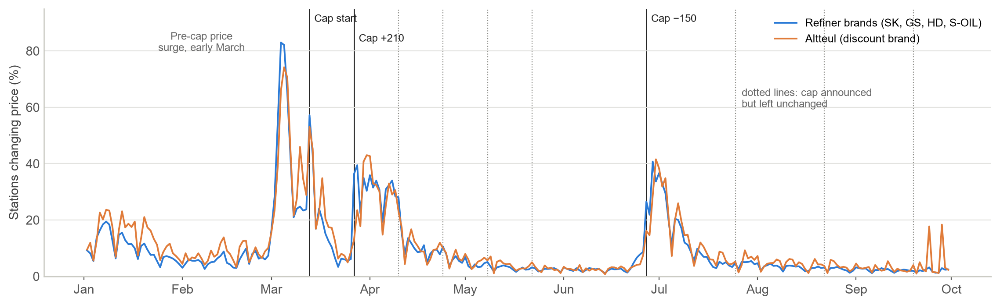
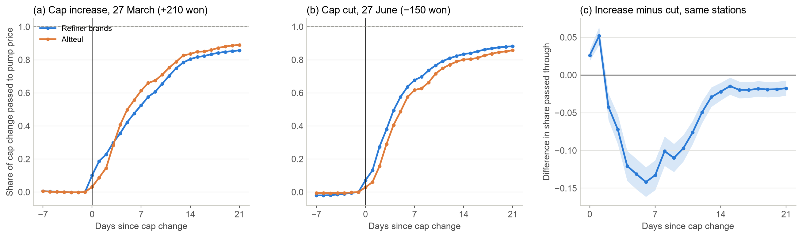
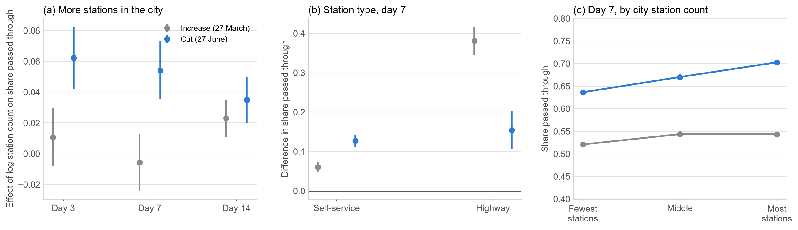
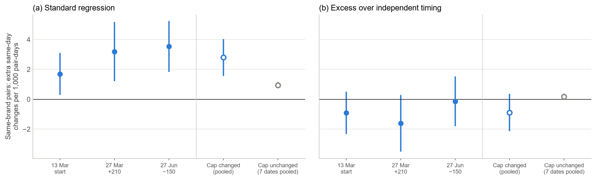
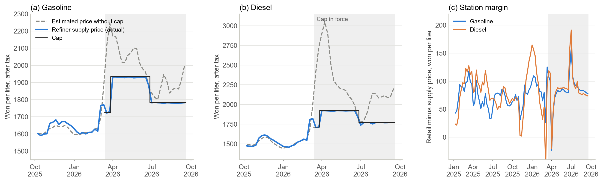

::: {.callout-note appearance="simple"}
**English version** — [Two Weeks to the Pump](../2026-10-fuel-price-cap-en/)

한국석유공사 오피넷이 공개하는 전국 주유소 10,744곳(정유 4사와 알뜰주유소)의 일별 판매가격(2024년 12월 29일~2026년 9월 30일)을 썼다. 정유사 주간 공급가격과 싱가포르 석유제품 시세도 오피넷에서, 원/달러 환율은 한국은행 ECOS에서 받았다. 무엇을 어떻게 검정할지는 결과를 보기 전에 문서로 정해 두었다.
:::

## 한눈에 보기

정부는 2026년 3월 13일부터 정유사가 주유소에 넘기는 기름값에 상한을 걸었다. 소비자가 주유소에서 내는 값이 아니라 도매가격에 건 상한이다. 상한을 언제, 얼마나 바꿀지는 미리 발표된다. 주유소 입장에서는 날짜와 크기를 아는 원가 변화가 생기는 셈이다. 그래서 "알려진 원가 변화가 소비자 가격에 얼마나 빨리 전달되는가"를 비교적 깨끗하게 볼 수 있다.

전국 주유소의 하루하루 가격을 따라가 보니 결론은 이렇다.

- 상한이 바뀐 날, 가격을 바꾼 주유소가 평소의 몇 배로 늘었다. 상한을 동결한 날에는 그런 일이 없었다.
- 상한 변경 폭의 약 80%가 2주 안에, 85~90%가 3주 안에 주유소 가격에 반영됐다.
- 주유소가 많은 시·군, 셀프 주유소, 고속도로 주유소일수록 더 빨리 내렸다.
- 같은 주유소끼리 비교하면 내릴 때가 올릴 때보다 빨랐다.
- 같은 브랜드 주유소끼리 날짜를 맞춰 가격을 바꾼 흔적은 없었다.
- 상한은 시행 내내 국제 시세로 따진 공급가격보다 낮았다. 그 차이는 주유소가 아니라 정유사와 유류세 인하가 떠안았다.

| 항목 | 수치 |
|:--|--:|
| 분석한 주유소 | 10,744곳, 2024.12.29~2026.9.30 매일 |
| 상한 시행일(3.13) 가격을 바꾼 정유 4사 주유소 | 54~63% |
| 상한 동결일 7번, 가격 변경 비율이 늘어난 최대 폭 | 3.6%p |
| 3.27 인상분이 반영된 비율, 1주 / 2주 / 3주 뒤 | 54% / 81% / 86% |
| 6.27 인하분이 반영된 비율, 1주 / 2주 / 3주 뒤 | 67% / 83% / 88% |
| 같은 주유소 9,933곳의 1주 뒤 반영 비율 차이(인상 − 인하) | −13.3%p |
| 상한과 국제 시세 기준 공급가격의 차이, 휘발유 / 경유 | 주별 17~236원 / 23~1,131원 낮음 |
| 주유소 마진(휘발유), 2025년 / 상한 기간 | 리터당 71원 / 77~87원 |

## 어떤 제도였나

중동 전쟁으로 국제 기름값이 치솟자 정부는 3월 13일 정유사 공급가격에 최고가격을 정했다. 처음 상한은 리터당 휘발유 1,724원, 경유 1,713원이었다. 3월 27일에는 상한을 210원 올렸고, 같은 날 유류세 인하 폭도 휘발유 7%→15%, 경유 10%→25%로 키웠다. 그 뒤 네 번 연달아 동결했다가 6월 27일 150원 내렸고, 다시 세 번 동결했다. 조정 주기는 6차부터 2주에서 4주로 늘었다.

유류세를 깎아 주거나 주유소 판매가격 자체에 상한을 두는 정책은 해외 연구가 꽤 쌓여 있다. 2022년 독일과 유럽 여러 나라의 유류세 인하, 2021~2022년 헝가리의 소매가격 상한이 대표적이다. 하지만 정유사 공급가격에 상한을 두고 몇 주마다 고치는 제도가 주유소 가격에 어떻게 이어지는지를 전국 주유소의 일별 자료로 본 연구는 찾지 못했다.

## 어떻게 봤나

가격이 실제로 움직인 상한 변경은 세 번이다. 3월 13일 시행, 3월 27일 210원 인상, 6월 27일 150원 인하다. 각 변경 전날 가격을 기준으로, 며칠 뒤 주유소 가격이 상한 변경 폭의 몇 %만큼 움직였는지(누적 반영률)를 주유소마다 계산했다. 3월 13일은 상한이 주중에 도입돼 정유사 주간 공급가격으로는 원가가 정확히 얼마나 변했는지 알 수 없어서, 반영률 대신 가격을 바꾼 시점만 봤다.

지역 차이는 같은 브랜드, 같은 시·도 안에서 비교했다. 시·군의 주유소 수(2026년 2월 기준), 셀프 여부, 고속도로 여부에 따라 반영률이 어떻게 다른지 회귀분석으로 추정했다. 상한을 동결한 일곱 번의 날은 "아무 일도 없어야 하는 날"로 삼아 결과를 대조했다.

## 상한이 바뀐 날, 주유소가 한꺼번에 움직였다

평소 하루에 가격을 바꾸는 주유소는 많지 않다. 2026년 2월에는 6%, 8월에는 3% 안팎이었다. 그런데 상한이 시행된 3월 13일에는 정유 4사 주유소의 54~63%, 알뜰주유소의 89%가 그날 가격을 바꿨다. 3월 27일 인상 다음 날과, 토요일에 시행된 6월 27일 인하 뒤 첫 월요일에도 40% 안팎이 가격을 바꿨다. 반면 상한을 동결한 일곱 번은 가격 변경 비율이 많아야 3.6%p 늘었을 뿐이다.

한 가지 짚어 둘 점이 있다. 올해 가격을 바꾼 주유소가 가장 많았던 날은 상한 시행 전인 3월 초(정유 4사 83%)였다. 국제 기름값이 급등하던 때다. 상한 변경일의 쏠림은 이 급등기와 별개로 변경일마다 따로 나타났다.

## 2주에 80%, 3주에 90% 가까이

반응은 빨랐지만 한 번에 끝나지 않았다. 정유 4사 주유소가 처음 가격을 바꾸기까지는 보통 0~2일이면 충분했다. 그러나 상한 변경 폭이 다 반영되기까지는 2~3주가 걸렸다. 하루 10~15원씩 나눠서 따라간 셈이다.

| 사건 | 상한 변경 | 1주 뒤 | 2주 뒤 | 3주 뒤 | 주유소 |
|:--|--:|--:|--:|--:|--:|
| 3월 27일 인상 | +210원 | 54% | 81% | 86% | 10,151곳 |
| 6월 27일 인하 | −150원 | 67% | 83% | 88% | 10,038곳 |

: 〈표 1〉 상한 변경분이 휘발유 판매가격에 반영된 비율(주유소 평균). 경유도 2주 뒤 80%(인상), 86%(인하)로 비슷하다.

알뜰주유소는 움직임이 달랐다. 인상 때는 사흘 동안 거의 꿈쩍하지 않다가 그 뒤 빠르게 올려, 3주 뒤에는 오히려 정유 4사보다 높은 89%까지 반영했다. 인하 때는 정유 4사보다 조금 늦었다. 알뜰주유소는 석유공사 공동구매로 공급가격이 주 단위로 정해지는데, 이런 구조와 맞는 모습이다.

## 주유소가 많은 동네부터 싸졌다

같은 브랜드, 같은 시·도 안에서 비교하면 주유소가 많은 시·군일수록 인하가 빨리 반영됐다. 6월 27일 인하 일주일 뒤, 주유소 수가 두 배인 시·군은 가격이 약 5.6원 더 내려가 있었다. 셀프 주유소는 일반 주유소보다 약 19원, 고속도로 주유소는 약 23원 더 내려가 있었다. 상한을 동결한 날에는 이런 차이가 보이지 않았다.

| | 3일 뒤 | 1주 뒤 | 2주 뒤 |
|:--|--:|--:|--:|
| 6월 27일 인하 | 0.062 (0.010) | 0.054 (0.010) | 0.035 (0.008) |
| 3월 27일 인상 | 0.011 (0.010) | −0.006 (0.009) | 0.023 (0.006) |
| 세 번 통합(휘발유) | 0.069 (0.016) | 0.053 (0.016) | 0.049 (0.014) |
| 세 번 통합(경유) | 0.051 (0.011) | 0.039 (0.010) | 0.038 (0.008) |

: 〈표 2〉 시·군 주유소 수(로그)가 반영률에 미친 영향. 같은 브랜드·같은 시·도끼리 비교했고 셀프·고속도로 여부를 함께 넣었다. 괄호 안은 시·군 단위 표준오차(229개 시·군). 상한 동결일에 같은 방식으로 재면 그 효과는 1주 뒤 가격 기준 −0.34원(휘발유)으로, 실제 변경일의 20분의 1도 안 된다.

올릴 때는 사정이 달랐다. 첫 일주일까지는 시·군별 차이가 없다가 2주째에 차이가 났다. 경쟁이 치열한 곳은 내릴 때 먼저 내리고, 올릴 때는 나중에 따라 올린 것이다. 셀프와 고속도로 주유소는 올릴 때도 빨랐는데, 특히 고속도로 주유소는 인상 일주일 뒤 반영률이 38%p나 높았다.

## 내릴 땐 빨랐고, 올릴 땐 느렸다

기름값은 흔히 "오를 땐 로켓, 내릴 땐 깃털"이라고 한다(Borenstein, Cameron and Gilbert, 1997). 이번에는 반대였다. 두 번 모두 표본에 든 주유소 9,933곳을 비교하면, 일주일 뒤 반영률이 인상 때가 인하 때보다 13.3%p 낮았다(경유 17.6%p). 2주가 지나면 차이는 2.2%p로 거의 사라진다. 정유 4사 모두 같은 방향이었고 알뜰주유소는 차이가 없었다.

다만 조심해서 읽어야 한다. 인상과 인하가 한 번씩뿐이다. 3월 27일 인상은 유류세 인하 확대와 같은 날이어서 소비자가 느낀 가격 변화가 상쇄됐다. 상한 기간에는 정부와 언론이 기름값을 유난히 지켜보기도 했다. 게다가 이 비대칭은 자료 일부를 본 뒤에 눈에 띈 것이라, 미리 등록한 가설로 확인한 결과가 아니다. 상한이 다시 바뀌면 미리 정한 방법으로 다시 확인할 계획이다.

## 같은 브랜드끼리 날짜를 맞추진 않았다

같은 시·군의 같은 브랜드 주유소 두 곳이 같은 날 가격을 바꾸는 비율은 다른 브랜드 두 곳보다 0.2~0.5%p 높았다. 언뜻 같은 브랜드끼리 보조를 맞춘 것처럼 보인다. 하지만 이 차이는 브랜드마다 가격을 자주 바꾸는 정도가 조금씩 다르다는 사실만으로도 생긴다.

간단한 예로 따져 보자. 서로 상관없이 움직이는 주유소 두 곳이 같은 날 가격을 바꿀 확률은 두 확률의 곱이다. 하루에 가격을 바꿀 확률이 20%인 브랜드와 40%인 브랜드가 있다면, 같은 브랜드 쌍의 평균 동시 변경 확률은 (4%+16%)/2=10%, 다른 브랜드 쌍은 8%다. 아무도 날짜를 맞추지 않아도 같은 브랜드 쌍이 더 자주 함께 움직이는 것처럼 나온다. 그래서 실제 동시 변경에서 이렇게 "우연히 겹칠 확률"을 빼고 남는 부분만 봤다. 이 보정은 추정 전에 정했다.

보정하고 나면 같은 브랜드 쌍의 초과 동시 변경은 1,000쌍·일당 −0.89(표준오차 0.64)로 0보다 크지 않았다. 흔히 쓰는 회귀식은 상한 변경일에 +2.80을 줬지만, 상한을 동결한 날에도 +0.94를 줬다. 같은 브랜드끼리 날짜를 맞춘 게 아니라 계산 방식이 만든 착시라는 뜻이다. 예외는 알뜰주유소끼리였다. 알뜰주유소 쌍은 보정 뒤에도 8.6(2.8)으로 함께 움직이는 경향이 뚜렷했다. 공동구매 가격이 주 단위로 정해지는 구조 탓으로 보인다.

## 상한은 내내 가격을 눌렀다

상한 기간 내내 정유 4사의 공급가격은 상한보다 2~6원 낮은 수준에 붙어 있었다. 이것만 보면 두 가지로 읽을 수 있다. 원가가 상한보다 높아 모두가 상한까지 받았을 수도 있고, 원가가 상한 아래로 내려갔는데도 상한이 일종의 기준점이 돼 가격이 안 내려갔을 수도 있다. 뒤의 경우라면 상한이 사실상 담합의 길잡이 노릇을 한 셈이다. 실제로 가격 상한이 그런 역할을 한 사례가 미국 신용카드 금리(Knittel and Stango, 2003)와 중국 주유소(Zhang et al., 2020)에서 보고된 바 있다.

어느 쪽인지 가리기 위해 상한 도입 전 60주(2025년 1월~2026년 2월)의 자료로 정유사 공급가격이 싱가포르 시세와 환율을 어떻게 따라갔는지 식을 세웠다. 이 식은 공급가격을 꽤 잘 설명했다(휘발유 설명력 84%, 경유 89%, 평균 오차 리터당 16~18원). 이 식을 상한 기간에 적용하면 "상한이 없었다면 받았을 공급가격"을 추정할 수 있다.

결과는 분명했다. 상한은 시행 내내 이 추정치보다 낮았다. 상한이 바뀐 주를 뺀 22주 가운데 상한이 추정치보다 오차 범위 이상 높았던 주는 휘발유, 경유 모두 한 주도 없었다. 식을 바꿔 다시 계산해도 같았다. 상한은 추정치보다 휘발유는 주별로 17~236원, 경유는 23~1,131원(4월 초) 낮았다.

원유 가격만 보면 7~8월에는 상한이 원가보다 높았던 것처럼 보인다. 하지만 올해는 원유보다 휘발유·경유 제품 시세가 훨씬 더 많이 올랐다. 제품 시세로 따지면 상한이 원가보다 높았던 적은 없다. 그러니 정유 4사 가격이 상한에 나란히 붙어 있었던 것은 상한이 실제로 가격을 눌렀기 때문으로 보는 게 자료와 맞다. 바꿔 말하면, 상한 기간에 가격이 나란했다는 사실만으로는 담합 여부를 판단할 수 없다.

그렇다면 상한이 깎아 준 몫은 누가 떠안았을까. 주유소는 아니었다. 주유소 마진(판매가격에서 공급가격을 뺀 값)은 상한 전후로 거의 그대로였다. 소비자가 덜 낸 돈은 정유사의 공급가격과 정부의 유류세 인하에서 나왔다.

| 기간 | 휘발유 | 경유 |
|:--|--:|--:|
| 2025년 | 71 | 81 |
| 2026년 1~2월 | 89 | 89 |
| 2026년 4~6월(상한 1,934원) | 77 | 82 |
| 2026년 7~9월(상한 1,784원) | 87 | 83 |

: 〈표 3〉 주유소 마진(리터당 원). 정유 4사 주유소의 주간 평균 판매가격에서 정유사 주간 평균 공급가격을 뺀 값의 평균이다. 상한이 바뀐 주는 주간 평균이 변경일 앞뒤를 섞어 일시적으로 크게 튀므로 뺐다.

## 무엇이 확인됐고, 무엇은 아직인가

**확인된 것.** 상한이 바뀌면 그날 주유소들이 한꺼번에 가격을 바꿨고, 2주 안에 약 80%, 3주 안에 85~90%가 반영됐다. 주유소가 많은 시·군과 셀프·고속도로 주유소에서 더 빨리 내렸다. 상한은 시행 내내 실제로 가격을 눌렀고, 주유소 마진은 그대로였다.

**아니었던 것.** 같은 브랜드 주유소끼리 날짜를 맞춰 가격을 바꾼다는 해석은 근거가 없었다. 상한이 원가보다 높아진 뒤에도 가격을 붙잡아 두는 바닥 노릇을 했다는 해석도 맞지 않았다. 상한 기간에 시·군 안 주유소 간 가격 차이가 40~60% 줄긴 했지만, 원래 기름값이 비쌀수록 가격 차이가 줄어드는 경향이 있어서 상한 덕분이라고 볼 수는 없었다.

**아직 모르는 것.** 내릴 때가 올릴 때보다 빠른 현상이 이 제도의 일반적인 특징인지는 사건이 더 쌓여야 알 수 있다. 3월 13일 시행 때 반영률이 정확히 얼마였는지는 정유사 공급가격이 주 단위라 알 수 없다. 소비자가 얻은 이익과 정유사가 진 부담이 모두 얼마인지는 판매량 자료가 없어 계산하지 못했다. 상한이 원가보다 훨씬 낮았던 동안 정유사가 수출을 늘리거나 재고를 줄였는지도 확인하지 못했다. 2026년 7월 정유 4사 기소의 쟁점(공급가격을 정한 방식)은 이 자료로 판단할 수 없다.

## 정책에 주는 시사점

첫째, 도매가격 상한은 주유소 가격에 빠르게, 하지만 한 번에 다 반영되지는 않는다. 첫 주에 절반 남짓, 3주면 대부분이다. 상한을 바꾼 효과를 따질 때 며칠 뒤 주유소 가격만 보면 효과를 과소평가하게 된다. 적어도 2~3주는 지켜봐야 한다.

둘째, 반영 속도는 동네 경쟁에 따라 다르다. 주유소가 적은 지역 소비자는 인하 혜택을 늦게 받는다. 상한을 내린 직후 가격 점검을 한다면 주유소가 적은 시·군부터 보는 게 효율적이다.

셋째, 상한이 원가보다 크게 낮으면 그 차이는 공급하는 쪽이 떠안는다. 올해는 정유사와 나라 살림(유류세 인하)이 떠안았다. 이런 상태가 길어질수록 정유사가 수출로 물량을 돌리거나 재고를 줄일 유인이 커진다. 가격과 함께 판매량과 수출 동향을 살펴야 하는 이유다.

넷째, 상한이 가격을 누르고 있는 동안에는 정유사들이 경쟁을 하든 안 하든 모두 상한 근처의 같은 값을 받게 된다. 따라서 상한 기간의 나란한 가격은 경쟁당국이 담합을 판단하는 근거로 쓰기 어렵다.

앞으로 할 일도 세 가지다. 상한이 다시 바뀌면 인상·인하의 속도 차이를 미리 정한 방법으로 다시 확인하겠다. 오피넷의 세전 공급가격으로 유류세 일정을 맞춰 보고 추정을 확정하겠다. 판매량과 수출 자료를 구하면 상한의 이익과 부담이 각각 얼마였는지, 공급 쪽은 어떻게 반응했는지 따져 보겠다.

### 데이터와 코드

분석에 쓴 자료는 모두 공개 자료다. 주유소 판매가격, 정유사 공급가격, 국제 석유제품 시세는 [오피넷](https://www.opinet.co.kr)에서, 환율은 [한국은행 ECOS](https://ecos.bok.or.kr)에서 받았다. 상한 변경 일정과 유류세 인하율은 정부 발표와 언론 보도로 정리했다. 미리 등록한 분석계획서, 계획에서 바꾼 점의 기록, 추정 코드는 요청하면 보내 드린다. 문의는 [hyunhak.kim@kookmin.ac.kr](mailto:hyunhak.kim@kookmin.ac.kr)로 부탁드린다.

### 참고문헌

Borenstein, S., Cameron, A. C. and Gilbert, R. (1997). Do gasoline prices respond asymmetrically to crude oil price changes? *Quarterly Journal of Economics*, 112(1), 305–339.

Knittel, C. R. and Stango, V. (2003). Price ceilings as focal points for tacit collusion: evidence from credit cards. *American Economic Review*, 93(5), 1703–1729.

Lewis, M. S. (2011). Asymmetric price adjustment and consumer search: an examination of the retail gasoline market. *Journal of Economics & Management Strategy*, 20(2), 409–449.

Lewis, M. S. and Marvel, H. P. (2011). When do consumers search? *Journal of Industrial Economics*, 59(3), 457–483.

Zhang, X.-B., Fei, Y., Zheng, Y. and Zhang, L. (2020). Price ceilings as focal points to reach price uniformity: evidence from a Chinese gasoline market. *Energy Economics*, 92.
